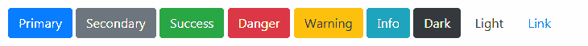
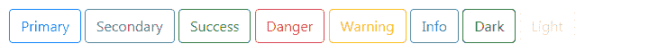
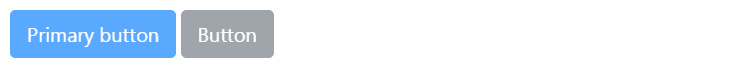
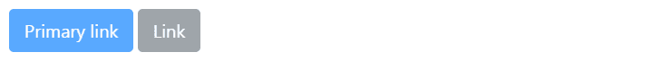

# Bootstrap 按钮

> 原文：<https://www.tutorialrepublic.com/twitter-bootstrap-4-tutorial/bootstrap-buttons.php>

在本教程中，你将学习如何用 Bootstrap 创建和修改按钮。

## 使用 Bootstrap 创建按钮

按钮是网站和应用不可或缺的一部分。它们用于各种目的，如提交或重置一个 [HTML 表单](../html-tutorial/html-forms.php)，执行交互式操作，如点击按钮时显示或隐藏网页上的内容，将用户重定向到另一个页面，等等。Bootstrap 提供了一种快速简单的方法来创建和定制按钮。

## Bootstrap 按钮样式

Bootstrap 中提供了不同的类来设计按钮的样式以及指示不同的状态或语义。按钮样式可以应用于任何元素。但是，它通常应用于 [`<a>`](../html-reference/html-a-tag.php) 、 [`<input>`](../html-reference/html-input-tag.php) 和 [`<button>`](../html-reference/html-button-tag.php) 元素，以获得最佳渲染效果。

以下示例将向您展示如何在 Bootstrap 中创建不同样式的按钮:

#### 例子

[Try this code »](../codelab.php?topic=bootstrap-4&file=buttons "Try this code using online Editor")

```
<button type="button" class="btn btn-primary">Primary</button>
<button type="button" class="btn btn-secondary">Secondary</button>
<button type="button" class="btn btn-success">Success</button>
<button type="button" class="btn btn-danger">Danger</button>
<button type="button" class="btn btn-warning">Warning</button>
<button type="button" class="btn btn-info">Info</button>    
<button type="button" class="btn btn-dark">Dark</button>
<button type="button" class="btn btn-light">Light</button>
<button type="button" class="btn btn-link">Link</button>
```

—以上示例的输出类似于以下内容:

[](../codelab.php?topic=bootstrap-4&file=buttons) 

* * *

## Bootstrap 大纲按钮

您也可以通过替换按钮修饰符类来创建轮廓按钮，如下所示:

#### 例子

[Try this code »](../codelab.php?topic=bootstrap-4&file=outline-buttons "Try this code using online Editor")

```
<button type="button" class="btn btn-outline-primary">Primary</button>
<button type="button" class="btn btn-outline-secondary">Secondary</button>
<button type="button" class="btn btn-outline-success">Success</button>
<button type="button" class="btn btn-outline-danger">Danger</button>
<button type="button" class="btn btn-outline-warning">Warning</button>
<button type="button" class="btn btn-outline-info">Info</button>
<button type="button" class="btn btn-outline-dark">Dark</button>
<button type="button" class="btn btn-outline-light">Light</button>
```

—以上示例的输出类似于以下内容:

[](../codelab.php?topic=bootstrap-4&file=outline-buttons) 

* * *

## 更改按钮的大小

Bootstrap 为您提供了进一步放大或缩小按钮的选项。您可以通过添加额外的类`.btn-lg`或`.btn-sm`来放大或缩小按钮，如下所示:

#### 例子

[Try this code »](../codelab.php?topic=bootstrap-4&file=button-sizes "Try this code using online Editor")

```
<button type="button" class="btn btn-primary btn-lg">Large</button>
<button type="button" class="btn btn-primary">Default</button>
<button type="button" class="btn btn-primary btn-sm">Small</button>
```

—上述示例的输出类似于以下内容:

[](../codelab.php?topic=bootstrap-4&file=button-sizes) 

您还可以通过向按钮添加额外的类`.btn-block`来创建块级按钮(覆盖父元素整个宽度的按钮)，如下所示:

#### 例子

[Try this code »](../codelab.php?topic=bootstrap-4&file=block-level-buttons "Try this code using online Editor")

```
<button type="button" class="btn btn-primary btn-lg btn-block">Block level button</button>
<button type="button" class="btn btn-secondary btn-lg btn-block">Block level button</button>
```

—以上示例的输出类似于以下内容:

[](../codelab.php?topic=bootstrap-4&file=block-level-buttons) 

* * *

## Bootstrap 禁用按钮

有时我们需要禁用一个按钮，因为某些原因，例如，如果一个用户没有资格执行这个特定的动作，或者我们想确保用户应该在执行这个特定的动作之前执行所有其他需要的动作。让我们看看如何做到这一点。

### 使用按钮和输入元素创建禁用的按钮

通过 [`<button>`](../html-reference/html-button-tag.php) 或 [`<input>`](../html-reference/html-input-tag.php) 标签创建的按钮可以通过在各自的元素中添加`disabled`属性来禁用，如下例所示:

#### 例子

[Try this code »](../codelab.php?topic=bootstrap-4&file=disabled-buttons "Try this code using online Editor")

```
<button type="button" class="btn btn-primary btn-lg" disabled>Primary button</button>
<button type="button" class="btn btn-secondary btn-lg" disabled>Button</button>
```

—以上示例的输出类似于以下内容:

[](../codelab.php?topic=bootstrap-4&file=disabled-buttons) 

### 使用锚元素创建禁用的按钮

通过 [`<a>`](../html-reference/html-a-tag.php) 标签创建的按钮可以通过添加`.disabled`类来禁用，如下所示:

#### 例子

[Try this code »](../codelab.php?topic=bootstrap-4&file=disabled-anchor-buttons "Try this code using online Editor")

```
<a href="#" class="btn btn-primary btn-lg disabled">Primary link</a>
<a href="#" class="btn btn-secondary btn-lg disabled">Link</a>
```

—以上示例的输出类似于以下内容:

[](../codelab.php?topic=bootstrap-4&file=disabled-anchor-buttons)  ***注意:**`.disabled`类只是让链接看起来像被禁用了一样，但是链接将保持可点击状态，除非你移除它的`href`属性。或者，您可以实现自定义的 [JavaScript 来阻止这些点击](../faq/how-to-remove-clickable-behavior-from-a-disabled-link-using-jquery.php)。*  ** * *

## Bootstrap 活动按钮

此外，您还可以应用类`.active`来强制按钮看起来像活动的(即被按下)。通常你不需要将这个类添加到按钮中，因为它们的活动状态是由 Bootstrap 使用 CSS `:active` [伪类](/css-tutorial/css-pseudo-classes.php)自动设计的。这里有一个例子:

#### 例子

[Try this code »](../codelab.php?topic=bootstrap-4&file=active-buttons "Try this code using online Editor")

```
<a href="#" class="btn btn-primary btn-lg active" role="button" aria-pressed="true">Primary link</a>
<a href="#" class="btn btn-secondary btn-lg active" role="button" aria-pressed="true">Link</a>
```

—以上示例的输出类似于以下内容:

[](../codelab.php?topic=bootstrap-4&file=active-buttons) 

* * *

## 创建微调按钮

使用 Bootstrap，您可以轻松地在按钮中包含微调图标，以指示应用中的加载状态。看看下面的例子，看看它是如何工作的:

#### 例子

[Try this code »](../codelab.php?topic=bootstrap-4&file=spinner-buttons "Try this code using online Editor")

```
<button type="button" class="btn btn-primary" disabled>
    <span class="spinner-border spinner-border-sm"></span>
</button>
<button type="button" class="btn btn-primary" disabled>
    <span class="spinner-border spinner-border-sm"></span> Loading...
</button>
<button type="button" class="btn btn-primary" disabled>
    <span class="spinner-grow spinner-grow-sm"></span> Loading...
</button>
```

—以上示例的输出类似于以下内容:

<iframe src="../examples/bootstrap/bootstrap-spinner-buttons.html" style="border:none;display:block;width:100%;height:58px;"></div> </div> <p>在下一章中，你将学习如何使用<a href="bootstrap-button-groups.php">Bootstrap 按钮组</a>组件将多个按钮水平或垂直组合成一行，就像工具栏一样。</p> <!--Bottom Navigation--> <!--End:Bottom Navigation--> <!-- InstanceEndEditable --> </body> </html></iframe>*