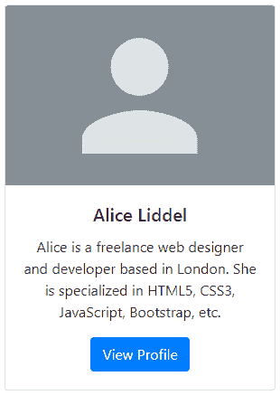
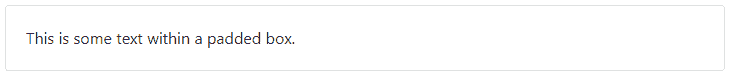
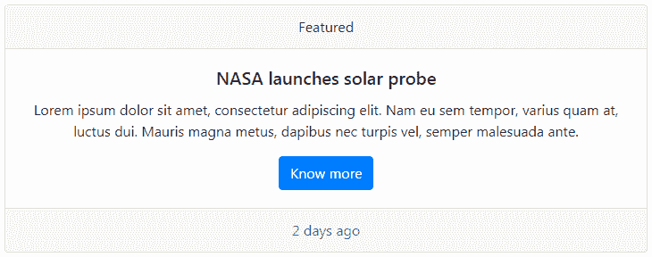
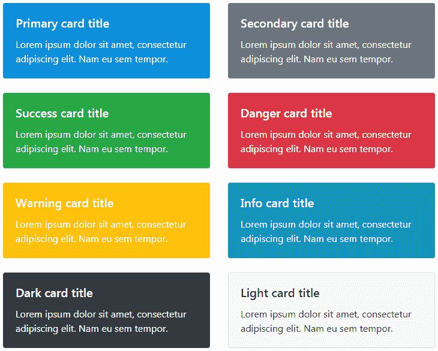
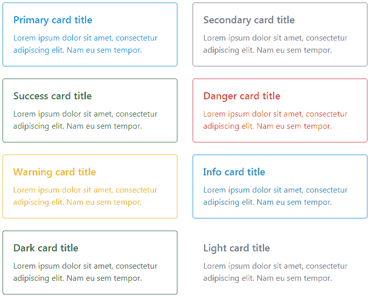
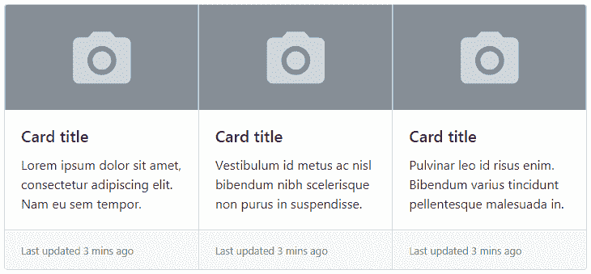
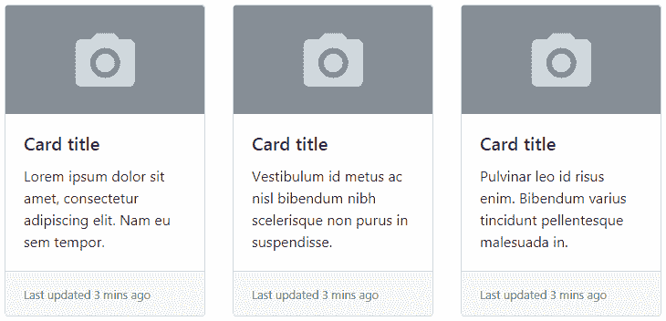
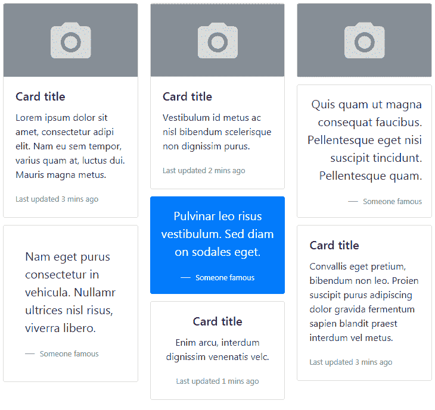
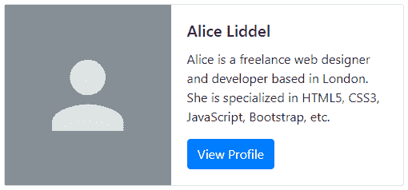
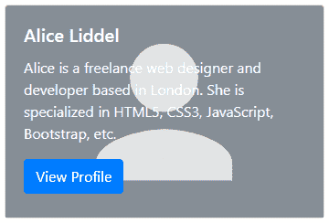

# Bootstrap 卡片

> 原文：<https://www.tutorialrepublic.com/twitter-bootstrap-4-tutorial/bootstrap-cards.php>

在本教程中，您将学习如何使用 Bootstrap 卡片组件。

## 介绍 Bootstrap 4 卡

Bootstrap 4 引入了一个新的灵活且可扩展的内容容器——**卡**组件——取代了旧的面板、井和缩略图组件。它包括页眉和页脚选项、各种各样的内容、上下文背景颜色和强大的显示选项。

在接下来的部分中，您将看到您可以使用 card component 做些什么。

## 创建基本卡

卡片加价非常简单。ourter 包装器需要基类`.card`，而内容可以放在`.card-body`中。下面的例子将向您展示如何创建一个带有图片、一些文本内容和一个按钮的卡片。

#### 例子

[Try this code »](../codelab.php?topic=bootstrap-4&file=card "Try this code using online Editor")

```html
<div class="card" style="width: 300px;">
    
    <div class="card-body text-center">
        <h5 class="card-title">Alice Liddel</h5>
        <p class="card-text">Alice is a freelance web designer and developer based in London. She is specialized in HTML5, CSS3, JavaScript, Bootstrap, etc.</p>
        <a href="#" class="btn btn-primary">View Profile</a>
    </div>
</div>
```

—以上示例的输出类似于以下内容:

[](../codelab.php?topic=bootstrap-4&file=card) 

* * *

## 卡组件的内容类型

card 组件支持各种各样内容，包括图像、文本、列表组、链接、导航等等。以下是该卡支持的示例。

### 仅身体卡

当你需要创建一个填充框的时候，你可以简单的使用`.card`和`.card-body`。

#### 例子

[Try this code »](../codelab.php?topic=bootstrap-4&file=basic-card "Try this code using online Editor")

```html
<div class="card">
    <div class="card-body">This is some text within a padded box.</div>
</div>
```

—以上示例的输出类似于以下内容:

[](../codelab.php?topic=bootstrap-4&file=basic-card) 

### 带页眉和页脚的卡片

您还可以分别使用`.card-header`和`.card-footer`类在卡片中添加页眉和页脚。让我们看看下面的例子:

#### 例子

[Try this code »](../codelab.php?topic=bootstrap-4&file=card-with-header-and-footer "Try this code using online Editor")

```html
<div class="card text-center">
    <div class="card-header">Featured</div>
    <div class="card-body">
        <h5 class="card-title">NASA launches solar probe</h5>
        <p class="card-text">Lorem ipsum dolor sit amet, consectetur adipiscing elit. Nam eu sem tempor, varius quam at, luctus dui. Mauris magna metus, dapibus nec turpis vel, semper malesuada ante.</p>
        <a href="#" class="btn btn-primary">Know more</a>
    </div>
    <div class="card-footer text-muted">2 days ago</div>
</div>
```

—上述示例的输出类似于以下内容:

[](../codelab.php?topic=bootstrap-4&file=card-with-header-and-footer) 

### 将列表组放入卡片中

您还可以将列表组与其他内容类型一起放在卡片中，如下所示。

#### 例子

[Try this code »](../codelab.php?topic=bootstrap-4&file=card-with-list-group "Try this code using online Editor")

```html
<div class="card" style="width: 18rem;">
    <div class="card-header">Featured</div>
    <ul class="list-group list-group-flush">
        <li class="list-group-item">Cras justo odio</li>
        <li class="list-group-item">Dapibus ac facilisis in</li>
        <li class="list-group-item">Vestibulum at eros</li>
    </ul>
    <div class="card-body">
        <a href="#" class="card-link">Add More</a>
        <a href="#" class="card-link">Share</a>
    </div>
</div>
```

—以上示例的输出类似于以下内容:

[](../codelab.php?topic=bootstrap-4&file=card-with-list-group) 

随意混合和搭配多种内容类型，以创建您需要的卡片。以下示例将创建一个具有图像、文本、列表组和链接的固定宽度的卡片。

#### 例子

[Try this code »](../codelab.php?topic=bootstrap-4&file=card-with-multiple-content-types "Try this code using online Editor")

```html
<div class="card" style="width: 300px;">
    
    <div class="card-body">
        <h5 class="card-title">Card title</h5>
        <p class="card-text">Pulvinar leo id risus pellentesque el vestibulum. Sed diam libero egetve sodales sapien vel, aliquet nibhte bibendum enim porttitor orci.</p>
    </div>
    <ul class="list-group list-group-flush">
        <li class="list-group-item">Cras justo odio</li>
        <li class="list-group-item">Dapibus ac facilisis in</li>
        <li class="list-group-item">Vestibulum at eros</li>
    </ul>
    <div class="card-body">
        <a href="#" class="card-link">Card link</a>
        <a href="#" class="card-link">Another link</a>
    </div>
</div>
```

* * *

## 自定义卡片背景

有几个选项可以自定义卡片背景、边框和颜色。您可以使用文本和背景实用程序类来更改卡片的外观。

#### 例子

[Try this code »](../codelab.php?topic=bootstrap-4&file=card-styles "Try this code using online Editor") *```html
<div class="row">
    <div class="col-sm-6">
        <div class="card text-white bg-primary mb-4">
            <div class="card-body">
                <h5 class="card-title">Primary card title</h5>
                <p class="card-text">Lorem ipsum dolor sit amet, consectetur adipiscing elit. Nam eu sem tempor.</p>
            </div>
        </div>
    </div>
    <div class="col-sm-6">
        <div class="card text-white bg-secondary mb-4">
            <div class="card-body">
                <h5 class="card-title">Secondary card title</h5>
                <p class="card-text">Lorem ipsum dolor sit amet, consectetur adipiscing elit. Nam eu sem tempor.</p>
            </div>
        </div>
    </div>
    <div class="col-sm-6">
        <div class="card text-white bg-success mb-4">
            <div class="card-body">
                <h5 class="card-title">Success card title</h5>
                <p class="card-text">Lorem ipsum dolor sit amet, consectetur adipiscing elit. Nam eu sem tempor.</p>
            </div>
        </div>
    </div>
    <div class="col-sm-6">
        <div class="card text-white bg-danger mb-4">
            <div class="card-body">
                <h5 class="card-title">Danger card title</h5>
                <p class="card-text">Lorem ipsum dolor sit amet, consectetur adipiscing elit. Nam eu sem tempor.</p>
            </div>
        </div>
    </div>
    <div class="col-sm-6">
        <div class="card text-white bg-warning mb-4">
            <div class="card-body">
                <h5 class="card-title">Warning card title</h5>
                <p class="card-text">Lorem ipsum dolor sit amet, consectetur adipiscing elit. Nam eu sem tempor.</p>
            </div>
        </div>
    </div>
    <div class="col-sm-6">
        <div class="card text-white bg-info mb-4">
            <div class="card-body">
                <h5 class="card-title">Info card title</h5>
                <p class="card-text">Lorem ipsum dolor sit amet, consectetur adipiscing elit. Nam eu sem tempor.</p>
            </div>
        </div>
    </div>    
    <div class="col-sm-6">
        <div class="card text-white bg-dark">
            <div class="card-body">
                <h5 class="card-title">Dark card title</h5>
                <p class="card-text">Lorem ipsum dolor sit amet, consectetur adipiscing elit. Nam eu sem tempor.</p>
            </div>
        </div>
    </div>
    <div class="col-sm-6">
        <div class="card bg-light">
            <div class="card-body">
                <h5 class="card-title">Light card title</h5>
                <p class="card-text">Lorem ipsum dolor sit amet, consectetur adipiscing elit. Nam eu sem tempor.</p>
            </div>
        </div>
    </div>
</div>
```*  *—以上示例的输出类似于以下内容:

[](../codelab.php?topic=bootstrap-4&file=card-styles) 

* * *

## 自定义卡片边框和文本

您还可以使用 text 和 border 实用程序类自定义任何卡片的文本和边框颜色。只需将这些类应用于父元素`.card`或其子元素，如下所示:

#### 例子

[Try this code »](../codelab.php?topic=bootstrap-4&file=card-styles-outline "Try this code using online Editor") *```html
<div class="row">
    <div class="col-sm-6">
        <div class="card border-primary mb-4">
            <div class="card-body text-primary">
                <h5 class="card-title">Primary card title</h5>
                <p class="card-text">Lorem ipsum dolor sit amet, consectetur adipiscing elit. Nam eu sem tempor.</p>
            </div>
        </div>
    </div>
    <div class="col-sm-6">
        <div class="card border-secondary mb-4">
            <div class="card-body text-secondary">
                <h5 class="card-title">Secondary card title</h5>
                <p class="card-text">Lorem ipsum dolor sit amet, consectetur adipiscing elit. Nam eu sem tempor.</p>
            </div>
        </div>
    </div>
    <div class="col-sm-6">
        <div class="card border-success mb-4">
            <div class="card-body text-success">
                <h5 class="card-title">Success card title</h5>
                <p class="card-text">Lorem ipsum dolor sit amet, consectetur adipiscing elit. Nam eu sem tempor.</p>
            </div>
        </div>
    </div>
    <div class="col-sm-6">
        <div class="card border-danger mb-4">
            <div class="card-body text-danger">
                <h5 class="card-title">Danger card title</h5>
                <p class="card-text">Lorem ipsum dolor sit amet, consectetur adipiscing elit. Nam eu sem tempor.</p>
            </div>
        </div>
    </div>
    <div class="col-sm-6">
        <div class="card border-warning mb-4">
            <div class="card-body text-warning">
                <h5 class="card-title">Warning card title</h5>
                <p class="card-text">Lorem ipsum dolor sit amet, consectetur adipiscing elit. Nam eu sem tempor.</p>
            </div>
        </div>
    </div>
    <div class="col-sm-6">
        <div class="card border-info mb-4">
            <div class="card-body text-info">
                <h5 class="card-title">Info card title</h5>
                <p class="card-text">Lorem ipsum dolor sit amet, consectetur adipiscing elit. Nam eu sem tempor.</p>
            </div>
        </div>
    </div>
    <div class="col-sm-6">
        <div class="card border-dark mb-4">
            <div class="card-body text-dark">
                <h5 class="card-title">Dark card title</h5>
                <p class="card-text">Lorem ipsum dolor sit amet, consectetur adipiscing elit. Nam eu sem tempor.</p>
            </div>
        </div>
    </div>
    <div class="col-sm-6">
        <div class="card border-light mb-4">
            <div class="card-body text-muted">
                <h5 class="card-title">Light card title</h5>
                <p class="card-text">Lorem ipsum dolor sit amet, consectetur adipiscing elit. Nam eu sem tempor.</p>
            </div>
        </div>
    </div>        
</div>
```*  *—以上示例的输出类似于以下内容:

[](../codelab.php?topic=bootstrap-4&file=card-styles-outline) 

* * *

## 卡片布局选项

除了卡片的样式之外，Bootstrap 还包括一些用于布置卡片系列的选项。然而，这些布局还没有响应。

### 创建卡组

您可以使用卡片组将卡片呈现为具有相同宽度和高度列的单个附加元素。卡组使用`display: flex;`来实现它们的统一大小。

#### 例子

[Try this code »](../codelab.php?topic=bootstrap-4&file=card-group "Try this code using online Editor") *```html
<div class="card-group">
    <div class="card">
        
        <div class="card-body">
            <h5 class="card-title">Card title</h5>
            <p class="card-text">Lorem ipsum dolor sit amet, consectetur adipiscing elit. Nam eu sem tempor.</p>
        </div>
        <div class="card-footer">
            <small class="text-muted">Last updated 3 mins ago</small>
        </div>
    </div>
    <div class="card">
        
        <div class="card-body">
            <h5 class="card-title">Card title</h5>
            <p class="card-text">Vestibulum id metus ac nisl bibendum nibh scelerisque non purus in suspendisse.</p>
        </div>
        <div class="card-footer">
            <small class="text-muted">Last updated 3 mins ago</small>
        </div>
    </div>
    <div class="card">
        
        <div class="card-body">
            <h5 class="card-title">Card title</h5>
            <p class="card-text">Pulvinar leo id risus enim. Bibendum varius tincidunt pellentesque malesuada in.</p>
        </div>
        <div class="card-footer">
            <small class="text-muted">Last updated 3 mins ago</small>
        </div>
    </div>
</div>
```*  *—以上示例的输出类似于以下内容:

[](../codelab.php?topic=bootstrap-4&file=card-group) 

### 创建卡片组

卡片组类似于卡片组(即每张卡片的宽度和高度相等)。唯一的区别是卡片并不相连。这里有一个例子:

#### 例子

[Try this code »](../codelab.php?topic=bootstrap-4&file=card-deck "Try this code using online Editor") *```html
<div class="card-deck">
    <div class="card">
        
        <div class="card-body">
            <h5 class="card-title">Card title</h5>
            <p class="card-text">Lorem ipsum dolor sit amet, consectetur adipiscing elit. Nam eu sem tempor.</p>
        </div>
        <div class="card-footer">
            <small class="text-muted">Last updated 3 mins ago</small>
        </div>
    </div>
    <div class="card">
        
        <div class="card-body">
            <h5 class="card-title">Card title</h5>
            <p class="card-text">Vestibulum id metus ac nisl bibendum nibh scelerisque non purus in suspendisse.</p>
        </div>
        <div class="card-footer">
            <small class="text-muted">Last updated 3 mins ago</small>
        </div>
    </div>
    <div class="card">
        
        <div class="card-body">
            <h5 class="card-title">Card title</h5>
            <p class="card-text">Pulvinar leo id risus enim. Bibendum varius tincidunt pellentesque malesuada in.</p>
        </div>
        <div class="card-footer">
            <small class="text-muted">Last updated 3 mins ago</small>
        </div>
    </div>
</div>
```*  *—以上示例的输出类似于以下内容:

[](../codelab.php?topic=bootstrap-4&file=card-deck) 

### 创建卡片列

有了 Bootstrap 4，你还可以像 Pinterest 一样用`.card-columns`包装卡片来创建卡片网格。卡是用 [CSS 列属性](/css-tutorial/css3-multi-column-layouts.php)而不是 flexbox 构建的，以便于对齐。卡片从上到下，从左到右排序。让我们来看一个例子:

#### 例子

[Try this code »](../codelab.php?topic=bootstrap-4&file=card-columns "Try this code using online Editor") *```html
<div class="card-columns">
<div class="card">
    
    <div class="card-body">
        <h5 class="card-title">Card title</h5>
        <p class="card-text">Lorem ipsum dolor sit amet, consectetur adipi elit. Nam eu sem tempor, varius quam at, luctus dui. Mauris magna metus.</p>
        <p class="card-text"><small class="text-muted">Last updated 3 mins ago</small></p>
    </div>
</div>
<div class="card p-3">
    <blockquote class="blockquote mb-0 card-body">
        <p>Nam eget purus consectetur in vehicula. Nullamr ultrices nisl risus, viverra libero.</p>
        <footer class="blockquote-footer">
            <small class="text-muted">Someone famous</small>
        </footer>
    </blockquote>
</div>
<div class="card">
    
    <div class="card-body">
        <h5 class="card-title">Card title</h5>
        <p class="card-text">Vestibulum id metus ac nisl bibendum scelerisque non dignissim purus.</p>
        <p class="card-text"><small class="text-muted">Last updated 2 mins ago</small></p>
    </div>
</div>
<div class="card bg-primary text-white text-center p-3">
    <blockquote class="blockquote mb-0">
        <p>Pulvinar leo risus vestibulum. Sed diam on sodales eget.</p>
        <footer class="blockquote-footer text-white">
            <small>Someone famous</small>
        </footer>
    </blockquote>
</div>
<div class="card text-center">
    <div class="card-body">
        <h5 class="card-title">Card title</h5>
        <p class="card-text">Enim arcu, interdum dignissim venenatis velc.</p>
        <p class="card-text"><small class="text-muted">Last updated 1 mins ago</small></p>
    </div>
</div>
<div class="card">
    
</div>
<div class="card p-3 text-right">
    <blockquote class="blockquote mb-0">
        <p>Quis quam ut magna consequat faucibus. Pellentesque eget nisi suscipit tincidunt. Pellentesque quam.</p>
        <footer class="blockquote-footer">
            <small class="text-muted">Someone famous</small>
        </footer>
    </blockquote>
</div>
<div class="card">
    <div class="card-body">
        <h5 class="card-title">Card title</h5>
        <p class="card-text">Convallis eget pretium, bibendum non leo. Proien suscipit purus adipiscing dolor gravida fermentum sapien blandit praest interdum vel metus.</p>
        <p class="card-text"><small class="text-muted">Last updated 3 mins ago</small></p>
    </div>
</div>
</div>
```*  *—以上示例的输出类似于以下内容:

[](../codelab.php?topic=bootstrap-4&file=card-columns) 

* * *

## 创建水平卡片

您也可以使用网格和实用程序类的组合来创建图像和文本内容并排放置的水平卡片，如下例所示:

#### 例子

[Try this code »](../codelab.php?topic=bootstrap-4&file=horizontal-card "Try this code using online Editor")

```html
<div class="card" style="max-width: 500px;">
    <div class="row no-gutters">
        <div class="col-sm-5" style="background: #868e96;">
            
        </div>
        <div class="col-sm-7">
            <div class="card-body">
                <h5 class="card-title">Alice Liddel</h5>
                <p class="card-text">Alice is a freelance web designer and developer based in London. She is specialized in HTML5, CSS3, JavaScript, Bootstrap, etc.</p>
                <a href="#" class="btn btn-primary stretched-link">View Profile</a>
            </div>
        </div>
    </div>
</div>
```

—以上示例的输出类似于以下内容:

[](../codelab.php?topic=bootstrap-4&file=card) 

* * *

## 卡片图像覆盖

你甚至可以使用类`.card-img-overlay`代替`.card-body`将一个图像变成卡片背景，并将卡片的文本放在它的顶部。根据图像的不同，您可能需要额外的样式来进行更好的调整。这里有一个例子:

#### 例子

[Try this code »](../codelab.php?topic=bootstrap-4&file=card-image-overlays "Try this code using online Editor")

```html
<div class="card text-white" style="width: 350px;">
    
    <div class="card-img-overlay">
        <h5 class="card-title">Alice Liddel</h5>
        <p class="card-text">Alice is a freelance web designer and developer based in London. She is specialized in HTML5, CSS3, JavaScript, Bootstrap, etc.</p>
        <a href="#" class="btn btn-primary stretched-link">View Profile</a>
    </div>
</div>
```

—以上示例的输出类似于以下内容:

[](../codelab.php?topic=bootstrap-4&file=card-image-overlays)  ***注意:**卡片内容不能大于图像高度。如果内容大于图像，内容将显示在图像之外。*  ** * *

## 卡片内的文本对齐

使用文本对齐实用程序类，您可以轻松地更改任何卡片的文本对齐方式——全部或特定部分。让我们来看一个例子:

#### 例子

[Try this code »](../codelab.php?topic=bootstrap-4&file=card-text-alignment "Try this code using online Editor") *```html
<!-- Card with default left text alignment -->
<div class="card">
    <div class="card-body">
        <h5 class="card-title">Card title</h5>
        <p class="card-text">Lorem ipsum dolor sit amet tempor...</p>
        <a href="#" class="btn btn-primary">Know more</a>
    </div>
</div>

<!-- Card with center text alignment -->
<div class="card text-center mt-3">
    <div class="card-body">
        <h5 class="card-title">Card title</h5>
        <p class="card-text">Vestibulum metus bibendum nibh sapien...</p>
        <a href="#" class="btn btn-primary">Know more</a>
    </div>
</div>

<!-- Card with right text alignment -->
<div class="card text-right mt-3">
    <div class="card-body">
        <h5 class="card-title">Card title</h5>
        <p class="card-text">Pulvinar leo id risus pellentesque diam...</p>
        <a href="#" class="btn btn-primary">Know more</a>
    </div>
</div>
```*  ** * *

## 指定卡片尺寸

卡片没有特定的宽度，它们默认为 100%宽。但是，您可以根据需要使用自定义 CSS、网格类或调整实用程序类来更改这一点。让我们看看这是如何工作的:

#### 例子

[Try this code »](../codelab.php?topic=bootstrap-4&file=card-sizing "Try this code using online Editor") *```html
<!-- Card sizing using grid markup -->
<div class="row">
    <div class="col-sm-6">
        <div class="card">
            <div class="card-body">
                <h5 class="card-title">Card title</h5>
                <p class="card-text">Lorem ipsum dolor sit amet...</p>
                <a href="#" class="btn btn-primary">Know more</a>
            </div>
        </div>
    </div>
    <div class="col-sm-6">
        <div class="card">
            <div class="card-body">
                <h5 class="card-title">Card title</h5>
                <p class="card-text">Vestibulum metus bibendum nibh...</p>
                <a href="#" class="btn btn-primary">Know more</a>
            </div>
        </div>
    </div>
</div>

<!-- Card sizing using sizing utility classes -->
<div class="card w-75">
    <div class="card-body">
        <h5 class="card-title">Card title</h5>
        <p class="card-text">Lorem ipsum dolor sit amet...</p>
        <a href="#" class="btn btn-primary">Know more</a>
    </div>
</div>

<!-- Card sizing using sizing utility classes -->
<div class="card" style="width: 15rem;">
    <div class="card-body">
        <h5 class="card-title">Card title</h5>
        <p class="card-text">Lorem ipsum dolor sit amet...</p>
        <a href="#" class="btn btn-primary">Know more</a>
    </div>
</div>
```*  ** * *

## 具有拉伸链接的卡片

您可以将类`.stretched-link`添加到卡片内部的链接中，使整张卡片可点击(即整张卡片就像一个链接)。对于拉伸链接，不建议使用多个链接。

尝试下面的例子，看看这实际上是如何工作的:

#### 例子

[Try this code »](../codelab.php?topic=bootstrap-4&file=card-with-stretched-link "Try this code using online Editor")

```html
<div class="card" style="width: 300px;">
    
    <div class="card-body text-center">
        <h5 class="card-title">Alice Liddel</h5>
        <p class="card-text">Alice is a freelance web designer and developer based in London. She is specialized in HTML5, CSS3, JavaScript, Bootstrap, etc.</p>
        <a href="#" class="btn btn-primary stretched-link">View Profile</a>
    </div>
</div>
```********