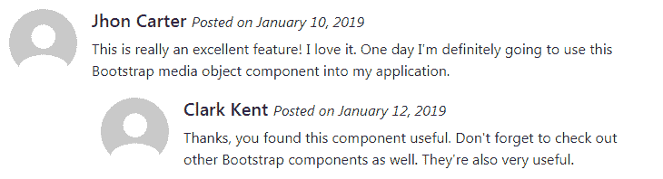

# Bootstrap 媒体对象

> 原文：<https://www.tutorialrepublic.com/twitter-bootstrap-4-tutorial/bootstrap-media-objects.php>

在本教程中，您将学习如何使用 Bootstrap 媒体对象组件。

## 使用 Bootstrap 媒体对象

如果您想要创建一个布局，其中包含左对齐或右对齐的媒体对象(如图像或视频)以及文本内容(如博客评论、推文等)。您可以使用新引入的 Bootstrap 媒体组件轻松实现这一点，如下所示:

#### 例子

[Try this code »](../codelab.php?topic=bootstrap-4&file=media-objects "Try this code using online Editor")

```html
<div class="media">
    
    <div class="media-body">
        <h5 class="mt-0">Jhon Carter <small><i>Posted on January 10, 2019</i></small></h5>
        <p>This is really an excellent feature! I love it. One day I'm definitely going to use this Bootstrap media object component into my application.</p>
    </div>
</div>
```

—上述示例的输出类似于以下内容:

[](../codelab.php?topic=bootstrap-4&file=media-objects) 

您还可以创建媒体组件的其他变体。将图像修改器类如`.rounded`或`.rounded-circle`应用于图像，创建圆角或圆形图像。

#### 例子

[Try this code »](../codelab.php?topic=bootstrap-4&file=rounded-media-objects "Try this code using online Editor")

```html
<div class="media">
    
    <div class="media-body">
        <h5 class="mt-0">Jhon Carter <small><i>Posted on January 10, 2019</i></small></h5>
        <p>This is really an excellent feature! I love it. One day I'm definitely going to use this Bootstrap media object component into my application.</p>
    </div>
</div>
```

—上述示例的输出类似于以下内容:

[](../codelab.php?topic=bootstrap-4&file=rounded-media-objects) 

* * *

## 创建嵌套媒体对象

媒体对象也可以嵌套在其他媒体对象中。这对于在博客文章中创建评论线索非常有用。下面是一个例子:

#### 例子

[Try this code »](../codelab.php?topic=bootstrap-4&file=nested-media-objects "Try this code using online Editor")

```html
<div class="media">
    
    <div class="media-body">
        <h5 class="mt-0">Jhon Carter <small><i>Posted on January 10, 2019</i></small></h5>
        <p>This is really an excellent feature! I love it. One day I'm definitely going to use this Bootstrap media object component into my application.</p>
        <!-- Nested media object -->
        <div class="media mt-2">
            
            <div class="media-body">
                <h5 class="mt-0">Clark Kent <small><i>Posted on January 12, 2019</i></small></h5>
                <p>Thanks, you found this component useful. Don't forget to check out other Bootstrap components as well. They're also very useful.</p>
            </div>
        </div>
    </div>
</div>
```

—以上示例的输出类似于以下内容:

[](../codelab.php?topic=bootstrap-4&file=nested-media-objects) 

* * *

## 媒体对象的对齐

您还可以通过调整 HTML 代码本身来更改内容和媒体的水平对齐方式，如下例所示:

#### 例子

[Try this code »](../codelab.php?topic=bootstrap-4&file=horizontal-alignment-of-media-objects "Try this code using online Editor")

```html
<div class="media">    
    <div class="media-body">
        <h5 class="mt-0">Jhon Carter <small><i>Posted on January 10, 2019</i></small></h5>
        <p>This is really an excellent feature! I love it. One day I'm definitely going to use this Bootstrap media object component into my application.</p>
    </div>
    
</div>
```

—以上示例的输出类似于以下内容:

[](../codelab.php?topic=bootstrap-4&file=horizontal-alignment-of-media-objects) 

除此之外，您还可以使用 flexbox 实用程序类在内容块的中间或底部对齐图像或其他媒体，例如，您可以使用类`.align-self-center`进行垂直居中对齐，使用类`.align-self-end`进行底部对齐。默认情况下，媒体对象内的媒体是顶部对齐的。这里有一个例子:

#### 例子

[Try this code »](../codelab.php?topic=bootstrap-4&file=vertical-alignment-of-media-objects "Try this code using online Editor") *```html
<!--Top aligned media-->
<div class="media">
    
    <div class="media-body">
        <h5 class="mt-0">Top aligned media <small><i>This is Default</i></small></h5>
        <p>Lorem ipsum dolor sit amet, consectetur adipiscing elit...</p>
    </div>
</div>
<hr>
<!--Middle aligned media-->
<div class="media">
    
    <div class="media-body">
        <h5 class="mt-0">Middle Aligned Media</h5>
        <p>Vestibulum quis quam ut magna consequat faucibus aleo...</p>
    </div>
</div>
<hr>
<!--Bottom aligned media-->
<div class="media">
    
    <div class="media-body">
        <h5 class="mt-0">Bottom Aligned Media</h5>
        <p>Amet nibh libero, in gravida nulla. Nulla vel metus...</p>
    </div>
</div>
```*  ** * *

## 创建媒体列表

您还可以使用 HTML 列表元素和媒体对象类来创建媒体列表。只需将类`.list-unstyled`应用于`<ul>`或`<ol>`元素，并将类`.media`应用于子`<li>`元素，如下例所示:

#### 例子

[Try this code »](../codelab.php?topic=bootstrap-4&file=media-list "Try this code using online Editor") *```html
<ul class="list-unstyled">
    <li class="media">
        
        <div class="media-body">
            <h5 class="mt-0">List-based media object</h5>
            <p>Lorem ipsum dolor sit amet, consectetur adipiscing elit. Nam eu sem tempor, varius quam at, luctus dui. Mauris magna metus, dapibus nec turpis vel, semper malesuada ante.</p>
        </div>
    </li>
    <li class="media my-2">
        
        <div class="media-body">
            <h5 class="mt-0">List-based media object</h5>
            <p>Vestibulum quis quam ut magna consequat faucibus. Pellentesque eget nisi a mi suscipit tincidunt. Ut tempus dictum risus. Pellentesque viverra sagittis quam at mattis.</p>
        </div>
    </li>
    <li class="media">
        
        <div class="media-body">
            <h5 class="mt-0">List-based media object</h5>
            <p>Amet nibh libero, in gravida nulla. Nulla vel metus scelerisque ante sollicitudin commodo. Cras purus odio, vestibulum in vulputate at, tempus viverra turpis.</p>
        </div>
    </li>
</ul>
```**