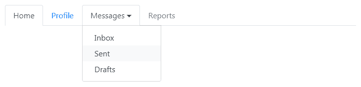

# Bootstrap 导航:标签和胶囊

> 原文：<https://www.tutorialrepublic.com/twitter-bootstrap-4-tutorial/bootstrap-navs.php>

在本教程中，你将学习如何创建 Bootstrap 导航组件。

## Bootstrap 导航组件

Bootstrap 提供了一种简单快捷的方式来创建基本的导航组件，如标签和胶囊，非常灵活和优雅。所有 Bootstrap 程序的导航组件——标签和胶囊——通过基类`.nav`共享相同的基本标签和样式。

## 使用 Bootstrap 创建基本导航

您可以使用 Bootstrap `.nav`类创建一个基本的导航菜单，如下所示:

#### 例子

[Try this code »](../codelab.php?topic=bootstrap-4&file=nav "Try this code using online Editor")

```html
<nav class="nav">
    <a href="#" class="nav-item nav-link active">Home</a>
    <a href="#" class="nav-item nav-link">Profile</a>
    <a href="#" class="nav-item nav-link">Messages</a>
    <a href="#" class="nav-item nav-link disabled" tabindex="-1">Reports</a>
</nav>
```

—以上示例的输出类似于以下内容:

[](../codelab.php?topic=bootstrap-4&file=nav)  ***注意:**你可以使用类`.disabled`让一个链接看起来像被禁用了。但是，`.disabled`类仅仅通过使链接变灰和移除悬停效果来改变链接的视觉外观，然而链接将保持可点击，除非你[移除`"href"`属性](/faq/how-to-remove-clickable-behavior-from-a-disabled-link-using-jquery.php)。*  ** * *

## 导航项目对齐

默认情况下，nav 是左对齐的，但是您可以使用 flexbox 实用程序轻松地将它们居中或右对齐。

以下示例使用类`.justify-content-center`将导航项目居中对齐。

#### 例子

[Try this code »](../codelab.php?topic=bootstrap-4&file=nav-center-alignment "Try this code using online Editor")

```html
<nav class="nav justify-content-center">
    <a href="#" class="nav-item nav-link active">Home</a>
    <a href="#" class="nav-item nav-link">Profile</a>
    <a href="#" class="nav-item nav-link">Messages</a>
    <a href="#" class="nav-item nav-link disabled" tabindex="-1">Reports</a>
</nav>
```

—以上示例的输出类似于以下内容:

[](../codelab.php?topic=bootstrap-4&file=nav-center-alignment) 

类似地，您可以使用类`.justify-content-end`将导航项目右对齐，就像这样:

#### 例子

[Try this code »](../codelab.php?topic=bootstrap-4&file=nav-right-alignment "Try this code using online Editor")

```html
<nav class="nav justify-content-end">
    <a href="#" class="nav-item nav-link active">Home</a>
    <a href="#" class="nav-item nav-link">Profile</a>
    <a href="#" class="nav-item nav-link">Messages</a>
    <a href="#" class="nav-item nav-link disabled" tabindex="-1">Reports</a>
</nav>
```

—以上示例的输出类似于以下内容:

[](../codelab.php?topic=bootstrap-4&file=nav-right-alignment) 

此外，您甚至可以通过使用类`.flex-column`更改 flex 项的方向来垂直堆叠导航项，如下例所示:

#### 例子

[Try this code »](../codelab.php?topic=bootstrap-4&file=nav-vertical-alignment "Try this code using online Editor")

```html
<nav class="nav flex-column">
    <a href="#" class="nav-item nav-link active">Home</a>
    <a href="#" class="nav-item nav-link">Profile</a>
    <a href="#" class="nav-item nav-link">Messages</a>
    <a href="#" class="nav-item nav-link disabled" tabindex="-1">Reports</a>
</nav>
```

—上述示例的输出类似于以下内容:

[](../codelab.php?topic=bootstrap-4&file=nav-vertical-alignment) 

* * *

## 创建基本选项卡

简单地说，将类`.nav-tabs`添加到基本导航中以生成选项卡式导航，如下所示:

#### 例子

[Try this code »](../codelab.php?topic=bootstrap-4&file=nav-tabs "Try this code using online Editor")

```html
<nav class="nav nav-tabs">
    <a href="#" class="nav-item nav-link active">Home</a>
    <a href="#" class="nav-item nav-link">Profile</a>
    <a href="#" class="nav-item nav-link">Messages</a>
    <a href="#" class="nav-item nav-link disabled" tabindex="-1">Reports</a>
</nav>
```

—上述示例的输出类似于以下内容:

[](../codelab.php?topic=bootstrap-4&file=nav-tabs) 

您还可以向选项卡项目添加图标，使其更具吸引力，如下所示:

#### 例子

[Try this code »](../codelab.php?topic=bootstrap-4&file=tabs-with-icons "Try this code using online Editor")

```html
<nav class="nav nav-tabs">
    <a href="#" class="nav-item nav-link active">
        <i class="fa fa-home"></i> Home
    </a>
    <a href="#" class="nav-item nav-link">
        <i class="fa fa-user"></i> Profile
    </a>
    <a href="#" class="nav-item nav-link">
        <i class="fa fa-envelope"></i> Messages
    </a>
    <a href="#" class="nav-item nav-link disabled" tabindex="-1">
        <i class="fa fa-line-chart"></i> Reports
    </a>
</nav>
```

—以上示例的输出类似于以下内容:

[](../codelab.php?topic=bootstrap-4&file=tabs-with-icons) 

* * *

## 创建胶囊导航

类似地，您可以通过在基本导航上添加类`.nav-pills`而不是类`.nav-tabs`来创建基于胶囊的导航，如下例所示:

#### 例子

[Try this code »](../codelab.php?topic=bootstrap-4&file=nav-pills "Try this code using online Editor")

```html
<nav class="nav nav-pills">
    <a href="#" class="nav-item nav-link active">Home</a>
    <a href="#" class="nav-item nav-link">Profile</a>
    <a href="#" class="nav-item nav-link">Messages</a>
    <a href="#" class="nav-item nav-link disabled" tabindex="-1">Reports</a>
</nav>
```

—上述示例的输出类似于以下内容:

[](../codelab.php?topic=bootstrap-4&file=nav-pills) 

类似地，像导航标签一样，你也可以添加图标到你的胶囊导航，使它更有吸引力:

#### 例子

[Try this code »](../codelab.php?topic=bootstrap-4&file=pills-with-icons "Try this code using online Editor")

```html
<nav class="nav nav-pills">
    <a href="#" class="nav-item nav-link active">
        <i class="fa fa-home"></i> Home
    </a>
    <a href="#" class="nav-item nav-link">
        <i class="fa fa-user"></i> Profile
    </a>
    <a href="#" class="nav-item nav-link">
        <i class="fa fa-envelope"></i> Messages
    </a>
    <a href="#" class="nav-item nav-link disabled" tabindex="-1">
        <i class="fa fa-line-chart"></i> Reports
    </a>
</nav>
```

—上述示例的输出类似于以下内容:

[](../codelab.php?topic=bootstrap-4&file=pills-nav-with-icons) 

此外，您可以在`.nav`元素上应用类`.flex-column`,使胶囊导航垂直堆叠显示，如下例所示:

#### 例子

[Try this code »](../codelab.php?topic=bootstrap-4&file=vertically-stacked-pills-nav "Try this code using online Editor")

```html
<nav class="nav nav-pills flex-column">
    <a href="#" class="nav-item nav-link active">
        <i class="fa fa-home"></i> Home
    </a>
    <a href="#" class="nav-item nav-link">
        <i class="fa fa-user"></i> Profile
    </a>
    <a href="#" class="nav-item nav-link">
        <i class="fa fa-envelope"></i> Messages
    </a>
    <a href="#" class="nav-item nav-link disabled" tabindex="-1">
        <i class="fa fa-line-chart"></i> Reports
    </a>
</nav>
```

—以上示例的输出类似于以下内容:

[](../codelab.php?topic=bootstrap-4&file=stacked-pills) 

* * *

## 带有下拉菜单的 Bootstrap 标签和胶囊导航

你可以添加下拉菜单到标签页和胶囊导航的链接中，只需要一点额外的标签。

除了`.nav`、`.nav-tabs`或`.nav-pills`类之外，还需要四个 CSS 类`.dropdown`、`.dropdown-toggle`、`.dropdown-menu`和`.dropdown-item`，以便在不使用任何 JavaScript 代码的情况下在导航中创建一个简单的下拉菜单。

### 创建带有下拉菜单的选项卡

下面的例子将向你展示如何在标签页中添加简单的下拉菜单。

#### 例子

[Try this code »](../codelab.php?topic=bootstrap-4&file=tabs-with-dropdown-menus "Try this code using online Editor")

```html
<nav class="nav nav-tabs">
    <a href="#" class="nav-item nav-link active">Home</a>
    <a href="#" class="nav-item nav-link">Profile</a>
    <div class="nav-item dropdown">
        <a href="#" class="nav-link dropdown-toggle" data-toggle="dropdown">Messages</a>
        <div class="dropdown-menu">
            <a href="#" class="dropdown-item">Inbox</a>
            <a href="#" class="dropdown-item">Sent</a>
            <a href="#" class="dropdown-item">Drafts</a>
        </div>
    </div>
    <a href="#" class="nav-item nav-link disabled" tabindex="-1">Reports</a>
</nav>
```

—以上示例的输出类似于以下内容:

[](../codelab.php?topic=bootstrap-4&file=tabs-with-dropdown-menus) 

### 创建带下拉菜单的胶囊

下面的例子将向你展示如何添加简单的下拉菜单到一个胶囊导航。

#### 例子

[Try this code »](../codelab.php?topic=bootstrap-4&file=pills-with-dropdown-menus "Try this code using online Editor")

```html
<nav class="nav nav-pills">
    <a href="#" class="nav-item nav-link active">Home</a>
    <a href="#" class="nav-item nav-link">Profile</a>
    <div class="nav-item dropdown">
        <a href="#" class="nav-link dropdown-toggle" data-toggle="dropdown">Messages</a>
        <div class="dropdown-menu">
            <a href="#" class="dropdown-item">Inbox</a>
            <a href="#" class="dropdown-item">Sent</a>
            <a href="#" class="dropdown-item">Drafts</a>
        </div>
    </div>
    <a href="#" class="nav-item nav-link disabled" tabindex="-1">Reports</a>
</nav>
```

—上面示例的输出如下所示:

[](../codelab.php?topic=bootstrap-4&file=pills-with-dropdown-menus) 

在[Bootstrap 下拉菜单](bootstrap-dropdowns.php)一章中，您将了解更多关于下拉菜单的信息。

* * *

## 填充并对齐导航组件

您可以使用`.nav`元素上的类`.nav-fill`强制您的导航项目扩展并按比例填充所有可用宽度。在下面的例子中，所有的水平空间都被导航项占据了，但是每个导航项的宽度并不相同。

#### 例子

[Try this code »](../codelab.php?topic=bootstrap-4&file=nav-fill "Try this code using online Editor")

```html
<nav class="nav nav-pills nav-fill">
    <a href="#" class="nav-item nav-link">Home</a>
    <a href="#" class="nav-item nav-link">About</a>
    <a href="#" class="nav-item nav-link active">Explore Products</a>
    <a href="#" class="nav-item nav-link">Contact Us</a>
</nav>
```

—以上示例的输出类似于以下内容:

[](../codelab.php?topic=bootstrap-4&file=nav-fill) 

或者，如果您希望 nav 填充所有水平空间，并且每个 nav 项具有相同的宽度，您可以使用类`.nav-justified`而不是`.nav-fill`。

#### 例子

[Try this code »](../codelab.php?topic=bootstrap-4&file=nav-justified "Try this code using online Editor")

```html
<nav class="nav nav-pills nav-justified">
    <a href="#" class="nav-item nav-link">Home</a>
    <a href="#" class="nav-item nav-link">About</a>
    <a href="#" class="nav-item nav-link active">Explore Products</a>
    <a href="#" class="nav-item nav-link">Contact Us</a>
</nav>
```

—上述示例的输出类似于以下内容:

[](../codelab.php?topic=bootstrap-4&file=nav-justified)*