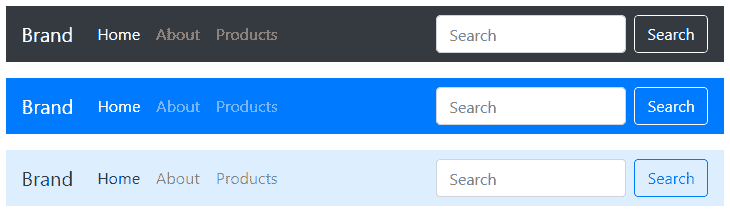

# 引导导航条

> 原文：<https://www.tutorialrepublic.com/twitter-bootstrap-4-tutorial/bootstrap-navbar.php>

在本教程中，您将学习如何使用 Bootstrap navbar 组件创建静态和固定位置的响应导航标题。

## 用 Bootstrap 创建一个简单的导航栏

您可以使用 Bootstrap navbar 组件为您的网站或应用程序创建响应性导航标题。这些响应式导航条最初在手机等具有小视窗的设备上折叠，但当用户单击切换按钮时会展开。但是，在笔记本电脑或台式机等中型和大型设备上，它将正常水平放置。

你也可以创建不同版本的导航条，比如带有下拉菜单和搜索框的导航条，以及固定位置的导航条。下面的例子将向你展示如何创建一个简单的带有导航链接的静态导航栏。

#### 例子

[Try this code »](../codelab.php?topic=bootstrap-4&file=static-navbar "Try this code using online Editor")

```
<nav class="navbar navbar-expand-md navbar-light bg-light">
    <a href="#" class="navbar-brand">Brand</a>
    <button type="button" class="navbar-toggler" data-toggle="collapse" data-target="#navbarCollapse">
        <span class="navbar-toggler-icon"></span>
    </button>

    <div class="collapse navbar-collapse" id="navbarCollapse">
        <div class="navbar-nav">
            <a href="#" class="nav-item nav-link active">Home</a>
            <a href="#" class="nav-item nav-link">Profile</a>
            <a href="#" class="nav-item nav-link">Messages</a>
            <a href="#" class="nav-item nav-link disabled" tabindex="-1">Reports</a>
        </div>
        <div class="navbar-nav ml-auto">
            <a href="#" class="nav-item nav-link">Login</a>
        </div>
    </div>
</nav>
```

—以上示例的输出类似于以下内容:

[](../codelab.php?topic=bootstrap-4&file=static-navbar) 

此外，除了纯文本，你还可以将你的 logo 图片放在 navbar 里面。但是，您需要手动设置徽标的高度，以使其在导航条内合适，如下所示:

#### 例子

[Try this code »](../codelab.php?topic=bootstrap-4&file=navbar-with-logo "Try this code using online Editor")

```
<nav class="navbar navbar-expand-md navbar-light bg-light">
    <a href="#" class="navbar-brand">
        
    </a>
    <button type="button" class="navbar-toggler" data-toggle="collapse" data-target="#navbarCollapse">
        <span class="navbar-toggler-icon"></span>
    </button>

    <div class="collapse navbar-collapse" id="navbarCollapse">
        <div class="navbar-nav">
            <a href="#" class="nav-item nav-link active">Home</a>
            <a href="#" class="nav-item nav-link">Profile</a>
            <a href="#" class="nav-item nav-link">Messages</a>
            <a href="#" class="nav-item nav-link disabled" tabindex="-1">Reports</a>
        </div>
        <div class="navbar-nav ml-auto">
            <a href="#" class="nav-item nav-link">Login</a>
        </div>
    </div>
</nav>
```

—上述示例的输出类似于以下内容:

[](../codelab.php?topic=bootstrap-4&file=navbar-with-logo)  ***注意:**使用`.ml-auto`、`.mr-auto`、`.justify-content-between`等实用类。对齐导航栏中的导航链接、窗体、按钮或文本。*  ** * *

## 向导航栏添加下拉菜单

您还可以在导航栏中包含下拉框和搜索框，如下所示:

#### 例子

[Try this code »](../codelab.php?topic=bootstrap-4&file=static-navbar-with-dropdown-and-search-form "Try this code using online Editor")

```
<nav class="navbar navbar-expand-md navbar-light bg-light">
    <a href="#" class="navbar-brand">Brand</a>
    <button type="button" class="navbar-toggler" data-toggle="collapse" data-target="#navbarCollapse">
        <span class="navbar-toggler-icon"></span>
    </button>

    <div class="collapse navbar-collapse justify-content-between" id="navbarCollapse">
        <div class="navbar-nav">
            <a href="#" class="nav-item nav-link active">Home</a>
            <a href="#" class="nav-item nav-link">Profile</a>
            <div class="nav-item dropdown">
                <a href="#" class="nav-link dropdown-toggle" data-toggle="dropdown">Messages</a>
                <div class="dropdown-menu">
                    <a href="#" class="dropdown-item">Inbox</a>
                    <a href="#" class="dropdown-item">Sent</a>
                    <a href="#" class="dropdown-item">Drafts</a>
                </div>
            </div>
        </div>
        <form class="form-inline">
            <div class="input-group">                    
                <input type="text" class="form-control" placeholder="Search">
                <div class="input-group-append">
                    <button type="button" class="btn btn-secondary"><i class="fa fa-search"></i></button>
                </div>
            </div>
        </form>
        <div class="navbar-nav">
            <a href="#" class="nav-item nav-link">Login</a>
        </div>
    </div>
</nav>
```

—上述示例的输出类似于以下内容:

[](../codelab.php?topic=bootstrap-4&file=static-navbar-with-dropdown-and-search-form)  ***提示:**要创建不固定在顶部或底部的导航条，可以把它放在`.container`中的任何地方，它设置了你的站点和内容的宽度。*  *查看 snippets 部分，查看一些设计精美的引导导航条的例子。

* * *

## 将搜索表单放在导航栏中

搜索表单是导航栏中非常常见的组件，你经常在各种网站上看到它。您可以使用 [`<form>`](../html-reference/html-form-tag.php) 元素上的类`.form-inline`将各种表单控件和组件放置在导航栏中，如下例所示:

#### 例子

[Try this code »](../codelab.php?topic=bootstrap-4&file=navbar-with-search-form "Try this code using online Editor")

```
<nav class="navbar navbar-expand-md navbar-dark bg-dark">
    <a href="#" class="navbar-brand">Brand</a>
    <button type="button" class="navbar-toggler" data-toggle="collapse" data-target="#navbarCollapse">
        <span class="navbar-toggler-icon"></span>
    </button>

    <div class="collapse navbar-collapse" id="navbarCollapse">
        <div class="navbar-nav">
            <a href="#" class="nav-item nav-link active">Home</a>
            <a href="#" class="nav-item nav-link">About</a>
            <a href="#" class="nav-item nav-link">Products</a>
        </div>
        <form class="form-inline ml-auto">
            <input type="text" class="form-control mr-sm-2" placeholder="Search">
            <button type="submit" class="btn btn-outline-light">Search</button>
        </form>
    </div>
</nav>
```

—以上示例的输出类似于以下内容:

[](../codelab.php?topic=bootstrap-4&file=navbar-with-search-form) 

* * *

## 更改导航栏的配色方案

您也可以通过使用`.navbar-light`选择浅背景色，或者使用`.navbar-dark`选择深背景色来更改导航栏的配色方案。然后，用背景色工具类对其进行定制，比如`.bg-dark`、`.bg-primary`等等。

或者，您也可以自己在`.navbar`元素上应用 CSS [`background-color`](/css-reference/css-background-color-property.php) 属性来自定义导航栏主题，如下例所示:

#### 例子

[Try this code »](../codelab.php?topic=bootstrap-4&file=navbar-color-schemes "Try this code using online Editor")

```
<nav class="navbar navbar-expand-md navbar-dark bg-dark">
    <!-- Navbar content -->
</nav>

<nav class="navbar navbar-dark bg-primary">
    <!-- Navbar content -->
</nav>

<nav class="navbar navbar-light" style="background-color: #ddeeff;">
    <!-- Navbar content -->
</nav>
```

—上述示例的输出类似于以下内容:

[](../codelab.php?topic=bootstrap-4&file=navbar-color-schemes) 

* * *

## 自举固定导航条

Bootstrap 还提供了创建 navbar 的机制，navbar 固定在视口的顶部或底部，并将随着页面上的内容滚动。

### 创建固定到顶部导航栏

将 position 实用程序类`.fixed-top`应用于`.navbar`元素，以固定视口顶部的导航栏，使其不会随页面滚动。这里有一个例子:

#### 例子

[Try this code »](../codelab.php?topic=bootstrap-4&file=navbar-fixed-to-top "Try this code using online Editor")

```
<nav class="navbar navbar-expand-md navbar-dark bg-dark fixed-top">
    <!-- Navbar content -->
</nav>
```

### 创建固定到底部导航栏

类似地，在`.navbar`元素上添加类`.fixed-bottom`来固定视口底部的导航条，如下例所示:

#### 例子

[Try this code »](../codelab.php?topic=bootstrap-4&file=navbar-fixed-to-bottom "Try this code using online Editor")

```
<nav class="navbar navbar-expand-md navbar-dark bg-dark fixed-bottom">
    <!-- Navbar content -->
</nav>
```

### 创建顶部粘性导航栏

你也可以创建粘性顶部导航条，它随着页面滚动，直到到达顶部，然后停留在那里，只需简单地使用`.navbar`元素上的`.sticky-top`类，如下所示:

#### 例子

[Try this code »](../codelab.php?topic=bootstrap-4&file=navbar-sticky-top "Try this code using online Editor")

```
<nav class="navbar navbar-expand-md navbar-dark bg-dark sticky-top">
    <!-- Navbar content -->
</nav>
```

 ***提示:**将固定的`.navbar`内容放置在`.container`或`.container-fluid`中，以便与其余内容进行适当的填充和对齐。*  ****注意:**记住在`[<body>](../html-reference/html-body-tag.php)`元素的顶部或底部添加`[padding](../css-reference/css-padding-property.php)`(至少 70px)，以防止在实现固定顶部或底部导航条时内容到导航条下面。此外，一定要在核心引导 CSS 文件之后添加您的自定义[样式表](../html-tutorial/html-styles.php)，否则您的样式表中的样式规则可能会被引导 CSS 文件覆盖。****