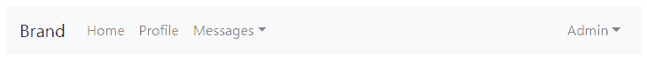
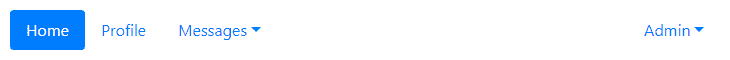

# Bootstrap 下拉菜单

> 原文：<https://www.tutorialrepublic.com/twitter-bootstrap-4-tutorial/bootstrap-dropdowns.php>

在本教程中，你将学习如何使用 Bootstrap dropdown 插件将下拉菜单添加到各种组件中。

## 用 Bootstrap 创建下拉菜单

下拉菜单通常用在导航标题中，当用户鼠标悬停或单击触发元素时，显示相关链接的列表。

你可以使用 Bootstrap dropdown 插件添加可切换的下拉菜单(即点击时打开和关闭)到几乎任何东西，如链接、按钮或按钮组、导航栏、标签和药丸导航等。甚至不用编写一行 JavaScript 代码。

## 通过数据属性添加下拉菜单

Bootstrap 为通过数据属性向元素添加下拉菜单提供了一种简单而优雅的机制。以下示例将向您展示通过数据属性向超链接添加下拉菜单所需的最少标签。

#### 例子

[Try this code »](../codelab.php?topic=bootstrap-4&file=adding-dropdowns-via-data-attributes "Try this code using online Editor")

```
<div class="dropdown">
    <a href="#" class="dropdown-toggle" data-toggle="dropdown">Dropdown</a>
    <div class="dropdown-menu">
        <a href="#" class="dropdown-item">Action</a>
        <a href="#" class="dropdown-item">Another action</a>
    </div>
</div>
```

上面的例子演示了最基本的 Bootstrap 下拉形式。让我们逐一了解 Bootstrap dropdown 组件的各个部分。

## 代码解释

Bootstrap dropdown 基本上有两个组件——可以是超链接或按钮的 dropdown trigger 元素，以及下拉菜单本身。

*   类指定了一个下拉菜单。
*   `.dropdown-toggle`类定义了 trigger 元素，在我们的例子中是一个超链接，而 trigger 元素需要属性`data-toggle="dropdown"`来切换下拉菜单。
*   具有类`.dropdown-menu`的 [`<div>`](#) 元素实际上是在构建下拉菜单，该菜单通常包含相关的链接或动作。

类似地，您可以向按钮和导航组件添加下拉菜单。下一节将向您展示 Bootstrap 下拉菜单的一些常见实现。

* * *

## 导航栏内的下拉菜单

下面的例子将向你展示如何在 navbar 中添加下拉菜单。

#### 例子

[Try this code »](../codelab.php?topic=bootstrap-4&file=dropdowns-within-navbar "Try this code using online Editor") *```
<nav class="navbar navbar-expand-md navbar-light bg-light">
    <a href="#" class="navbar-brand">Brand</a>
    <button type="button" class="navbar-toggler" data-toggle="collapse" data-target="#navbarCollapse">
        <span class="navbar-toggler-icon"></span>
    </button>
    <div id="navbarCollapse" class="collapse navbar-collapse">
        <ul class="nav navbar-nav">
            <li class="nav-item">
                <a href="#" class="nav-link">Home</a>
            </li>
            <li class="nav-item">
                <a href="#" class="nav-link">Profile</a>
            </li>
            <li class="nav-item dropdown">
                <a href="#" class="nav-link dropdown-toggle" data-toggle="dropdown">Messages</a>
                <div class="dropdown-menu">
                    <a href="#" class="dropdown-item">Inbox</a>
                    <a href="#" class="dropdown-item">Drafts</a>
                    <a href="#" class="dropdown-item">Sent Items</a>
                    <div class="dropdown-divider"></div>
                    <a href="#"class="dropdown-item">Trash</a>
                </div>
            </li>
        </ul>
        <ul class="nav navbar-nav ml-auto">
            <li class="nav-item dropdown">
                <a href="#" class="nav-link dropdown-toggle" data-toggle="dropdown">Admin</a>
                <div class="dropdown-menu dropdown-menu-right">
                    <a href="#" class="dropdown-item">Reports</a>
                    <a href="#" class="dropdown-item">Settings</a>
                    <div class="dropdown-divider"></div>
                    <a href="#"class="dropdown-item">Logout</a>
                </div>
            </li>
        </ul>
    </div>
</nav>
```*  *—以上示例的输出类似于以下内容:

[](../codelab.php?topic=bootstrap-4&file=dropdowns-within-navbar)  ***提示:**您可以通过在空白的`<div>`元素上添加类`.dropdown-divider`来绘制分隔线来分隔下拉菜单中的链接。*  ** * *

## nav 内的下拉列表

下面的例子将向你展示如何添加下拉列表到药丸导航。

#### 例子

[Try this code »](../codelab.php?topic=bootstrap-4&file=dropdowns-within-nav "Try this code using online Editor") *```
<ul class="nav nav-pills">
    <li class="nav-item">
        <a href="#" class="nav-link active">Home</a>
    </li>
    <li class="nav-item">
        <a href="#" class="nav-link">Profile</a>
    </li>
    <li class="nav-item dropdown">
        <a href="#" class="nav-link dropdown-toggle" data-toggle="dropdown">Messages</a>
        <div class="dropdown-menu">
            <a href="#" class="dropdown-item">Inbox</a>
            <a href="#" class="dropdown-item">Drafts</a>
            <a href="#" class="dropdown-item">Sent Items</a>
            <div class="dropdown-divider"></div>
            <a href="#"class="dropdown-item">Trash</a>
        </div>
    </li>
    <li class="nav-item dropdown ml-auto">
        <a href="#" class="nav-link dropdown-toggle" data-toggle="dropdown">Admin</a>
        <div class="dropdown-menu dropdown-menu-right">
            <a href="#" class="dropdown-item">Reports</a>
            <a href="#" class="dropdown-item">Settings</a>
            <div class="dropdown-divider"></div>
            <a href="#"class="dropdown-item">Logout</a>
        </div>
    </li>
</ul>
```*  *—以上示例的输出类似于以下内容:

[](../codelab.php?topic=bootstrap-4&file=dropdowns-within-nav) 

您可以通过用`.nav-tabs`替换类`.nav-pills`来简单地将上面的例子转换成一个 tab dropdown，而不需要进一步修改标签。

* * *

## 按钮内的下拉菜单

下面的例子将向你展示如何在主按钮上添加下拉菜单。

#### 例子

[Try this code »](../codelab.php?topic=bootstrap-4&file=dropdowns-within-buttons "Try this code using online Editor")

```
<div class="btn-group">
    <button type="button" class="btn btn-primary dropdown-toggle" data-toggle="dropdown">Action</button>
    <div class="dropdown-menu">
        <a href="#" class="dropdown-item">Action</a>
        <a href="#" class="dropdown-item">Another action</a>
        <div class="dropdown-divider"></div>
        <a href="#" class="dropdown-item">Separated link</a>
    </div>
</div>
```

—同样，您可以向按钮的其他变体添加下拉菜单，如下所示:

[](../codelab.php?topic=bootstrap-4&file=dropdowns-within-buttons) 

* * *

## Bootstrap 拆分按钮下拉列表

下面的例子将向你展示如何在拆分按钮中添加下拉菜单。

#### 例子

[Try this code »](../codelab.php?topic=bootstrap-4&file=split-button-dropdowns "Try this code using online Editor")

```
<div class="btn-group">
    <button type="button" class="btn btn-primary">Action</button>
    <button type="button" class="btn btn-primary dropdown-toggle dropdown-toggle-split" data-toggle="dropdown">
        <span class="sr-only">Toggle Dropdown</span>
    </button>
    <div class="dropdown-menu">
        <a href="#" class="dropdown-item">Action</a>
        <a href="#" class="dropdown-item">Another action</a>
        <div class="dropdown-divider"></div>
        <a href="#" class="dropdown-item">Separated link</a>
    </div>
</div>
```

—同样，您可以向按钮的其他变体添加下拉菜单，如下所示:

[](../codelab.php?topic=bootstrap-4&file=split-button-dropdowns)  ***提示:**你可以在`.btn`元素上使用 Bootstrap 的按钮相对大小调整类，比如`.btn-lg`和`.btn-sm`来进一步[调整按钮下拉列表](../codelab.php?topic=bootstrap-4&file=sizing-button-dropdowns)的大小。*  ** * *

## 按钮组内的下拉列表

要在按钮组中创建下拉菜单，只需在另一个`.btn-group`中放置一个`.btn-group`和下拉标签。

#### 例子

[Try this code »](../codelab.php?topic=bootstrap-4&file=dropdowns-within-button-groups "Try this code using online Editor")

```
<div class="btn-group">
    <button type="button" class="btn btn-primary">Button</button>
    <button type="button" class="btn btn-primary">Another Button</button>
    <div class="btn-group">
        <button type="button" class="btn btn-primary dropdown-toggle" data-toggle="dropdown">Dropdown</button>
        <div class="dropdown-menu">
            <a href="#" class="dropdown-item">Action</a>
            <a href="#" class="dropdown-item">Another action</a>
            <div class="dropdown-divider"></div>
            <a href="#" class="dropdown-item">Separated link</a>
        </div>
    </div>
</div>
```

—以上示例的输出类似于以下内容:

[](../codelab.php?topic=bootstrap-4&file=dropdowns-within-button-groups) 

类似地，您可以在垂直堆叠的按钮组中创建下拉列表，如下所示:

#### 例子

[Try this code »](../codelab.php?topic=bootstrap-4&file=dropdowns-within-vertically-stacked-button-groups "Try this code using online Editor")

```
<div class="btn-group-vertical">
    <button type="button" class="btn btn-primary">Button</button>
    <button type="button" class="btn btn-primary">Another Button</button>
    <div class="btn-group">
        <button type="button" class="btn btn-primary dropdown-toggle" data-toggle="dropdown">Dropdown</button>
        <div class="dropdown-menu">
            <a href="#" class="dropdown-item">Action</a>
            <a href="#" class="dropdown-item">Another action</a>
            <div class="dropdown-divider"></div>
            <a href="#" class="dropdown-item">Separated link</a>
        </div>
    </div>
</div>
```

* * *

## 创建下拉菜单、左下拉菜单和右下拉菜单

您甚至可以通过向父元素(即`.btn-group`元素)分别添加一个额外的类`.dropup`、`.dropleft`和`.dropright`来触发元素上方以及左侧和右侧的下拉菜单，如下例所示。

#### 例子

[Try this code »](../codelab.php?topic=bootstrap-4&file=dropup-dropleft-and-dropright-menus "Try this code using online Editor") *```
<!-- Dropup menu -->
<div class="btn-group dropup">
    <button type="button" class="btn btn-primary dropdown-toggle" data-toggle="dropdown">Dropup</button>
    <div class="dropdown-menu">
        <a href="#" class="dropdown-item">Action</a>
        <a href="#" class="dropdown-item">Another action</a>
        <div class="dropdown-divider"></div>
        <a href="#" class="dropdown-item">Separated link</a>
    </div>
</div>

<!-- Dropleft menu -->
<div class="btn-group dropleft">
    <button type="button" class="btn btn-primary dropdown-toggle" data-toggle="dropdown">Dropleft</button>
    <div class="dropdown-menu">
        <a href="#" class="dropdown-item">Action</a>
        <a href="#" class="dropdown-item">Another action</a>
        <div class="dropdown-divider"></div>
        <a href="#" class="dropdown-item">Separated link</a>
    </div>
</div>

<!-- Dropright menu -->
<div class="btn-group dropright">
    <button type="button" class="btn btn-primary dropdown-toggle" data-toggle="dropdown">Dropright</button>
    <div class="dropdown-menu">
        <a href="#" class="dropdown-item">Action</a>
        <a href="#" class="dropdown-item">Another action</a>
        <div class="dropdown-divider"></div>
        <a href="#" class="dropdown-item">Separated link</a>
    </div>
</div>
```*  *—以上示例的输出类似于以下内容:

[](../codelab.php?topic=bootstrap-4&file=dropup-dropleft-and-dropright-menus) 

* * *

## 创建右对齐的下拉菜单

默认情况下，下拉菜单的左上角位于其父元素的左下角，即从顶部沿左侧 100%。要右对齐下拉菜单，只需在`.dropdown-menu`基类中添加一个额外的类`.dropdown-menu-right`。

#### 例子

[Try this code »](../codelab.php?topic=bootstrap-4&file=right-aligned-dropdown-menus "Try this code using online Editor")

```
<div class="btn-group">
    <button type="button" class="btn btn-primary dropdown-toggle" data-toggle="dropdown">Right-aligned Dropdown Menu</button>
    <div class="dropdown-menu dropdown-menu-right">
        <a href="#" class="dropdown-item">Action</a>
        <a href="#" class="dropdown-item">Another action</a>
        <div class="dropdown-divider"></div>
        <a href="#" class="dropdown-item">Separated link</a>
    </div>
</div>
```

—以上示例的输出类似于以下内容:

[](../codelab.php?topic=bootstrap-4&file=right-aligned-dropdown-menus) 

* * *

## 向下拉项目添加标题

通过将类`.dropdown-header`添加到`<div>`元素中，可以选择添加一个菜单标题来标签下拉菜单中的菜单项，如下所示:

#### 例子

[Try this code »](../codelab.php?topic=bootstrap-4&file=dropdown-header "Try this code using online Editor")

```
<div class="btn-group">
    <button type="button" class="btn btn-primary dropdown-toggle" data-toggle="dropdown">Products</button>
    <div class="dropdown-menu">
        <div class="dropdown-header">ELECTRONICS</div>
        <a href="#" class="dropdown-item">Mobiles</a>
        <a href="#" class="dropdown-item">Tablets</a>
        <a href="#" class="dropdown-item">Laptops</a>
        <div class="dropdown-header">FASHION</div>
        <a href="#" class="dropdown-item">Clothing</a>
        <a href="#" class="dropdown-item">Sunglasses</a>
    </div>
</div>
```

* * *

## 禁用下拉列表中的项目

您可以将类`.disabled`应用到下拉菜单中的菜单项，使它们看起来像是被禁用的。然而，该链接仍然是可点击的，要禁用它，你通常可以使用 JavaScript 或手动[移除锚点的`href`属性](../faq/how-to-remove-clickable-behavior-from-a-disabled-link-using-jquery.php)。

#### 例子

[Try this code »](../codelab.php?topic=bootstrap-4&file=disabling-dropdown-items "Try this code using online Editor")

```
<div class="btn-group">
    <button type="button" class="btn btn-primary dropdown-toggle" data-toggle="dropdown">Reports</button>
    <div class="dropdown-menu">
        <a href="#" class="dropdown-item">View</a>
        <a href="#" class="dropdown-item">Download</a>
        <a href="#" class="dropdown-item disabled" tabindex="-1">Edit / Delete</a>
    </div>
</div>
```

* * *

## 通过 JavaScript 添加下拉菜单

您也可以使用 JavaScript 手动添加下拉菜单——只需用 JavaScript 代码中链接或按钮元素的`id`或`class` [选择器](../css-tutorial/css-selectors.php)调用`dropdown()` Bootstrap 方法。

#### 例子

[Try this code »](../codelab.php?topic=bootstrap-4&file=enable-dropdowns-via-javascript "Try this code using online Editor")

```
<script>
$(document).ready(function(){
    $(".dropdown-toggle").dropdown();
});  
</script>
```

 ***注意:**无论您是通过 JavaScript 还是 data-api 调用 dropdown，dropdown 的触发器元素仍然需要`data-toggle="dropdown"`。*  ** * *

## 选择

有一些选项可以传递给`dropdown()` Bootstrap 方法来定制下拉菜单的功能。选项可以通过数据属性或 JavaScript 传递。

通过数据属性设置下拉选项，只需在`data-`后面加上选项名称，如`data-offset="10"`、`data-display="static"`等。

| 

```
Name        
```

 | 

```
Type            
```

 | 缺省值 | 描述 |
| --- | --- | --- | --- |
| 抵消 | 数字&#124;字符串&#124;函数 | Zero | 指定下拉列表相对于其目标的偏移量。
可以指定各种单位的偏移量，如`px`、`%`、`vw`、`vh`等。解释为像素的无单位值。 |
| 无礼的 | 布尔型 | 真实的 | 当引用元素重叠时，允许下拉菜单翻转。 |
| 分界线 | 字符串&#124;元素 | ' scrollParent ' | 下拉菜单的溢出约束边界。接受`'viewport'`、`'window'`、`'scrollParent'`的值或 HTMLElement 引用(仅限 JavaScript)。 |
| 参考 | 字符串&#124;元素 | '切换' | 下拉菜单的引用元素。接受`'toggle'`、`'parent'`或 HTMLElement 引用的值。 |
| 显示 | 线 | “动态” | 指定下拉列表的动态定位。您可以使用值`'static'`禁用此功能 |

有关上述选项的更多信息，请参见 [Popper.js 的文档](https://popper.js.org/popper-documentation.html)。

 ***注意:**当边界设置为`'scrollParent'`以外的任何值时，样式`position: static`应用于`.dropdown`容器。*  ** * *

## 方法

这是标准的 bootstrap 下拉方法:

## $().下拉菜单(“切换”)

此方法切换给定导航栏或选项卡式导航的下拉菜单。

#### 例子

[Try this code »](../codelab.php?topic=bootstrap-4&file=dropdown-methods "Try this code using online Editor")

```
<script>
$(document).ready(function(){
    $("#myDropdown").dropdown('toggle');
});  
</script>
```

## $().下拉菜单(“显示”)

此方法显示给定导航栏或选项卡式导航的下拉菜单。

#### 例子

[Try this code »](../codelab.php?topic=bootstrap-4&file=dropdown-methods "Try this code using online Editor")

```
<script>
$(document).ready(function(){
    $("#myDropdown").dropdown('show');
});  
</script>
```

## $().下拉菜单(“隐藏”)

此方法隐藏给定导航栏或选项卡式导航的下拉菜单。

#### 例子

[Try this code »](../codelab.php?topic=bootstrap-4&file=dropdown-methods "Try this code using online Editor")

```
<script>
$(document).ready(function(){
    $("#myDropdown").dropdown('hide');
});  
</script>
```

## $().下拉菜单(“更新”)

此方法更新元素下拉列表的位置。

#### 例子

[Try this code »](../codelab.php?topic=bootstrap-4&file=dropdown-methods "Try this code using online Editor")

```
<script>
$(document).ready(function(){
    $("#myDropdown").dropdown('update');
});  
</script>
```

* * *

## 事件

这些是增强下拉菜单功能的标准 Bootstrap 事件。所有 dropdown 事件都在`.dropdown-menu`的父元素上触发。

| 事件 | 描述 |
| --- | --- |
| show.bs.dropdown | 当调用 show instance 方法时，此事件将立即激发。您可以使用`event.relatedTarget`来定位切换锚元素。 |
| showed . bs . drop down | 当下拉列表对用户可见时，将触发此事件。它将等待 CSS 转换完成。您可以使用`event.relatedTarget`来定位切换锚元素。 |
| hide.bs.dropdown | 当 hide 实例方法被调用时，此事件立即被激发。您可以使用`event.relatedTarget`来定位切换锚元素。 |
| hidden.bs.dropdown | 当下拉列表对用户隐藏完毕时，将触发此事件。它将等待 CSS 转换完成。您可以使用`event.relatedTarget`来定位切换锚元素。 |

下面的例子显示了当用户点击下拉链接时它的文本内容。

#### 例子

[Try this code »](../codelab.php?topic=bootstrap-4&file=dropdown-events "Try this code using online Editor")

```
<script>
$(document).ready(function(){
    $(".dropdown").on("show.bs.dropdown", function(e){
        var linkText = $(e.relatedTarget).text(); // Get the link text
        alert("Click on OK button to view the dropdown menu for - " + linkText);
    });
});
</script>
```*******