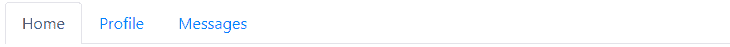

# Bootstrap 标签

> 原文：<https://www.tutorialrepublic.com/twitter-bootstrap-4-tutorial/bootstrap-tabs.php>

在本教程中，你将学习如何使用 Bootstrap 标签插件创建动态标签来切换内容。

## 使用 Bootstrap 创建选项卡

基于选项卡的导航提供了一种简单而强大的机制，通过将内容分成不同的窗格，每个窗格一次只能查看一个，来处理小区域内的大量内容。用户可以通过在窗格之间切换来快速访问内容，而无需离开页面。以下示例将向您展示如何使用 Bootstrap 选项卡组件创建基本选项卡。

#### 例子

[Try this code »](../codelab.php?topic=bootstrap-4&file=basic-tabs "Try this code using online Editor")

```html
<ul class="nav nav-tabs">
    <li class="nav-item">
        <a href="#" class="nav-link active">Home</a>
    </li>
    <li class="nav-item">
        <a href="#" class="nav-link">Profile</a>
    </li>
    <li class="nav-item">
        <a href="#" class="nav-link">Messages</a>
    </li>
</ul>
```

—以上示例的输出类似于以下内容:

[](../codelab.php?topic=bootstrap-4&file=basic-tabs) 

标签插件也适用于胶囊导航。要创建 pill nav，只需在选项卡标签中用`.nav-pills`替换类`.nav-tabs`，如下例所示:

#### 例子

[Try this code »](../codelab.php?topic=bootstrap-4&file=basic-pills "Try this code using online Editor")

```html
<ul class="nav nav-pills">
    <li class="nav-item">
        <a href="#" class="nav-link active">Home</a>
    </li>
    <li class="nav-item">
        <a href="#" class="nav-link">Profile</a>
    </li>
    <li class="nav-item">
        <a href="#" class="nav-link">Messages</a>
    </li>
</ul>
```

—上述示例的输出类似于以下内容:

[](../codelab.php?topic=bootstrap-4&file=basic-pills) 

* * *

## 通过数据属性创建动态选项卡

您无需编写任何 JavaScript 就可以激活选项卡组件——只需在每个选项卡上指定`data-toggle="tab"`,并为每个选项卡创建一个具有唯一 ID 的`.tab-pane`,然后将它们包装在`.tab-content`中。以下示例将向您展示如何通过 Bootstrap 中的数据属性创建一个基本的表格 tabs。

#### 例子

[Try this code »](../codelab.php?topic=bootstrap-4&file=create-dynamic-tabs-via-data-attribute "Try this code using online Editor")

```html
<ul class="nav nav-tabs">
    <li class="nav-item">
        <a href="#home" class="nav-link active" data-toggle="tab">Home</a>
    </li>
    <li class="nav-item">
        <a href="#profile" class="nav-link" data-toggle="tab">Profile</a>
    </li>
    <li class="nav-item">
        <a href="#messages" class="nav-link" data-toggle="tab">Messages</a>
    </li>
</ul>
<div class="tab-content">
    <div class="tab-pane fade show active" id="home">
        <p>Home tab content ...</p>
    </div>
    <div class="tab-pane fade" id="profile">
        <p>Profile tab content ...</p>
    </div>
    <div class="tab-pane fade" id="messages">
        <p>Messages tab content ...</p>
    </div>
</div>
```

* * *

## 通过 JavaScript 创建动态标签

您也可以通过 JavaScript 启用选项卡。每个选项卡都需要单独激活。

#### 例子

[Try this code »](../codelab.php?topic=bootstrap-4&file=create-dynamic-tabs-via-javascript "Try this code using online Editor")

```html
<script>
$(document).ready(function(){
    $("#myTab a").click(function(e){
        e.preventDefault();
        $(this).tab('show');
    });
});
</script>
```

您可以通过多种方式激活单个选项卡:

#### 例子

[Try this code »](../codelab.php?topic=bootstrap-4&file=activate-individual-tabs-via-javascript "Try this code using online Editor")

```html
$('#myTab a[href="#profile"]').tab('show'); // show tab targeted by the selector
$("#myTab a:first").tab('show'); // show first tab
$("#myTab a:last").tab('show'); // show last tab
$("#myTab li:eq(2) a").tab('show'); // show third tab (0-indexed, like an array)
```

* * *

## 方法

这是标准的 bootstrap 的 tab 方法:

## $().选项卡(“显示”)

激活选项卡元素和相关内容容器。选项卡应该有一个 data-target 或 href，用于定位 DOM 中的容器节点。

#### 例子

[Try this code »](../codelab.php?topic=bootstrap-4&file=tab-show-method "Try this code using online Editor")

```html
<script>
$(document).ready(function(){
    $("#myTab li:eq(1) a").tab('show');
})
</script>
```

* * *

## 事件

这些是增强选项卡功能的标准 Bootstrap 事件。

| 事件 | 描述 |
| --- | --- |
| show.bs.tab | 此事件在选项卡显示时触发，但在新选项卡显示之前。您可以使用`event.target`和`event.relatedTarget`分别定位活动标签和前一个活动标签(如果可用)。 |
| showed . bs . tab | 此事件在选项卡显示后的选项卡显示时触发。您可以使用`event.target`和`event.relatedTarget`分别定位活动标签和前一个活动标签(如果可用)。 |
| hide.bs.tab | 当要隐藏当前活动选项卡，从而显示新选项卡时，将触发此事件。您可以使用`event.target`和`event.relatedTarget`分别定位当前激活的选项卡和即将激活的新选项卡。 |
| hidden.bs.tab | 此事件在隐藏上一个活动选项卡并显示新选项卡后触发。您可以使用`event.target`和`event.relatedTarget`分别定位前一个活动标签和新的活动标签。 |

以下示例在选项卡转换完全完成时向用户显示活动选项卡和上一个选项卡的名称。

#### 例子

[Try this code »](../codelab.php?topic=bootstrap-4&file=tabs-events "Try this code using online Editor")

```html
<script>
$(document).ready(function(){
    $('a[data-toggle="tab"]').on('shown.bs.tab', function(e){
        e.target // active tab
        e.relatedTarget // previous tab
    })
});
</script>
```