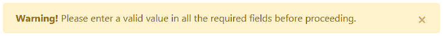
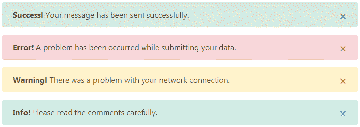
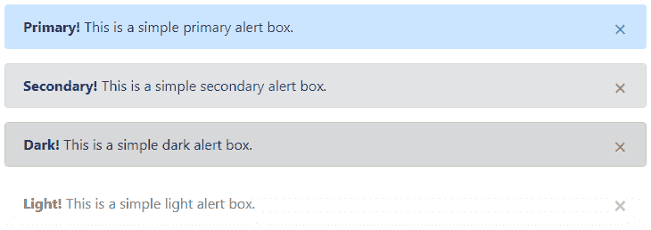
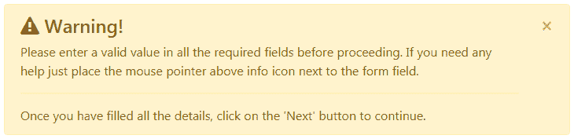
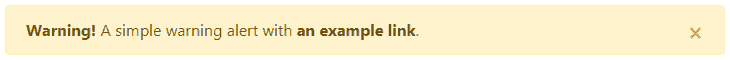

# 引导警报

> 原文：<https://www.tutorialrepublic.com/twitter-bootstrap-4-tutorial/bootstrap-alerts.php>

在本教程中，您将学习如何使用 Bootstrap 创建警报消息。

## 使用引导创建警报消息

警告框经常用于突出需要终端用户立即注意的信息，例如警告、错误或确认消息。

使用 Bootstrap，您可以轻松地为各种用途创建优雅的警告消息框。您还可以添加一个可选的关闭按钮来消除任何警报。

您可以通过将上下文类`.alert-warning`添加到`.alert`基类来创建一个简单的引导警告消息框，如下例所示:

#### 例子

[Try this code »](../codelab.php?topic=bootstrap-4&file=alert-box "Try this code using online Editor")

```
<div class="alert alert-warning alert-dismissible fade show">
    <strong>Warning!</strong> Please enter a valid value in all the required fields before proceeding.
    <button type="button" class="close" data-dismiss="alert">&times;</button>
</div>
```

—以上示例的输出类似于以下内容:

[](../codelab.php?topic=bootstrap-4&file=alert-box)  ***提示:**`.alert`元素上的`.fade`和`.show`类在关闭警告框时启用渐变过渡效果。如果你不想动画只是删除这些类。此外，`.alert`元件上需要类别`.alert-dismissible`用于`.close`按钮的正确定位。如果您的提醒没有关闭按钮，您可以跳过此课程。*  *Bootstrap 4 总共提供了 8 种不同类型的警报。以下示例将向您展示最常用的警报，它们是:成功、错误或危险、警告和信息警报。

#### 例子

[Try this code »](../codelab.php?topic=bootstrap-4&file=common-alert-messages "Try this code using online Editor")

```
<!-- Success Alert -->
<div class="alert alert-success alert-dismissible fade show">
    <strong>Success!</strong> Your message has been sent successfully.
    <button type="button" class="close" data-dismiss="alert">&times;</button>
</div>
<!-- Error Alert -->
<div class="alert alert-danger alert-dismissible fade show">
    <strong>Error!</strong> A problem has been occurred while submitting your data.
    <button type="button" class="close" data-dismiss="alert">&times;</button>
</div>
<!-- Warning Alert -->
<div class="alert alert-warning alert-dismissible fade show">
    <strong>Warning!</strong> There was a problem with your network connection.
    <button type="button" class="close" data-dismiss="alert">&times;</button>
</div>
<!-- Info Alert -->
<div class="alert alert-info alert-dismissible fade show">
    <strong>Info!</strong> Please read the comments carefully.
    <button type="button" class="close" data-dismiss="alert">&times;</button>
</div>
```

—以上示例的输出类似于以下内容:

[](../codelab.php?topic=bootstrap-4&file=common-alert-messages) 

以下是 Bootstrap 4 中引入的新警报，可用于各种目的。

#### 例子

[Try this code »](../codelab.php?topic=bootstrap-4&file=new-alert-boxes "Try this code using online Editor")

```
<!-- Primary Alert -->
<div class="alert alert-primary alert-dismissible fade show">
    <strong>Primary!</strong> This is a simple primary alert box.
    <button type="button" class="close" data-dismiss="alert">&times;</button>
</div>
<!-- Secondary Alert -->
<div class="alert alert-secondary alert-dismissible fade show">
    <strong>Secondary!</strong> This is a simple secondary alert box.
    <button type="button" class="close" data-dismiss="alert">&times;</button>
</div>
<!-- Dark Alert -->
<div class="alert alert-dark alert-dismissible fade show">
    <strong>Dark!</strong> This is a simple dark alert box.
    <button type="button" class="close" data-dismiss="alert">&times;</button>
</div>
<!-- Light Alert -->
<div class="alert alert-light alert-dismissible fade show">
    <strong>Light!</strong> This is a simple light alert box.
    <button type="button" class="close" data-dismiss="alert">&times;</button>
</div>
```

—上述示例的输出类似于以下内容:

[](../codelab.php?topic=bootstrap-4&file=new-alert-boxes) 

* * *

## 警报中的附加内容

您还可以在警报中放置额外的 HTML 元素，如标题、段落和分隔线。要管理元素之间的间距，您可以使用边距实用程序类，如下所示:

#### 例子

[Try this code »](../codelab.php?topic=bootstrap-4&file=alert-with-additional-content "Try this code using online Editor")

```
<div class="alert alert-warning alert-dismissible fade show">
    <h4 class="alert-heading"><i class="fa fa-warning"></i> Warning!</h4>
    <p>Please enter a valid value in all the required fields before proceeding. If you need any help just place the mouse pointer above info icon next to the form field.</p>
    <hr>
    <p class="mb-0">Once you have filled all the details, click on the 'Next' button to continue.</p>
    <button type="button" class="close" data-dismiss="alert">&times;</button>
</div>
```

—以上示例的输出类似于以下内容:

[](../codelab.php?topic=bootstrap-4&file=alert-with-additional-content) 

* * *

## 匹配通知中的链接颜色

将实用程序类`.alert-link`应用于任何警告框内的链接，以快速创建匹配的彩色链接，如下例所示:

#### 例子

[Try this code »](../codelab.php?topic=bootstrap-4&file=alert-links "Try this code using online Editor")

```
<div class="alert alert-warning alert-dismissible fade show">
    <strong>Warning!</strong> A simple warning alert with <a href="#" class="alert-link">an example link</a>.
    <button type="button" class="close" data-dismiss="alert">&times;</button>
</div>
```

—以上示例的输出类似于以下内容:

[](../codelab.php?topic=bootstrap-4&file=alert-links) 

同样，您可以匹配其他警告框中的链接，如下例所示:

#### 例子

[Try this code »](../codelab.php?topic=bootstrap-4&file=matching-links-inside-different-alerts "Try this code using online Editor") *```
<!-- Success Alert -->
<div class="alert alert-success alert-dismissible fade show">
    <strong>Success!</strong> A simple success alert with <a href="#" class="alert-link">an example link</a>.
    <button type="button" class="close" data-dismiss="alert">&times;</button>
</div>
<!-- Error Alert -->
<div class="alert alert-danger alert-dismissible fade show">
    <strong>Error!</strong> A simple danger alert with <a href="#" class="alert-link">an example link</a>.
    <button type="button" class="close" data-dismiss="alert">&times;</button>
</div>
<!-- Warning Alert -->
<div class="alert alert-warning alert-dismissible fade show">
    <strong>Warning!</strong> A simple warning alert with <a href="#" class="alert-link">an example link</a>.
    <button type="button" class="close" data-dismiss="alert">&times;</button>
</div>
<!-- Info Alert -->
<div class="alert alert-info alert-dismissible fade show">
    <strong>Info!</strong> A simple info alert with <a href="#" class="alert-link">an example link</a>.
    <button type="button" class="close" data-dismiss="alert">&times;</button>
</div>
<!-- Primary Alert -->
<div class="alert alert-primary alert-dismissible fade show">
    <strong>Primary!</strong> A simple primary alert with <a href="#" class="alert-link">an example link</a>.
    <button type="button" class="close" data-dismiss="alert">&times;</button>
</div>
<!-- Secondary Alert -->
<div class="alert alert-secondary alert-dismissible fade show">
    <strong>Secondary!</strong> A simple secondary alert with <a href="#" class="alert-link">an example link</a>.
    <button type="button" class="close" data-dismiss="alert">&times;</button>
</div>
<!-- Dark Alert -->
<div class="alert alert-dark alert-dismissible fade show">
    <strong>Dark!</strong> A simple dark alert with <a href="#" class="alert-link">an example link</a>.
    <button type="button" class="close" data-dismiss="alert">&times;</button>
</div>
<!-- Light Alert -->
<div class="alert alert-light alert-dismissible fade show">
    <strong>Light!</strong> A simple light alert with <a href="#" class="alert-link">an example link</a>.
    <button type="button" class="close" data-dismiss="alert">&times;</button>
</div>
```*  ** * *

## 通过数据属性关闭警报

数据属性提供了一种简单易行的方法来为警告框添加关闭功能。只需将`data-dismiss="alert"`添加到关闭按钮，它将自动启用包含警告消息框的解除。此外，将类`.alert-dismissible`添加到`.alert`元素中，以便正确定位`.close`按钮。这里有一个例子:

#### 例子

[Try this code »](../codelab.php?topic=bootstrap-4&file=dismissal-of-alert-message-via-data-attribute "Try this code using online Editor")

```
<div class="alert alert-info alert-dismissible fade show">
    <strong>Note!</strong> This is a simple example of dismissible alert.
    <button type="button" class="close" data-dismiss="alert">&times;</button>
</div>
```

使用 [`<button>`](/html-reference/html-button-tag.php) 元素创建关闭按钮，以便在所有设备上正常运行。

* * *

## 通过 JavaScript 关闭提醒

您还可以通过 JavaScript 启用警报解除。

#### 例子

[Try this code »](../codelab.php?topic=bootstrap-4&file=dismissal-of-alert-message-via-javascript "Try this code using online Editor")

```
<script>
$(document).ready(function(){
    $(".close").click(function(){
        $("#myAlert").alert('close');
    });
});  
</script>
```

* * *

## 方法

以下是标准的引导数据库警报方法:

## $().警报()

该方法让警报监听具有`data-dismiss="alert"`属性的后代元素上的点击事件。使用 data-api 的自动初始化时不需要。

#### 例子

[Try this code »](../codelab.php?topic=bootstrap-4&file=alert-method "Try this code using online Editor")

```
<script>
$(document).ready(function(){
    $(".alert").alert();
});  
</script>
```

## $().警报(“关闭”)

该方法通过从 DOM 中移除警报来关闭警报。

#### 例子

[Try this code »](../codelab.php?topic=bootstrap-4&file=alert-close-method "Try this code using online Editor")

```
<script>
$(document).ready(function(){
    $(".close").click(function(){
        $("#myAlert").alert('close');
    });
}); 
</script>
```

* * *

## 事件

Bootstrap 的 alert 类包括几个用于挂钩警报功能的事件。

| 事件 | 描述 |
| --- | --- |
| 关闭. bs.alert | 调用 close 实例方法时，此事件会立即激发。 |
| 关闭. bs.alert | 当警报消息框关闭时，将激发此事件。它将等到 CSS 转换过程完全完成后才会被触发。 |

下面的示例在警报消息框的淡出过渡完全完成时向用户显示一条警报消息。

#### 例子

[Try this code »](../codelab.php?topic=bootstrap-4&file=alert-events "Try this code using online Editor")

```
<script>
$(document).ready(function(){
    $("#myAlert").on('closed.bs.alert', function(){
        alert("Alert message box has been closed.");
    });
});
</script>
```**