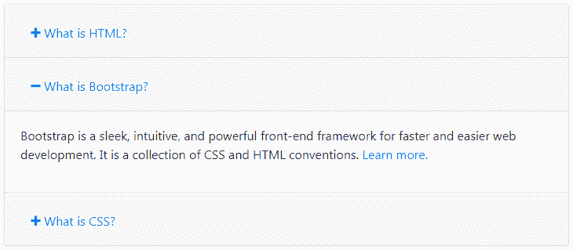

# 自举手风琴

> 原文：<https://www.tutorialrepublic.com/twitter-bootstrap-4-tutorial/bootstrap-accordion.php>

在本教程中，你将学习如何用 Bootstrap 创建手风琴。

## 使用 Bootstrap 创建折叠式小部件

网站上广泛使用折叠菜单和窗口小部件来管理大量的内容和导航列表。使用 Bootstrap collapse 插件，您可以创建手风琴或简单的可折叠面板，而无需编写任何 JavaScript 代码。

以下示例将向您展示如何使用 Bootstrap 可折叠插件和 panel 组件构建一个简单的 accordion 小部件。

#### 例子

[Try this code »](../codelab.php?topic=bootstrap-4&file=accordion "Try this code using online Editor") *```
<div class="accordion" id="myAccordion">
    <div class="card">
        <div class="card-header" id="headingOne">
            <h2 class="mb-0">
                <button type="button" class="btn btn-link" data-toggle="collapse" data-target="#collapseOne">1\. What is HTML?</button>
            </h2>
        </div>
        <div id="collapseOne" class="collapse" aria-labelledby="headingOne" data-parent="#myAccordion">
            <div class="card-body">
                <p>HTML stands for HyperText Markup Language. HTML is the standard markup language for describing the structure of web pages. <a href="https://www.tutorialrepublic.com/html-tutorial/" target="_blank">Learn more.</a></p>
            </div>
        </div>
    </div>
    <div class="card">
        <div class="card-header" id="headingTwo">
            <h2 class="mb-0">
                <button type="button" class="btn btn-link collapsed" data-toggle="collapse" data-target="#collapseTwo">2\. What is Bootstrap?</button>
            </h2>
        </div>
        <div id="collapseTwo" class="collapse show" aria-labelledby="headingTwo" data-parent="#myAccordion">
            <div class="card-body">
                <p>Bootstrap is a sleek, intuitive, and powerful front-end framework for faster and easier web development. It is a collection of CSS and HTML conventions. <a href="https://www.tutorialrepublic.com/twitter-bootstrap-tutorial/" target="_blank">Learn more.</a></p>
            </div>
        </div>
    </div>
    <div class="card">
        <div class="card-header" id="headingThree">
            <h2 class="mb-0">
                <button type="button" class="btn btn-link collapsed" data-toggle="collapse" data-target="#collapseThree">3\. What is CSS?</button>
            </h2>
        </div>
        <div id="collapseThree" class="collapse" aria-labelledby="headingThree" data-parent="#myAccordion">
            <div class="card-body">
                <p>CSS stands for Cascading Style Sheet. CSS allows you to specify various style properties for a given HTML element such as colors, backgrounds, fonts etc. <a href="https://www.tutorialrepublic.com/css-tutorial/" target="_blank">Learn more.</a></p>
            </div>
        </div>
    </div>
</div>
```*  *—上述示例的输出类似于以下内容:

[](../codelab.php?topic=bootstrap-4&file=accordion) 

* * *

## 带加减图标的自举手风琴

您还可以向 Bootstrap accordion 小部件添加加号或减号图标，用几行 jQuery 代码使它在视觉上更有吸引力，如下所示:

#### 例子

[Try this code »](../codelab.php?topic=bootstrap-4&file=accordion-with-plus-minus-icon "Try this code using online Editor")

```
<script>
$(document).ready(function(){
    // Add minus icon for collapse element which is open by default
    $(".collapse.show").each(function(){
        $(this).prev(".card-header").find(".fa").addClass("fa-minus").removeClass("fa-plus");
    });

    // Toggle plus minus icon on show hide of collapse element
    $(".collapse").on('show.bs.collapse', function(){
        $(this).prev(".card-header").find(".fa").removeClass("fa-plus").addClass("fa-minus");
    }).on('hide.bs.collapse', function(){
        $(this).prev(".card-header").find(".fa").removeClass("fa-minus").addClass("fa-plus");
    });
});
</script>
```

—上述示例的输出类似于以下内容:

[](../codelab.php?topic=bootstrap-4&file=accordion-with-plus-minus-icon) 

类似地，您可以利用 jQuery 和 CSS 转换效果向手风琴添加箭头图标。

上例中的`show.bs.collapse`和`hide.bs.collapse`是[崩溃事件](#collapse-events)，你将在本章稍后了解这些事件。

* * *

## 通过数据属性展开和折叠元素

您可以使用引导折叠功能，通过数据属性展开和折叠任何特定元素，而无需使用折叠标记。

#### 例子

[Try this code »](../codelab.php?topic=bootstrap-4&file=creating-collapsible-element-via-data-attributes "Try this code using online Editor")

```
<!-- Trigger Button HTML -->
<input type="button" class="btn btn-primary" data-toggle="collapse" data-target="#toggleDemo" value="Toggle Button">

<!-- Collapsible Element HTML -->
<div id="toggleDemo" class="collapse show"><p>This is a simple example of expanding and collapsing individual element via data attribute. Click on the <b>Toggle Button</b> button to see the effect.</p></div>
```

我们刚刚创建了一个可折叠的控件，没有编写任何 JavaScript 代码。好吧，为了更好地理解，让我们一个接一个地浏览这段代码的每一部分。

## 代码解释

Bootstrap collapse 插件基本上需要两个元素才能正常工作——控制器元素(如按钮或超链接，单击它可以折叠另一个元素)和可折叠元素本身。

*   将`data-toggle="collapse"`属性(*第 2 行*)与属性`data-target`(用于按钮)或 href(用于锚点)一起添加到控制器元素中，以自动分配对可折叠元素的控制。
*   `data-target`或`href`属性接受一个 [CSS 选择器](../css-tutorial/css-selectors.php)来将折叠应用到特定的元素。确保将类`.collapse`添加到可折叠元素中。
*   除了类`.collapse`之外，您还可以选择性地将类`.show` ( *第 5 行*)添加到可折叠元素中，使其默认打开。

要使可折叠控件像手风琴菜单一样成组工作，您可以利用前面示例中演示的[引导面板组件](bootstrap-panels.php)。

* * *

## 通过 JavaScript 展开和折叠元素

您也可以通过 JavaScript 手动展开和折叠单个元素——只需在 JavaScript 代码中使用可折叠元素的`id`或`class` [选择器](../css-tutorial/css-selectors.php)调用`collapse()` Bootstrap 方法。

#### 例子

[Try this code »](../codelab.php?topic=bootstrap-4&file=creating-collapsible-element-via-javascript "Try this code using online Editor")

```
<!-- JavaScript to Expand and Collapse Element -->
<script>
$(document).ready(function(){
    $(".btn").click(function(){
        $("#toggleDemo").collapse('toggle');
    });
});
</script>

<!-- Trigger Button HTML -->
<input type="button" class="btn btn-primary" value="Toggle Button">

<!-- Collapsible Element HTML -->
<div id="toggleDemo" class="collapse show"><p>This is a simple example of expanding and collapsing individual element via JavaScript. Click on the <b>Simple Collapsible</b> button to see the effect.</p></div>
```

* * *

## 选择

有一些选项可以传递给`collapse()` Bootstrap 方法来定制可折叠元素的功能。

| 

```
Name      
```

 | 

```
Type         
```

 | 缺省值 | 描述 |
| --- | --- | --- | --- |
| 父母 | 选择器 | 错误的 | 当调用时显示此可折叠项目时，指定父级下的所有其他可折叠元素都将关闭。 |
| 触发器 | 布尔型 | 真实的 | 在调用时切换可折叠元素。 |

您也可以使用 accordion 上的数据属性来设置这些选项——只需将选项名称附加到`data-`上，如`data-parent="#myAccordion"`、`data-toggle="false"`等。如基本实现中所示。

* * *

## 方法

以下是标准的 bootstrap 折叠方法:

## 。折叠(选项)

该方法将内容激活为可折叠元素。

#### 例子

[Try this code »](../codelab.php?topic=bootstrap-4&file=collapse-methods "Try this code using online Editor")

```
<script>
$(document).ready(function(){
    $(".btn").click(function(){
        $("#myCollapsible").collapse({
            toggle: false
        });
    });
});
</script>
```

## 。折叠(“切换”)

此方法切换(显示或隐藏)可折叠元素。

#### 例子

[Try this code »](../codelab.php?topic=bootstrap-4&file=collapse-methods "Try this code using online Editor")

```
<script>
$(document).ready(function(){
    $(".toggle-btn").click(function(){
        $("#myCollapsible").collapse('toggle');
    });
});
</script>
```

## 。折叠(“显示”)

此方法显示一个可折叠的元素。

#### 例子

[Try this code »](../codelab.php?topic=bootstrap-4&file=collapse-methods "Try this code using online Editor")

```
<script>
$(document).ready(function(){
    $(".show-btn").click(function(){
        $("#myCollapsible").collapse('show');
    });
});
</script>
```

## 。折叠(“隐藏”)

此方法隐藏一个可折叠的元素。

#### 例子

[Try this code »](../codelab.php?topic=bootstrap-4&file=collapse-methods "Try this code using online Editor")

```
<script>
$(document).ready(function(){
    $(".hide-btn").click(function(){
        $("#myCollapsible").collapse('hide');
    });
});
</script>
```

* * *

## 事件

Bootstrap 的 collapse 类包含一些用于挂钩折叠功能的事件。

| 事件 | 描述 |
| --- | --- |
| show.bs .折叠 | 当调用 show instance 方法时，此事件将立即激发。 |
| 显示. bs .折叠 | 当折叠元素对用户可见时，将触发此事件。它将等到 CSS 转换过程完全完成后才会被触发。 |
| 隐藏. bs .折叠 | 当 hide 方法被调用时，此事件立即被激发。 |
| 隐藏. bs .折叠 | 当折叠元素对用户隐藏时，将触发此事件。它将等到 CSS 转换过程完全完成后才会被触发。 |

下面的示例在可折叠元素的滑动转换完全完成时向用户显示一条警告消息。

#### 例子

[Try this code »](../codelab.php?topic=bootstrap-4&file=collapse-events "Try this code using online Editor")

```
<script>
$(document).ready(function(){
    $("#myCollapsible").on('hidden.bs.collapse', function(){
        alert("Collapsible element has been completely closed.");
    });
});
</script>
```*