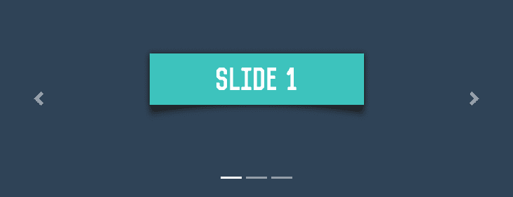

# Bootstrap转盘

> 原文：<https://www.tutorialrepublic.com/twitter-bootstrap-4-tutorial/bootstrap-carousel.php>

在本教程中，你将学习如何创建Bootstrap转盘。

## 使用Bootstrap程序创建旋转木马

旋转木马也称为幻灯片或图像滑块，是在网页的小空间内展示大量内容的最佳方式。它是内容的动态呈现，通过在几个项目之间循环，文本和图像对用户是可见的或可访问的。

下面的例子将向你展示如何使用 Bootstrap carousel 插件构建一个简单的 carousel，比如图像旋转器或幻灯片。

#### 例子

[Try this code »](../codelab.php?topic=bootstrap-4&file=carousel "Try this code using online Editor")

```
<div id="myCarousel" class="carousel slide" data-ride="carousel">
    <!-- Carousel indicators -->
    <ol class="carousel-indicators">
        <li data-target="#myCarousel" data-slide-to="0" class="active"></li>
        <li data-target="#myCarousel" data-slide-to="1"></li>
        <li data-target="#myCarousel" data-slide-to="2"></li>
    </ol>
    <!-- Wrapper for carousel items -->
    <div class="carousel-inner">
        <div class="carousel-item active">
            
        </div>
        <div class="carousel-item">
            
        </div>
        <div class="carousel-item">
            
        </div>
    </div>
    <!-- Carousel controls -->
    <a class="carousel-control-prev" href="#myCarousel" data-slide="prev">
        <span class="carousel-control-prev-icon"></span>
    </a>
    <a class="carousel-control-next" href="#myCarousel" data-slide="next">
        <span class="carousel-control-next-icon"></span>
    </a>
</div>
```

—以上示例的输出类似于以下内容:

[](../codelab.php?topic=bootstrap-4&file=carousel) 

查看片段部分，了解一些设计精美的Bootstrap传送带的例子。

您还可以在转盘的各个幻灯片上添加标题或描述文本，请查看下一个示例。

* * *

## 通过数据属性激活转盘

使用 Bootstrap，您可以通过数据属性非常容易地创建旋转木马，而无需编写一行 JavaScript 代码。让我们看一下下面的例子:

#### 例子

[Try this code »](../codelab.php?topic=bootstrap-4&file=activate-carousel-via-data-attributes "Try this code using online Editor")

```
<div id="myCarousel" class="carousel slide" data-interval="3000" data-ride="carousel">
    <!-- Carousel indicators -->
    <ol class="carousel-indicators">
        <li data-target="#myCarousel" data-slide-to="0" class="active"></li>
        <li data-target="#myCarousel" data-slide-to="1"></li>
        <li data-target="#myCarousel" data-slide-to="2"></li>
    </ol>
    <!-- Wrapper for carousel items -->
    <div class="carousel-inner">
        <div class="carousel-item active">
            
            <div class="carousel-caption d-none d-md-block">
                <h5>First slide label</h5>
                <p>Lorem ipsum dolor sit amet, consectetur adipiscing elit.</p>
            </div>
        </div>
        <div class="carousel-item">
            
            <div class="carousel-caption d-none d-md-block">
                <h5>Second slide label</h5>
                <p>Nulla vitae elit libero, a pharetra augue mollis interdum.</p>
            </div>
        </div>
        <div class="carousel-item">
            
            <div class="carousel-caption d-none d-md-block">
                <h5>First slide label</h5>
                <p>Praesent commodo cursus magna, vel scelerisque nisl consectetur.</p>
            </div>
        </div>
    </div>
    <!-- Carousel controls -->
    <a class="carousel-control-prev" href="#myCarousel" data-slide="prev">
        <span class="carousel-control-prev-icon"></span>
    </a>
    <a class="carousel-control-next" href="#myCarousel" data-slide="next">
        <span class="carousel-control-next-icon"></span>
    </a>
</div>
```

您可能想知道这段代码是关于什么的。好了，为了更好地理解，让我们一个接一个地浏览这个旋转木马代码的每一部分。

## 代码解释

Bootstrap转盘基本上有三个组件——转盘指示器(*小圆圈*)、转盘控件(*上一个和下一个箭头*)以及转盘项目或载玻片。

*   每个传送带的最外层容器需要一个唯一的`id`(在我们的例子中为`id="myCarousel"`)，以便传送带指示器(*线 no-4，5，6* )和传送带控制器(*线 no-33，36* )能够正确定位。
*   `.carousel`元素的`data-ride="carousel"`属性告诉Bootstrap程序在页面加载时立即开始动画旋转木马。而`data-interval`属性指定两张幻灯片之间的时间延迟。
*   点击特定的转盘指示器时，`.data-slide-to`属性(*第 4、5、6 行*)将滑动位置移动到特定项目(从 0 开始的索引)。
*   幻灯片在`.carousel-inner` ( *第 9 行*)中指定，每个幻灯片的内容在`.carousel-item`元素中定义，可以是文本和图像。
*   转盘控件(*第 33、36 行*)上的`data-slide`属性接受关键字`prev`或`next`，这将改变载玻片相对于其当前位置的位置。

其余的事情是不言自明的，比如`.carousel`元素指定了Bootstrap转盘，`.carousel-indicators`元素指示转盘中有多少张幻灯片以及哪张幻灯片当前是活动的，`.carousel-item`元素中使用的`.carousel-caption`元素定义了该幻灯片的标题等。

 ***提示:**需要将类`.active`添加到其中一个幻灯片上(即在`.carousel-item`元素上)。否则，传送带将不可见。*  ****注意:**`.carousel`元素上的`.slide`类将 CSS 幻灯片过渡动画添加到轮播中，使轮播项目在显示新项目时滑动。*  ** * *

## 通过 JavaScript 激活转盘

您也可以使用 JavaScript 手动激活 carousel 只需在 JavaScript 代码中使用包装器元素的`id`或`class`选择器调用`carousel()`方法。

#### 例子

[Try this code »](../codelab.php?topic=bootstrap-4&file=activate-carousel-via-javascript "Try this code using online Editor")

```
<script>
$(document).ready(function(){
        $("#myCarousel").carousel();
});
</script>
```

* * *

## 选择

有一些选项可以传递给`carousel()` Bootstrap 方法来定制转盘的功能。选项可以通过数据属性或 JavaScript 传递。

通过数据属性设置模态选项，只需在`data-`后面加上选项名称，如`data-interval="3000"`、`data-pause="hover"`等。

| 名字 | 类型 | 缺省值 | 描述 |
| --- | --- | --- | --- |
| 间隔 | 数字 | Five thousand | 指定自动循环中一张幻灯片到另一张幻灯片之间的延迟时间(以毫秒为单位)。如果`false`，转盘不会自动循环。 |
| 中止 | 字符串
为空 | “盘旋” | 默认情况下，当鼠标指针进入转盘时暂停转盘的循环，当鼠标指针离开转盘时继续循环。如果设置为`null`，悬停在转盘上不会暂停。 |
| 包 | 布尔型 | 真实的 | 指定转盘应该连续循环还是硬停(即停在最后一张幻灯片)。 |
| 键盘 | 布尔型 | 真实的 | 指定转盘是否应对键盘事件做出反应。默认情况下是`true`,这意味着如果 carousel 有焦点，您可以使用键盘上的左右箭头键转到它的上一张和下一张幻灯片。 |
| 骑行 | 线 | 错误的 | 用户手动循环第一个项目后，自动播放转盘。如果是“转盘”，加载时自动播放转盘。 |
| 触控 | 布尔型 | 真实的 | 指定转盘是否应支持触摸屏设备上的左/右滑动交互。 |

数据属性为设置轮播选项提供了一种简单的方法，但是 JavaScript 是更好的方法，因为它可以避免重复的工作。参见下一节中的 [`.carousel(options)`](#carousel-options) 方法，了解如何使用 JavaScript 设置传送带的选项。

* * *

## 禁用Bootstrap转盘中的自动滑动

默认情况下，Bootstrap转盘在页面加载时自动开始播放或滑动。但是，您可以通过设置 carousel `interval`选项来关闭这种自动滑动，方法是在`.carousel`元素上设置类似`data-interval="false"`的数据属性，或者通过 JavaScript 使用 [`.carousel(options)`](#carousel-options) ，如下例所示:

#### 例子

[Try this code »](../codelab.php?topic=bootstrap-4&file=remove-auto-slide-from-carousel "Try this code using online Editor")

```
<script>
$(document).ready(function(){
    $("#myCarousel").carousel({
        interval : false
    });
});
</script>
```

* * *

## 方法

这些是标准的 bootstrap 的旋转木马方法:

## 。旋转木马(选项)

这个方法用可选的选项初始化传送带，并开始在项目间循环。

#### 例子

[Try this code »](../codelab.php?topic=bootstrap-4&file=carousel-methods "Try this code using online Editor")

```
<script>
$(document).ready(function(){
    $("#myCarousel").carousel({
        interval : 3000
    });
});
</script>
```

## 。旋转木马(“循环”)

此方法启动 carousel，从左到右循环显示项目。

#### 例子

[Try this code »](../codelab.php?topic=bootstrap-4&file=carousel-methods "Try this code using online Editor")

```
<script>
$(document).ready(function(){
    $(".start-slide").click(function(){
        $("#myCarousel").carousel('cycle');
    });
});
</script>
```

## 。旋转木马(“暂停”)

该方法阻止传送带在项目间循环。

#### 例子

[Try this code »](../codelab.php?topic=bootstrap-4&file=carousel-methods "Try this code using online Editor")

```
<script>
$(document).ready(function(){
    $(".pause-slide").click(function(){
        $("#myCarousel").carousel('pause');
    });
});
</script>
```

## 。旋转木马(编号)

该方法将轮播循环到特定的帧(从 0 开始，类似于数组)。

#### 例子

[Try this code »](../codelab.php?topic=bootstrap-4&file=carousel-methods "Try this code using online Editor")

```
<script>
$(document).ready(function(){
    $(".slide-three").click(function(){
        $("#myCarousel").carousel(3);
    });
});
</script>
```

## 。旋转木马('上一个')

该方法使传送带循环到前一项。

#### 例子

[Try this code »](../codelab.php?topic=bootstrap-4&file=carousel-methods "Try this code using online Editor")

```
<script>
$(document).ready(function(){
    $(".prev-slide").click(function(){
        $("#myCarousel").carousel('prev');
    });
});
</script>
```

## 。旋转木马(“下一个”)

该方法使传送带循环到下一个项目。

#### 例子

[Try this code »](../codelab.php?topic=bootstrap-4&file=carousel-methods "Try this code using online Editor")

```
<script>
$(document).ready(function(){
    $(".next-slide").click(function(){
        $("#myCarousel").carousel('next');
    });
});
</script>
```

* * *

## 事件

Bootstrap 的 carousel 类包含一些用于挂钩 carousel 功能的事件。

| 事件 | 描述 |
| --- | --- |
| slide.bs.carousel | 当调用 slide 实例方法时，该事件立即触发。 |
| slid.bs .旋转木马 | 当旋转木马完成其幻灯片转换时，将触发此事件。 |

下面的示例在圆盘传送带项目的滑动过渡完全完成时向用户显示一条警告消息。

#### 例子

[Try this code »](../codelab.php?topic=bootstrap-4&file=carousel-events "Try this code using online Editor")

```
<script>
$(document).ready(function(){
    $('#myCarousel').on('slid.bs.carousel', function(){
        alert("The sliding transition of previous carousel item has been fully completed.");
    }); 
});
</script>
```**