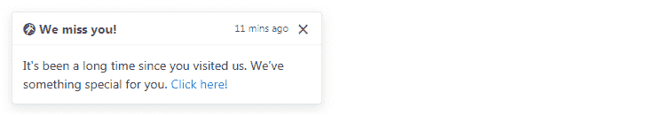
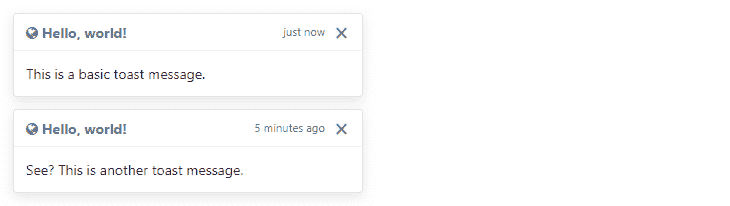
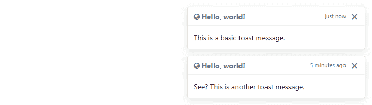

# 自助祝酒

> 原文：<https://www.tutorialrepublic.com/twitter-bootstrap-4-tutorial/bootstrap-toasts.php>

在本教程中，您将学习如何使用 Bootstrap toast 组件。

## 用 Bootstrap 创建祝酒词

toast 组件是 Bootstrap 4 中新引入的。它们是轻量级通知，类似于在计算机屏幕上由 web 浏览器显示的推送通知。它们由 flexbox 构建，因此您可以轻松地在网页上对齐和定位它们。

此外，由于性能原因，比如工具提示，toasts 是可选的，所以您必须自己用`toast()`方法初始化它们。此外，如果不指定`autohide: false`，祝酒词将在 500 毫秒(0.5 秒)后自动隐藏。现在让我们看看如何制作祝酒词。

### 步骤 1:添加 Toast 标记

祝酒词的标记非常简单。下面的例子将展示如何创建一个包含标题、正文和关闭按钮的 toast 组件。

#### 例子

[Try this code »](../codelab.php?topic=bootstrap-4&file=toast "Try this code using online Editor")

```
<div class="toast" id="myToast">
    <div class="toast-header">
        <strong class="mr-auto"><i class="fa fa-grav"></i> We miss you!</strong>
        <small>11 mins ago</small>
        <button type="button" class="ml-2 mb-1 close" data-dismiss="toast">&times;</button>
    </div>
    <div class="toast-body">
        It's been a long time since you visited us. We've something special for you. <a href="#">Click here!</a>
    </div>
</div>
```

### 第二步:敬酒

祝酒词可以通过 JavaScript 触发——只需用 JavaScript 代码中目标元素的`id`、`class`或任何 [CSS 选择器](../css-tutorial/css-selectors.php)调用`toast()` Bootstrap 方法。

#### 例子

[Try this code »](../codelab.php?topic=bootstrap-4&file=toast "Try this code using online Editor")

```
<script>
$(document).ready(function(){
    $("#myToast").toast('show');
});
</script>
```

—以上示例的输出类似于以下内容:

[](../codelab.php?topic=bootstrap-4&file=toast) 

* * *

## 垂直堆放祝酒

多个祝酒词以可读的方式自动垂直堆叠。这里有一个例子:

#### 例子

[Try this code »](../codelab.php?topic=bootstrap-4&file=vertically-stacked-toasts "Try this code using online Editor") *```
<div class="toast fade show">
    <div class="toast-header">
        <strong class="mr-auto"><i class="fa fa-globe"></i> Hello, world!</strong>
        <small class="text-muted">just now</small>
        <button type="button" class="ml-2 mb-1 close" data-dismiss="toast">&times;</button>
    </div>
    <div class="toast-body">
        This is a basic toast message.
    </div>
</div>

<div class="toast fade show">
    <div class="toast-header">
        <strong class="mr-auto"><i class="fa fa-globe"></i> Hello, world!</strong>
        <small class="text-muted">5 minutes ago</small>
        <button type="button" class="ml-2 mb-1 close" data-dismiss="toast">&times;</button>
    </div>
    <div class="toast-body">
        See? This is another toast message.
    </div>
</div>
```*  *—上述示例的输出类似于以下内容:

[](../codelab.php?topic=bootstrap-4&file=vertically-stacked-toasts) 

* * *

## 敬酒的位置

你可以使用自定义 CSS 在网页上的任何地方放置祝酒词。但是，建议通知位于右上角或中上方。此外，如果你想一次只显示一个 toast，将定位样式内联，即直接放在`.toast`元素上。

#### 例子

[Try this code »](../codelab.php?topic=bootstrap-4&file=toasts-placement "Try this code using online Editor") *```
<!-- Wrapping element -->
<div style="position: relative; min-height: 300px;">
    <!-- Position toasts -->
    <div style="position: absolute; top: 0; right: 0;">
        <div class="toast fade show">
            <div class="toast-header">
                <strong class="mr-auto"><i class="fa fa-globe"></i> Hello, world!</strong>
                <small class="text-muted">just now</small>
                <button type="button" class="ml-2 mb-1 close" data-dismiss="toast">&times;</button>
            </div>
            <div class="toast-body">
                This is a basic toast message.
            </div>
        </div>

        <div class="toast fade show">
            <div class="toast-header">
                <strong class="mr-auto"><i class="fa fa-globe"></i> Hello, world!</strong>
                <small class="text-muted">5 minutes ago</small>
                <button type="button" class="ml-2 mb-1 close" data-dismiss="toast">&times;</button>
            </div>
            <div class="toast-body">
                See? This is another toast message.
            </div>
        </div>
    </div>    
</div>
```*  *—以上示例的输出类似于以下内容:

[](../codelab.php?topic=bootstrap-4&file=toasts-placement) 

* * *

## 选择

有一些选项可以传递给`toast()` Bootstrap 方法来定制 toast 的功能。选项可以通过数据属性或 JavaScript 传递。

通过数据属性设置 toast 选项，只需在`data-`后面加上选项名称，如`data-autohide="false"`、`data-delay="3000"`等。

| 名字 | 类型 | 缺省值 | 描述 |
| --- | --- | --- | --- |
| 动画 | 布尔型 | 真实的 | 对吐司应用 CSS 淡入淡出过渡。 |
| 自动隐藏 | 布尔型 | 真实的 | 自动隐藏吐司。 |
| 耽搁 | 数字 | Five hundred | 延迟隐藏 toast(毫秒)。 |

数据属性为设置 toast 选项提供了一种简单的方法，但是 JavaScript 是更好的方法，因为它可以避免重复的工作。参见下一节中的 [`.toast(options)`](#toast-options) 方法，了解如何使用 JavaScript 设置祝酒词选项。

在下面的例子中，我们使用数据属性(*第 1 行*)将`autohide`选项设置为`false`，这可以防止 toast 自动关闭。

#### 例子

[Try this code »](../codelab.php?topic=bootstrap-4&file=stop-hiding-toast-automatically "Try this code using online Editor")

```
<div class="toast" data-autohide="false">
    <div class="toast-header">
        <strong class="mr-auto"><i class="fa fa-grav"></i> We miss you!</strong>
        <small>11 mins ago</small>
        <button type="button" class="ml-2 mb-1 close" data-dismiss="toast">
            <span aria-hidden="true">&times;</span>
        </button>
    </div>
    <div class="toast-body">
        <div>It's been a long time since you visited us. We've something special for you. <a href="#">Click here!</a></div>
    </div>
</div>
```

* * *

## 方法

这些是标准的 bootstrap 的 toast 方法:

## $().吐司(选项)

该方法将内容激活为 toast。它还允许您为它们设置[选项](#toast-options)。

以下示例中的 jQuery 代码将阻止 toast 自动关闭。

#### 例子

[Try this code »](../codelab.php?topic=bootstrap-4&file=disable-toast-autohide "Try this code using online Editor")

```
<script>
$(document).ready(function(){
    $(".show-toast").click(function(){
        $("#myToast").toast({
            autohide: false
        });
    }); 
});
</script>
```

下面的 jQuery 代码将 toast 的自动隐藏时间增加到 3 秒。

#### 例子

[Try this code »](../codelab.php?topic=bootstrap-4&file=increase-toast-autohide-time "Try this code using online Editor")

```
<script>
$(document).ready(function(){
    $(".show-toast").click(function(){
        $("#myToast").toast({
            delay: 3000
        });
    }); 
});
</script>
```

## 。祝酒词(“表演”)

此方法用于显示 toast。

#### 例子

[Try this code »](../codelab.php?topic=bootstrap-4&file=toast-methods "Try this code using online Editor")

```
<script>
$(document).ready(function(){
    $(".show-toast").click(function(){
        $("#myToast").toast('show');
    });
});
</script>
```

## 。吐司('隐藏')

这个方法是用来隐藏吐司的。如果你设置`autohide`为`false`，你必须手动调用这个方法。

#### 例子

[Try this code »](../codelab.php?topic=bootstrap-4&file=toast-methods "Try this code using online Editor")

```
<script>
$(document).ready(function(){
    $(".hide-toast").click(function(){
        $("#myToast").toast('hide');
    });
});
</script>
```

## 。烤面包(排列)

这个方法隐藏了吐司。它将保留在 DOM 上，但不会再显示。

#### 例子

[Try this code »](../codelab.php?topic=bootstrap-4&file=toast-methods "Try this code using online Editor")

```
<script>
$(document).ready(function(){
    $(".dispose-toast").click(function(){
        $("#myToast").toast('dispose');
    });
});
</script>
```

* * *

## 事件

Bootstrap 的 toast 类包含一些用于挂接 toast 功能的事件。

| 事件 | 描述 |
| --- | --- |
| show.bs.toast | 当调用 show instance 方法时，此事件将立即激发。 |
| showed . bs . toast | 当 toast 对用户可见时，将触发此事件。它将等到 CSS 转换过程完全完成后才会被触发。 |
| hide.bs.toast | 当 hide 实例方法被调用时，此事件立即被激发。 |
| 隐藏的. bs .吐司 | 当用户看不到 toast 时，将触发此事件。它将等到 CSS 转换过程完全完成后才会被触发。 |

下面的示例在 toast 淡出过渡完全完成时向用户显示一条警告消息。

#### 例子

[Try this code »](../codelab.php?topic=bootstrap-4&file=toast-events "Try this code using online Editor")

```
<script>
$(document).ready(function(){
    $("#myToast").on('hidden.bs.toast', function(){
        alert("Toast component has been completely closed.");
    });
});
</script>
```**