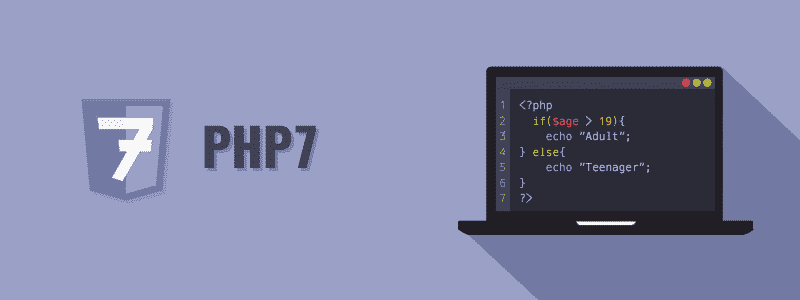

# PHP 教程

> 原文：<https://www.tutorialrepublic.com/php-tutorial/>

PHP 是用于创建动态网页的最流行的服务器端脚本语言。

PHP 代表超文本预处理器。PHP 是一种非常流行和广泛使用的开源服务器端脚本语言，用于编写动态生成的网页。PHP 最初是由拉斯马斯·勒德尔夫在 1994 年创建的。它最初被称为个人主页。

PHP 脚本在服务器上执行，结果以普通 HTML 格式发送到 web 浏览器。PHP 可以集成许多流行的数据库，包括 MySQL、PostgreSQL、Oracle、Microsoft SQL Server、Sybase 等等。PHP 当前的主要版本是 7。本教程中的所有代码都已经针对最新发布的 PHP 7 进行了测试和验证。

PHP 是一种非常强大的语言，但是很容易学习和使用。所以，把这个网站收藏起来，继续吧。

 *提示:我们的 PHP 教程将帮助你学习 PHP 脚本语言的基础，从基础到高级的主题一步一步来。如果你是初学者，从基础开始，通过每天学习一点点逐步前进。*  ** * *

## 你能用 PHP 做什么

用 PHP 可以做更多的事情。

*   您可以动态生成页面和文件。
*   您可以在服务器上创建、打开、读取、写入和关闭文件。
*   您可以从 web 表单中收集数据，如用户信息、电子邮件、电话号码等。
*   你可以给你网站的用户发电子邮件。
*   您可以发送和接收 cookies 来跟踪您网站的访问者。
*   您可以存储、删除和修改数据库中的信息。
*   您可以限制对您网站的未授权访问。
*   你可以加密数据，以便在互联网上安全传输。

这个列表并没有到此结束，你还可以用 PHP 做很多其他有趣的事情。在接下来的章节中，你将会详细地了解它们。

* * *

## PHP 相对于其他语言的优势

如果您熟悉其他服务器端语言，如 ASP.NET 或 Java，您可能想知道是什么让 PHP 如此特别。选择 PHP 有几个好处。

*   **易学:** PHP 易学易用。对于刚开始从事 web 开发的初级程序员来说，PHP 通常被认为是学习语言的首选。
*   **开源:** PHP 是一个开源项目。它是由一个世界范围的开发人员社区开发和维护的，开发人员可以免费下载和使用它的源代码。
*   **可移植性:** PHP 运行在微软 Windows、Linux、Mac OS 等各种平台上。而且它几乎兼容今天使用的所有服务器，如 Apache、IIS 等。
*   **快速性能:**用 PHP 编写的脚本通常比用 ASP、Ruby、Python、Java 等其他脚本语言编写的脚本执行或运行得更快。
*   **庞大的社区:**由于 PHP 得到了全球社区的支持，在线查找与 PHP 相关的帮助或文档变得极其容易。

 *提示:你知道一些像脸书、雅虎、Flickr 和维基百科这样的大型网站是用 PHP 建立的吗？大多数主要的内容管理系统(CMS ),如 WordPress、Drupal、Joomla 和 Magento 也是用 PHP 开发的。*  ** * *

## 本教程涵盖的内容

本 PHP 教程系列涵盖了所有基本的编程概念，包括数据类型、运算符、创建和使用变量、生成输出、构建代码以在程序中做出决策或多次循环相同的代码块、创建和操作字符串和数组、定义和调用函数等等。

一旦你熟悉了基础知识，你将进入下一个层次，解释文件系统、会话和 cookies、日期和时间的概念，以及如何从你的脚本发送电子邮件、处理和验证表单、执行数据过滤和处理 PHP 中的错误。

最后，您将探索一些高级概念，如类和对象、解析 JSON 数据、正则表达式的模式匹配、异常处理，以及如何使用 PHP 操作 MySQL 数据库中的数据并创建有用的功能，如用户登录系统、Ajax 搜索等。

 *提示:本教程的每一章都包含了大量真实世界的例子，你可以使用在线编辑器来尝试和测试。这些例子将帮助你更好地理解概念或主题。它还包含智能解决方案以及有用的提示和重要说明。***