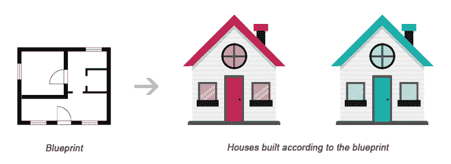

# PHP 类和对象

> 原文：<https://www.tutorialrepublic.com/php-tutorial/php-classes-and-objects.php>

在本教程中，你将学习如何用 PHP 编写面向对象风格的代码。

## 什么是面向对象编程

面向对象编程(OOP)是一种基于类和对象概念的编程模型。与过程式编程相反，过程式编程的重点是编写对数据执行操作的过程或函数，而面向对象编程的重点是创建同时包含数据和函数的对象。

与传统的或过程式的编程风格相比，面向对象的编程有几个优点。最重要的列举如下:

*   它为程序提供了一个清晰的模块结构。
*   它帮助你坚持“不要重复自己”(DRY)的原则，从而使你的代码更容易维护、修改和调试。
*   它使得用更少的代码、更短的开发时间和高度的可重用性来创建更复杂的行为成为可能。

下面几节将描述类和对象在 PHP 中是如何工作的。

 ***提示:**以*过程化编程*风格编写的程序，意思是一个程序由一个或多个过程组成。然而，过程是一起执行特定任务的一组编程语句。*  ****提示:**do not Repeat Yourself(DRY)原则背后的思想是通过抽象出应用中常见的代码，并将它们放在一个地方，然后重用它们而不是重复它们，来减少代码的重复。*  ** * *

## 理解类和对象

类和对象是面向对象编程的两个主要方面。类是一个自包含的、独立的变量和函数的集合，它们一起工作来执行一个或多个特定的任务，而对象是一个类的单个实例。

一个类就像一个模板或蓝图，从这里可以创建许多单独的对象。创建单个对象时，它们继承相同的通用属性和行为，尽管每个对象的某些属性值可能不同。

比如，把一个类想象成一栋房子的蓝图。蓝图本身不是房子，而是房子的详细平面图。而一个物体就像一个根据蓝图建造的实际的房子。我们可以从同一个蓝图建造几个相同的房子，但每个房子可能有不同的油漆、内部和家庭，如下图所示。



可以使用关键字`class`声明一个类，后跟类名和一对花括号(`{}`)，如下例所示。

让我们创建一个名为 Rectangle.php 的 PHP 文件，并将下面的示例代码放入其中，这样我们的类代码就可以与程序的其他部分分开。然后，我们可以在任何需要的地方使用它，只需简单地包含 Rectangle.php 文件。

#### 例子

[Download](../examples/bin/download-source.php?topic=php&file=Rectangle "Download Source Code")

```php
<?php
class Rectangle
{
    // Declare  properties
    public $length = 0;
    public $width = 0;

    // Method to get the perimeter
    public function getPerimeter(){
        return (2 * ($this->length + $this->width));
    }

    // Method to get the area
    public function getArea(){
        return ($this->length * $this->width);
    }
}
?>
```

在上面的例子中，属性和方法前面的关键字`public`是一个[访问修饰符](#oop-access-modifier)，表示这个属性或方法可以从任何地方访问。我们将在本章的稍后部分了解更多。

 ***注意:**从语法上来说，一个类中的变量叫做*属性*，而函数叫做*方法*。此外，类名通常以 PascalCase 书写，即每个连接的单词都以大写字母开头(例如 MyClass)。*  *一旦定义了一个类，就可以用`new`关键字从这个类中创建对象。可以通过该对象实例直接访问类方法和属性。

创建另一个名为 test.php 的 PHP 文件，并将以下代码放入其中。

#### 例子

[Run this code »](../codelab.php?topic=php&file=creating-objects-from-a-class "Run this code to view the output")

```php
<?php
// Include class definition
require "Rectangle.php";

// Create a new object from Rectangle class
$obj = new Rectangle;

// Get the object properties values
echo $obj->length; // 0utput: 0
echo $obj->width; // 0utput: 0

// Set object properties values
$obj->length = 30;
$obj->width = 20;

// Read the object properties values again to show the change
echo $obj->length; // 0utput: 30
echo $obj->width; // 0utput: 20

// Call the object methods
echo $obj->getPerimeter(); // 0utput: 100
echo $obj->getArea(); // Output: 600
?>
```

箭头符号(`->`)是一个 OOP 结构，用于访问给定对象包含的属性和方法。然而，伪变量`$this`提供了对调用对象的引用，即该方法所属的对象。

当使用同一个类的多个实例时，面向对象编程的真正威力变得显而易见，如下例所示:

#### 例子

[Run this code »](../codelab.php?topic=php&file=using-multiple-objects-of-the-same-class "Run this code to view the output")

```php
<?php
// Include class definition
require "Rectangle.php";

// Create multiple objects from the Rectangle class
$obj1 = new Rectangle;
$obj2 = new Rectangle;

// Call the methods of both the objects
echo $obj1->getArea(); // Output: 0
echo $obj2->getArea(); // Output: 0

// Set $obj1 properties values
$obj1->length = 30;
$obj1->width = 20;

// Set $obj2 properties values
$obj2->length = 35;
$obj2->width = 50;

// Call the methods of both the objects again
echo $obj1->getArea(); // Output: 600
echo $obj2->getArea(); // Output: 1750
?>
```

正如您在上面的例子中看到的，在不同的对象上调用`getArea()`方法会导致该方法在不同的数据集上操作。每个对象实例都是完全独立的，有自己的属性和方法，因此可以独立操作，即使它们属于同一个类。

* * *

## 使用构造函数和析构函数

为了使面向对象的编程更容易，PHP 提供了一些神奇的方法，当某个对象中发生某些动作时，这些方法会自动执行。

例如，每当创建一个新对象时，神奇的方法`__construct()`(称为*构造函数*)就会自动执行。同样，当对象被销毁时，魔法方法`__destruct()`(称为*析构函数*)会自动执行。一旦对象被销毁，析构函数就会清理分配给对象的所有资源。

#### 例子

[Run this code »](../codelab.php?topic=php&file=execute-code-automatically-with-constructor-and-destructor "Run this code to view the output")

```php
<?php
class MyClass
{
    // Constructor
    public function __construct(){
        echo 'The class "' . __CLASS__ . '" was initiated!<br>';
    }

    // Destructor
    public function __destruct(){
        echo 'The class "' . __CLASS__ . '" was destroyed.<br>';
    }
}

// Create a new object
$obj = new MyClass;

// Output a message at the end of the file
echo "The end of the file is reached.";
?>
```

以上示例中的 PHP 代码将产生以下输出:

The class "MyClass" was initiated!
The end of the file is reached.
The class "MyClass" was destroyed.

当脚本结束时，会自动调用析构函数。但是，要显式触发析构函数，可以使用 PHP `unset()`函数销毁对象，如下所示:

#### 例子

[Run this code »](../codelab.php?topic=php&file=destroying-an-object-manually "Run this code to view the output")

```php
<?php
class MyClass
{
    // Constructor
    public function __construct(){
        echo 'The class "' . __CLASS__ . '" was initiated!<br>';
    }

    // Destructor
    public function __destruct(){
    echo 'The class "' . __CLASS__ . '" was destroyed.<br>';
    }
}

// Create a new object
$obj = new MyClass;

// Destroy the object
unset($obj);

// Output a message at the end of the file
echo "The end of the file is reached.";
?>
```

现在，上面示例中的 PHP 代码将产生以下输出:

The class "MyClass" was initiated!
The class "MyClass" was destroyed.
The end of the file is reached. ***提示:** PHP 在脚本执行完毕时会自动清理执行过程中分配的所有资源，例如关闭数据库连接、销毁对象等。*  ****注意:**`__CLASS__`是一个[幻常数](php-magic-constants.php)，它包含了它所在的类的名称。如果它出现在类之外，则为空。*  ** * *

## 通过继承扩展类

使用`extends`关键字，类可以继承另一个类的属性和方法。这个扩展的过程叫做继承。这可能是使用面向对象编程模型背后最有力的原因。

#### 例子

[Run this code »](../codelab.php?topic=php&file=class-inheritance "Run this code to view the output")

```php
<?php
// Include class definition
require "Rectangle.php";

// Define a new class based on an existing class
class Square extends Rectangle
{   
    // Method to test if the rectangle is also a square
    public function isSquare(){
        if($this->length == $this->width){
            return true; // Square
        } else{
            return false; // Not a square
        }
    }
}

// Create a new object from Square class
$obj = new Square;

// Set object properties values
$obj->length = 20;
$obj->width = 20;

// Call the object methods
if($obj->isSquare()){
    echo "The area of the square is ";
} else{
    echo "The area of the rectangle is ";
};
echo $obj->getArea();
?>
```

以上示例中的 PHP 代码将产生以下输出:

The area of the square is 400

正如你在上面的例子中看到的，尽管 Square 的类定义没有明确包含`getArea()`方法，也没有包含`$length`和`$width`属性，但是 Square 类的实例可以使用它们，因为它们是从父 Rectangle 类继承的。

 ***提示:**由于子类是从父类派生出来的，所以也称为派生类，其父类称为基类。*  ** * *

## 控制属性和方法的可见性

当处理类时，您甚至可以使用*可见性关键字*来限制对其属性和方法的访问，以获得更好的控制。有三个可见性关键字(从最可见到最不可见):`public`、`protected`、`private`，它们决定了如何以及从哪里可以访问和修改属性和方法。

*   **public** —公共属性或方法可以在任何地方访问，无论是在类内部还是外部。这是 PHP 中所有类成员的默认可见性。
*   **受保护的** —受保护的属性或方法只能从类本身内部或子类或继承类(即扩展该类的类)中访问。
*   私有属性或方法只能从定义它的类中访问。即使是子类或继承类也不能访问私有属性或方法。

以下示例将向您展示这种可见性实际上是如何工作的:

#### 例子

[Download](../examples/bin/download-source.php?topic=php&file=access-control-modifiers "Download Source Code")

```php
<?php
// Class definition
class Automobile
{
    // Declare  properties
    public $fuel;
    protected $engine;
    private $transmission;
}
class Car extends Automobile
{
    // Constructor
    public function __construct(){
        echo 'The class "' . __CLASS__ . '" was initiated!<br>';
    }
}

// Create an object from Automobile class
$automobile = new Automobile;

// Attempt to set $automobile object properties
$automobile->fuel = 'Petrol'; // ok
$automobile->engine = '1500 cc'; // fatal error
$automobile->transmission = 'Manual'; // fatal error

// Create an object from Car class
$car = new Car;

// Attempt to set $car object properties
$car->fuel = 'Diesel'; // ok
$car->engine = '2200 cc'; // fatal error
$car->transmission = 'Automatic'; // undefined
?>
```

* * *

## 静态属性和方法

除了可见性，属性和方法也可以被声明为`static`，这使得它们不需要类的实例化就可以被访问。静态属性和方法可以使用作用域解析操作符(`::`)来访问，比如:`ClassName::$property`和`ClassName::method()`。

声明为 static 的属性不能通过该类的对象进行访问，但静态方法可以，如下例所示:

#### 例子

[Download](../examples/bin/download-source.php?topic=php&file=static-properties-and-methods "Download Source Code")

```php
<?php
// Class definition
class HelloClass
{
    // Declare a static property
    public static $greeting = "Hello World!";

    // Declare a static method
    public static function sayHello(){
        echo self::$greeting;
    }
}
// Attempt to access static property and method directly
echo HelloClass::$greeting; // Output: Hello World!
HelloClass::sayHello(); // Output: Hello World!

// Attempt to access static property and method via object
$hello = new HelloClass;
echo $hello->greeting; // Strict Warning
$hello->sayHello(); // Output: Hello World!
?>
```

上例中的关键字`self`表示“当前类”。它的前面从来没有美元符号(`$`)，后面总是跟着`::`运算符(例如`self::$name`)。

`self`关键字不同于`this`关键字，后者意味着“当前对象”或“类的当前实例”。`this`关键字的前面总是有一个美元符号(`$`)，后面是`->`运算符(例如`$this->name`)。

 ***注意:**由于静态方法可以在没有类实例(即对象)的情况下被调用，伪变量`$this`在声明为静态的方法中是不可用的。*  *我们希望您现在已经理解了面向对象编程的基本概念。你会在 PHP 和 MySQL 数据库部分找到更多关于 OOP 的例子。*******