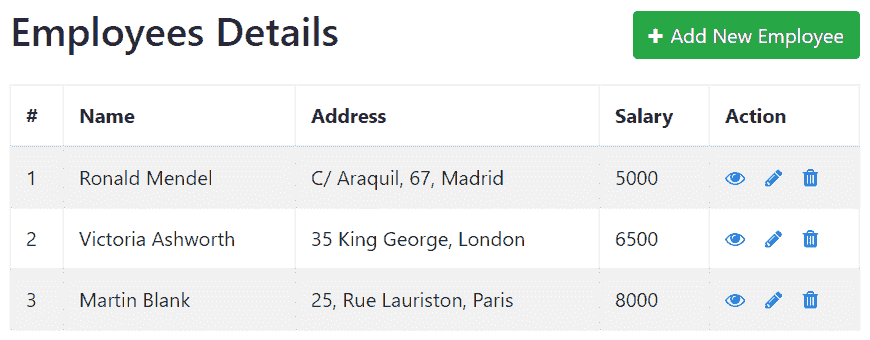

# PHP MySQL CRUD 应用

> 原文：<https://www.tutorialrepublic.com/php-tutorial/php-mysql-crud-application.php>

在本教程中，你将学习如何用 PHP 和 MySQL 构建一个 CRUD 应用。

## 什么是污垢

CRUD 是 **C** reate、 **R** ead、 **U** pdate、 **D** elete 的缩写。CRUD 操作是数据库的基本数据操作。在前面的章节中，我们已经了解了如何执行创建(即插入)、读取(即选择)、更新和删除操作。在本教程中，我们将创建一个简单的 PHP 应用，在一个地方对 MySQL 数据库表执行所有这些操作。

好吧，让我们从创建我们将在所有例子中使用的表开始。

## 创建数据库表

执行以下 SQL 查询，在 MySQL 数据库中创建一个名为 *employees* 的表。我们将在未来的所有操作中使用该表。

#### 例子

[Download](../examples/downloads/employees-table.zip "Download Countries Table")

```
CREATE TABLE employees (
    id INT NOT NULL PRIMARY KEY AUTO_INCREMENT,
    name VARCHAR(100) NOT NULL,
    address VARCHAR(255) NOT NULL,
    salary INT(10) NOT NULL
);
```

* * *

## 创建配置文件

创建表之后，我们需要创建一个 PHP 脚本来连接到 MySQL 数据库服务器。让我们创建一个名为“config.php”的文件，并将以下代码放入其中。

稍后我们将使用 PHP `require_once()`函数在其他页面中包含这个配置文件。

#### 例子

Procedural Object Oriented PDO[Download](../examples/bin/download-source.php?topic=php&file=config "Download Source Code") *```
<?php
/* Database credentials. Assuming you are running MySQL
server with default setting (user 'root' with no password) */
define('DB_SERVER', 'localhost');
define('DB_USERNAME', 'root');
define('DB_PASSWORD', '');
define('DB_NAME', 'demo');

/* Attempt to connect to MySQL database */
$link = mysqli_connect(DB_SERVER, DB_USERNAME, DB_PASSWORD, DB_NAME);

// Check connection
if($link === false){
    die("ERROR: Could not connect. " . mysqli_connect_error());
}
?>
```

```
<?php
/* Database credentials. Assuming you are running MySQL
server with default setting (user 'root' with no password) */
define('DB_SERVER', 'localhost');
define('DB_USERNAME', 'root');
define('DB_PASSWORD', '');
define('DB_NAME', 'demo');

/* Attempt to connect to MySQL database */
$mysqli = new mysqli(DB_SERVER, DB_USERNAME, DB_PASSWORD, DB_NAME);

// Check connection
if($mysqli === false){
    die("ERROR: Could not connect. " . $mysqli->connect_error);
}
?>
```

```
<?php
/* Database credentials. Assuming you are running MySQL
server with default setting (user 'root' with no password) */
define('DB_SERVER', 'localhost');
define('DB_USERNAME', 'root');
define('DB_PASSWORD', '');
define('DB_NAME', 'demo');

/* Attempt to connect to MySQL database */
try{
    $pdo = new PDO("mysql:host=" . DB_SERVER . ";dbname=" . DB_NAME, DB_USERNAME, DB_PASSWORD);
    // Set the PDO error mode to exception
    $pdo->setAttribute(PDO::ATTR_ERRMODE, PDO::ERRMODE_EXCEPTION);
} catch(PDOException $e){
    die("ERROR: Could not connect. " . $e->getMessage());
}
?>
```*  *如果您已经使用下载按钮下载了面向对象或 PDO 代码示例，请在测试代码之前从文件名中删除文本“-oo-format”或“-pdo-format”。

 ***注意:**在测试这段代码之前，根据您的 MySQL 服务器设置替换凭证，例如，用您自己的数据库名称替换数据库名称“demo ”,用您自己的数据库用户名替换用户名“root ”,指定数据库密码(如果有的话)。*  ** * *

## 创建登录页面

首先，我们将为 CRUD 应用创建一个登录页面，其中包含一个数据网格，显示来自 *employees* 数据库表的记录。对于网格中显示的每条记录，它也有操作图标，您可以选择查看其详细信息、更新或删除它。

我们还将在数据网格的顶部添加一个 create 按钮，用于在 *employees* 表中创建新记录。创建一个名为“index.php”的文件，并将以下代码放入其中:

#### 例子

Procedural Object Oriented PDO[Download](../examples/bin/download-source.php?topic=php&file=index "Download Source Code") *```
<!DOCTYPE html>
<html lang="en">
<head>
    <meta charset="UTF-8">
    <title>Dashboard</title>
    <link rel="stylesheet" href="https://stackpath.bootstrapcdn.com/bootstrap/4.5.2/css/bootstrap.min.css">
    <link rel="stylesheet" href="https://maxcdn.bootstrapcdn.com/font-awesome/4.7.0/css/font-awesome.min.css">
    <script src="https://code.jquery.com/jquery-3.5.1.min.js"></script>
    <script src="https://cdn.jsdelivr.net/npm/popper.js@1.16.1/dist/umd/popper.min.js"></script>
    <script src="https://stackpath.bootstrapcdn.com/bootstrap/4.5.2/js/bootstrap.min.js"></script>
    <style>
        .wrapper{
            width: 600px;
            margin: 0 auto;
        }
        table tr td:last-child{
            width: 120px;
        }
    </style>
    <script>
        $(document).ready(function(){
            $('[data-toggle="tooltip"]').tooltip();   
        });
    </script>
</head>
<body>
    <div class="wrapper">
        <div class="container-fluid">
            <div class="row">
                <div class="col-md-12">
                    <div class="mt-5 mb-3 clearfix">
                        <h2 class="pull-left">Employees Details</h2>
                        <a href="create.php" class="btn btn-success pull-right"><i class="fa fa-plus"></i> Add New Employee</a>
                    </div>
                    <?php
                    // Include config file
                    require_once "config.php";

                    // Attempt select query execution
                    $sql = "SELECT * FROM employees";
                    if($result = mysqli_query($link, $sql)){
                        if(mysqli_num_rows($result) > 0){
                            echo '<table class="table table-bordered table-striped">';
                                echo "<thead>";
                                    echo "<tr>";
                                        echo "<th>#</th>";
                                        echo "<th>Name</th>";
                                        echo "<th>Address</th>";
                                        echo "<th>Salary</th>";
                                        echo "<th>Action</th>";
                                    echo "</tr>";
                                echo "</thead>";
                                echo "<tbody>";
                                while($row = mysqli_fetch_array($result)){
                                    echo "<tr>";
                                        echo "<td>" . $row['id'] . "</td>";
                                        echo "<td>" . $row['name'] . "</td>";
                                        echo "<td>" . $row['address'] . "</td>";
                                        echo "<td>" . $row['salary'] . "</td>";
                                        echo "<td>";
                                            echo '<a href="read.php?id='. $row['id'] .'" class="mr-3" title="View Record" data-toggle="tooltip"><span class="fa fa-eye"></span></a>';
                                            echo '<a href="update.php?id='. $row['id'] .'" class="mr-3" title="Update Record" data-toggle="tooltip"><span class="fa fa-pencil"></span></a>';
                                            echo '<a href="delete.php?id='. $row['id'] .'" title="Delete Record" data-toggle="tooltip"><span class="fa fa-trash"></span></a>';
                                        echo "</td>";
                                    echo "</tr>";
                                }
                                echo "</tbody>";                            
                            echo "</table>";
                            // Free result set
                            mysqli_free_result($result);
                        } else{
                            echo '<div class="alert alert-danger"><em>No records were found.</em></div>';
                        }
                    } else{
                        echo "Oops! Something went wrong. Please try again later.";
                    }

                    // Close connection
                    mysqli_close($link);
                    ?>
                </div>
            </div>        
        </div>
    </div>
</body>
</html>
```

```
<!DOCTYPE html>
<html lang="en">
<head>
    <meta charset="UTF-8">
    <title>Dashboard</title>
    <link rel="stylesheet" href="https://stackpath.bootstrapcdn.com/bootstrap/4.5.2/css/bootstrap.min.css">
    <link rel="stylesheet" href="https://maxcdn.bootstrapcdn.com/font-awesome/4.7.0/css/font-awesome.min.css">
    <script src="https://code.jquery.com/jquery-3.5.1.min.js"></script>
    <script src="https://cdn.jsdelivr.net/npm/popper.js@1.16.1/dist/umd/popper.min.js"></script>
    <script src="https://stackpath.bootstrapcdn.com/bootstrap/4.5.2/js/bootstrap.min.js"></script>
    <style>
        .wrapper{
            width: 600px;
            margin: 0 auto;
        }
        table tr td:last-child{
            width: 120px;
        }
    </style>
    <script>
        $(document).ready(function(){
            $('[data-toggle="tooltip"]').tooltip();   
        });
    </script>
</head>
<body>
    <div class="wrapper">
        <div class="container-fluid">
            <div class="row">
                <div class="col-md-12">
                    <div class="mt-5 mb-3 clearfix">
                        <h2 class="pull-left">Employees Details</h2>
                        <a href="create.php" class="btn btn-success pull-right"><i class="fa fa-plus"></i> Add New Employee</a>
                    </div>
                    <?php
                    // Include config file
                    require_once "config.php";

                    // Attempt select query execution
                    $sql = "SELECT * FROM employees";
                    if($result = $mysqli->query($sql)){
                        if($result->num_rows > 0){
                            echo '<table class="table table-bordered table-striped">';
                                echo "<thead>";
                                    echo "<tr>";
                                        echo "<th>#</th>";
                                        echo "<th>Name</th>";
                                        echo "<th>Address</th>";
                                        echo "<th>Salary</th>";
                                        echo "<th>Action</th>";
                                    echo "</tr>";
                                echo "</thead>";
                                echo "<tbody>";
                                while($row = $result->fetch_array()){
                                    echo "<tr>";
                                        echo "<td>" . $row['id'] . "</td>";
                                        echo "<td>" . $row['name'] . "</td>";
                                        echo "<td>" . $row['address'] . "</td>";
                                        echo "<td>" . $row['salary'] . "</td>";
                                        echo "<td>";
                                            echo '<a href="read.php?id='. $row['id'] .'" class="mr-3" title="View Record" data-toggle="tooltip"><span class="fa fa-eye"></span></a>';
                                            echo '<a href="update.php?id='. $row['id'] .'" class="mr-3" title="Update Record" data-toggle="tooltip"><span class="fa fa-pencil"></span></a>';
                                            echo '<a href="delete.php?id='. $row['id'] .'" title="Delete Record" data-toggle="tooltip"><span class="fa fa-trash"></span></a>';
                                        echo "</td>";
                                    echo "</tr>";
                                }
                                echo "</tbody>";                            
                            echo "</table>";
                            // Free result set
                            $result->free();
                        } else{
                            echo '<div class="alert alert-danger"><em>No records were found.</em></div>';
                        }
                    } else{
                        echo "Oops! Something went wrong. Please try again later.";
                    }

                    // Close connection
                    $mysqli->close();
                    ?>
                </div>
            </div>        
        </div>
    </div>
</body>
</html>
```

```
<!DOCTYPE html>
<html lang="en">
<head>
    <meta charset="UTF-8">
    <title>Dashboard</title>
    <link rel="stylesheet" href="https://stackpath.bootstrapcdn.com/bootstrap/4.5.2/css/bootstrap.min.css">
    <link rel="stylesheet" href="https://maxcdn.bootstrapcdn.com/font-awesome/4.7.0/css/font-awesome.min.css">
    <script src="https://code.jquery.com/jquery-3.5.1.min.js"></script>
    <script src="https://cdn.jsdelivr.net/npm/popper.js@1.16.1/dist/umd/popper.min.js"></script>
    <script src="https://stackpath.bootstrapcdn.com/bootstrap/4.5.2/js/bootstrap.min.js"></script>
    <style>
        .wrapper{
            width: 600px;
            margin: 0 auto;
        }
        table tr td:last-child{
            width: 120px;
        }
    </style>
    <script>
        $(document).ready(function(){
            $('[data-toggle="tooltip"]').tooltip();   
        });
    </script>
</head>
<body>
    <div class="wrapper">
        <div class="container-fluid">
            <div class="row">
                <div class="col-md-12">
                    <div class="mt-5 mb-3 clearfix">
                        <h2 class="pull-left">Employees Details</h2>
                        <a href="create.php" class="btn btn-success pull-right"><i class="fa fa-plus"></i> Add New Employee</a>
                    </div>
                    <?php
                    // Include config file
                    require_once "config.php";

                    // Attempt select query execution
                    $sql = "SELECT * FROM employees";
                    if($result = $pdo->query($sql)){
                        if($result->rowCount() > 0){
                            echo '<table class="table table-bordered table-striped">';
                                echo "<thead>";
                                    echo "<tr>";
                                        echo "<th>#</th>";
                                        echo "<th>Name</th>";
                                        echo "<th>Address</th>";
                                        echo "<th>Salary</th>";
                                        echo "<th>Action</th>";
                                    echo "</tr>";
                                echo "</thead>";
                                echo "<tbody>";
                                while($row = $result->fetch()){
                                    echo "<tr>";
                                        echo "<td>" . $row['id'] . "</td>";
                                        echo "<td>" . $row['name'] . "</td>";
                                        echo "<td>" . $row['address'] . "</td>";
                                        echo "<td>" . $row['salary'] . "</td>";
                                        echo "<td>";
                                            echo '<a href="read.php?id='. $row['id'] .'" class="mr-3" title="View Record" data-toggle="tooltip"><span class="fa fa-eye"></span></a>';
                                            echo '<a href="update.php?id='. $row['id'] .'" class="mr-3" title="Update Record" data-toggle="tooltip"><span class="fa fa-pencil"></span></a>';
                                            echo '<a href="delete.php?id='. $row['id'] .'" title="Delete Record" data-toggle="tooltip"><span class="fa fa-trash"></span></a>';
                                        echo "</td>";
                                    echo "</tr>";
                                }
                                echo "</tbody>";                            
                            echo "</table>";
                            // Free result set
                            unset($result);
                        } else{
                            echo '<div class="alert alert-danger"><em>No records were found.</em></div>';
                        }
                    } else{
                        echo "Oops! Something went wrong. Please try again later.";
                    }

                    // Close connection
                    unset($pdo);
                    ?>
                </div>
            </div>        
        </div>
    </div>
</body>
</html>
```*  *一旦 *employees* 表中填充了一些记录，登录页面(即 CRUD 数据网格)可能会类似于下图所示:

[](#)  ***提示:**我们已经使用了 Bootstrap 框架来快速美观地制作这个 CRUD 应用布局。Bootstrap 是最流行和最强大的前端框架，用于更快和更容易响应的 web 开发。请查看[Bootstrap 教程](/twitter-bootstrap-tutorial/)部分，了解关于这个框架的更多信息。*  ** * *

## 创建创建页面

在本节中，我们将构建 CRUD 应用的**C**create 功能。

让我们创建一个名为“create.php”的文件，并将以下代码放入其中。它将生成一个 web 表单，可用于在 *employees* 表中插入记录。

#### 例子

Procedural Object Oriented PDO[Download](../examples/bin/download-source.php?topic=php&file=create "Download Source Code") *```
<?php
// Include config file
require_once "config.php";

// Define variables and initialize with empty values
$name = $address = $salary = "";
$name_err = $address_err = $salary_err = "";

// Processing form data when form is submitted
if($_SERVER["REQUEST_METHOD"] == "POST"){
    // Validate name
    $input_name = trim($_POST["name"]);
    if(empty($input_name)){
        $name_err = "Please enter a name.";
    } elseif(!filter_var($input_name, FILTER_VALIDATE_REGEXP, array("options"=>array("regexp"=>"/^[a-zA-Z\s]+$/")))){
        $name_err = "Please enter a valid name.";
    } else{
        $name = $input_name;
    }

    // Validate address
    $input_address = trim($_POST["address"]);
    if(empty($input_address)){
        $address_err = "Please enter an address.";     
    } else{
        $address = $input_address;
    }

    // Validate salary
    $input_salary = trim($_POST["salary"]);
    if(empty($input_salary)){
        $salary_err = "Please enter the salary amount.";     
    } elseif(!ctype_digit($input_salary)){
        $salary_err = "Please enter a positive integer value.";
    } else{
        $salary = $input_salary;
    }

    // Check input errors before inserting in database
    if(empty($name_err) && empty($address_err) && empty($salary_err)){
        // Prepare an insert statement
        $sql = "INSERT INTO employees (name, address, salary) VALUES (?, ?, ?)";

        if($stmt = mysqli_prepare($link, $sql)){
            // Bind variables to the prepared statement as parameters
            mysqli_stmt_bind_param($stmt, "sss", $param_name, $param_address, $param_salary);

            // Set parameters
            $param_name = $name;
            $param_address = $address;
            $param_salary = $salary;

            // Attempt to execute the prepared statement
            if(mysqli_stmt_execute($stmt)){
                // Records created successfully. Redirect to landing page
                header("location: index.php");
                exit();
            } else{
                echo "Oops! Something went wrong. Please try again later.";
            }
        }

        // Close statement
        mysqli_stmt_close($stmt);
    }

    // Close connection
    mysqli_close($link);
}
?>

<!DOCTYPE html>
<html lang="en">
<head>
    <meta charset="UTF-8">
    <title>Create Record</title>
    <link rel="stylesheet" href="https://stackpath.bootstrapcdn.com/bootstrap/4.5.2/css/bootstrap.min.css">
    <style>
        .wrapper{
            width: 600px;
            margin: 0 auto;
        }
    </style>
</head>
<body>
    <div class="wrapper">
        <div class="container-fluid">
            <div class="row">
                <div class="col-md-12">
                    <h2 class="mt-5">Create Record</h2>
                    <p>Please fill this form and submit to add employee record to the database.</p>
                    <form action="<?php echo htmlspecialchars($_SERVER["PHP_SELF"]); ?>" method="post">
                        <div class="form-group">
                            <label>Name</label>
                            <input type="text" name="name" class="form-control <?php echo (!empty($name_err)) ? 'is-invalid' : ''; ?>" value="<?php echo $name; ?>">
                            <span class="invalid-feedback"><?php echo $name_err;?></span>
                        </div>
                        <div class="form-group">
                            <label>Address</label>
                            <textarea name="address" class="form-control <?php echo (!empty($address_err)) ? 'is-invalid' : ''; ?>"><?php echo $address; ?></textarea>
                            <span class="invalid-feedback"><?php echo $address_err;?></span>
                        </div>
                        <div class="form-group">
                            <label>Salary</label>
                            <input type="text" name="salary" class="form-control <?php echo (!empty($salary_err)) ? 'is-invalid' : ''; ?>" value="<?php echo $salary; ?>">
                            <span class="invalid-feedback"><?php echo $salary_err;?></span>
                        </div>
                        <input type="submit" class="btn btn-primary" value="Submit">
                        <a href="index.php" class="btn btn-secondary ml-2">Cancel</a>
                    </form>
                </div>
            </div>        
        </div>
    </div>
</body>
</html>
```

```
<?php
// Include config file
require_once "config.php";

// Define variables and initialize with empty values
$name = $address = $salary = "";
$name_err = $address_err = $salary_err = "";

// Processing form data when form is submitted
if($_SERVER["REQUEST_METHOD"] == "POST"){
    // Validate name
    $input_name = trim($_POST["name"]);
    if(empty($input_name)){
        $name_err = "Please enter a name.";
    } elseif(!filter_var($input_name, FILTER_VALIDATE_REGEXP, array("options"=>array("regexp"=>"/^[a-zA-Z\s]+$/")))){
        $name_err = "Please enter a valid name.";
    } else{
        $name = $input_name;
    }

    // Validate address
    $input_address = trim($_POST["address"]);
    if(empty($input_address)){
        $address_err = "Please enter an address.";     
    } else{
        $address = $input_address;
    }

    // Validate salary
    $input_salary = trim($_POST["salary"]);
    if(empty($input_salary)){
        $salary_err = "Please enter the salary amount.";     
    } elseif(!ctype_digit($input_salary)){
        $salary_err = "Please enter a positive integer value.";
    } else{
        $salary = $input_salary;
    }

    // Check input errors before inserting in database
    if(empty($name_err) && empty($address_err) && empty($salary_err)){
        // Prepare an insert statement
        $sql = "INSERT INTO employees (name, address, salary) VALUES (?, ?, ?)";

        if($stmt = $mysqli->prepare($sql)){
            // Bind variables to the prepared statement as parameters
            $stmt->bind_param("sss", $param_name, $param_address, $param_salary);

            // Set parameters
            $param_name = $name;
            $param_address = $address;
            $param_salary = $salary;

            // Attempt to execute the prepared statement
            if($stmt->execute()){
                // Records created successfully. Redirect to landing page
                header("location: index.php");
                exit();
            } else{
                echo "Oops! Something went wrong. Please try again later.";
            }
        }

        // Close statement
        $stmt->close();
    }

    // Close connection
    $mysqli->close();
}
?>

 <!DOCTYPE html>
<html lang="en">
<head>
    <meta charset="UTF-8">
    <title>Create Record</title>
    <link rel="stylesheet" href="https://stackpath.bootstrapcdn.com/bootstrap/4.5.2/css/bootstrap.min.css">
    <style>
        .wrapper{
            width: 600px;
            margin: 0 auto;
        }
    </style>
</head>
<body>
    <div class="wrapper">
        <div class="container-fluid">
            <div class="row">
                <div class="col-md-12">
                    <h2 class="mt-5">Create Record</h2>
                    <p>Please fill this form and submit to add employee record to the database.</p>
                    <form action="<?php echo htmlspecialchars($_SERVER["PHP_SELF"]); ?>" method="post">
                        <div class="form-group">
                            <label>Name</label>
                            <input type="text" name="name" class="form-control <?php echo (!empty($name_err)) ? 'is-invalid' : ''; ?>" value="<?php echo $name; ?>">
                            <span class="invalid-feedback"><?php echo $name_err;?></span>
                        </div>
                        <div class="form-group">
                            <label>Address</label>
                            <textarea name="address" class="form-control <?php echo (!empty($address_err)) ? 'is-invalid' : ''; ?>"><?php echo $address; ?></textarea>
                            <span class="invalid-feedback"><?php echo $address_err;?></span>
                        </div>
                        <div class="form-group">
                            <label>Salary</label>
                            <input type="text" name="salary" class="form-control <?php echo (!empty($salary_err)) ? 'is-invalid' : ''; ?>" value="<?php echo $salary; ?>">
                            <span class="invalid-feedback"><?php echo $salary_err;?></span>
                        </div>
                        <input type="submit" class="btn btn-primary" value="Submit">
                        <a href="index.php" class="btn btn-secondary ml-2">Cancel</a>
                    </form>
                </div>
            </div>        
        </div>
    </div>
</body>
</html>
```

```
<?php
// Include config file
require_once "config.php";

// Define variables and initialize with empty values
$name = $address = $salary = "";
$name_err = $address_err = $salary_err = "";

// Processing form data when form is submitted
if($_SERVER["REQUEST_METHOD"] == "POST"){
    // Validate name
    $input_name = trim($_POST["name"]);
    if(empty($input_name)){
        $name_err = "Please enter a name.";
    } elseif(!filter_var($input_name, FILTER_VALIDATE_REGEXP, array("options"=>array("regexp"=>"/^[a-zA-Z\s]+$/")))){
        $name_err = "Please enter a valid name.";
    } else{
        $name = $input_name;
    }

    // Validate address
    $input_address = trim($_POST["address"]);
    if(empty($input_address)){
        $address_err = "Please enter an address.";     
    } else{
        $address = $input_address;
    }

    // Validate salary
    $input_salary = trim($_POST["salary"]);
    if(empty($input_salary)){
        $salary_err = "Please enter the salary amount.";     
    } elseif(!ctype_digit($input_salary)){
        $salary_err = "Please enter a positive integer value.";
    } else{
        $salary = $input_salary;
    }

    // Check input errors before inserting in database
    if(empty($name_err) && empty($address_err) && empty($salary_err)){
        // Prepare an insert statement
        $sql = "INSERT INTO employees (name, address, salary) VALUES (:name, :address, :salary)";

        if($stmt = $pdo->prepare($sql)){
            // Bind variables to the prepared statement as parameters
            $stmt->bindParam(":name", $param_name);
            $stmt->bindParam(":address", $param_address);
            $stmt->bindParam(":salary", $param_salary);

            // Set parameters
            $param_name = $name;
            $param_address = $address;
            $param_salary = $salary;

            // Attempt to execute the prepared statement
            if($stmt->execute()){
                // Records created successfully. Redirect to landing page
                header("location: index.php");
                exit();
            } else{
                echo "Oops! Something went wrong. Please try again later.";
            }
        }

        // Close statement
        unset($stmt);
    }

    // Close connection
    unset($pdo);
}
?>

<!DOCTYPE html>
<html lang="en">
<head>
    <meta charset="UTF-8">
    <title>Create Record</title>
    <link rel="stylesheet" href="https://stackpath.bootstrapcdn.com/bootstrap/4.5.2/css/bootstrap.min.css">
    <style>
        .wrapper{
            width: 600px;
            margin: 0 auto;
        }
    </style>
</head>
<body>
    <div class="wrapper">
        <div class="container-fluid">
            <div class="row">
                <div class="col-md-12">
                    <h2 class="mt-5">Create Record</h2>
                    <p>Please fill this form and submit to add employee record to the database.</p>
                    <form action="<?php echo htmlspecialchars($_SERVER["PHP_SELF"]); ?>" method="post">
                        <div class="form-group">
                            <label>Name</label>
                            <input type="text" name="name" class="form-control <?php echo (!empty($name_err)) ? 'is-invalid' : ''; ?>" value="<?php echo $name; ?>">
                            <span class="invalid-feedback"><?php echo $name_err;?></span>
                        </div>
                        <div class="form-group">
                            <label>Address</label>
                            <textarea name="address" class="form-control <?php echo (!empty($address_err)) ? 'is-invalid' : ''; ?>"><?php echo $address; ?></textarea>
                            <span class="invalid-feedback"><?php echo $address_err;?></span>
                        </div>
                        <div class="form-group">
                            <label>Salary</label>
                            <input type="text" name="salary" class="form-control <?php echo (!empty($salary_err)) ? 'is-invalid' : ''; ?>" value="<?php echo $salary; ?>">
                            <span class="invalid-feedback"><?php echo $salary_err;?></span>
                        </div>
                        <input type="submit" class="btn btn-primary" value="Submit">
                        <a href="index.php" class="btn btn-secondary ml-2">Cancel</a>
                    </form>
                </div>
            </div>        
        </div>
    </div>
</body>
</html>
```*  *同一个“create.php”文件将显示 HTML 表单并处理提交的表单数据。在保存数据之前，它还将对用户输入进行基本验证(*第 11 行到第 37 行*)。

* * *

## 创建阅读页面

现在是时候构建 CRUD 应用的 ead 功能了。

让我们创建一个名为“read.php”的文件，并将以下代码放入其中。它将简单地根据雇员的 id 属性从*雇员*表中检索记录。

#### 例子

Procedural Object Oriented PDO[Download](../examples/bin/download-source.php?topic=php&file=read "Download Source Code") *```
<?php
// Check existence of id parameter before processing further
if(isset($_GET["id"]) && !empty(trim($_GET["id"]))){
    // Include config file
    require_once "config.php";

    // Prepare a select statement
    $sql = "SELECT * FROM employees WHERE id = ?";

    if($stmt = mysqli_prepare($link, $sql)){
        // Bind variables to the prepared statement as parameters
        mysqli_stmt_bind_param($stmt, "i", $param_id);

        // Set parameters
        $param_id = trim($_GET["id"]);

        // Attempt to execute the prepared statement
        if(mysqli_stmt_execute($stmt)){
            $result = mysqli_stmt_get_result($stmt);

            if(mysqli_num_rows($result) == 1){
                /* Fetch result row as an associative array. Since the result set
                contains only one row, we don't need to use while loop */
                $row = mysqli_fetch_array($result, MYSQLI_ASSOC);

                // Retrieve individual field value
                $name = $row["name"];
                $address = $row["address"];
                $salary = $row["salary"];
            } else{
                // URL doesn't contain valid id parameter. Redirect to error page
                header("location: error.php");
                exit();
            }

        } else{
            echo "Oops! Something went wrong. Please try again later.";
        }
    }

    // Close statement
    mysqli_stmt_close($stmt);

    // Close connection
    mysqli_close($link);
} else{
    // URL doesn't contain id parameter. Redirect to error page
    header("location: error.php");
    exit();
}
?>

<!DOCTYPE html>
<html lang="en">
<head>
    <meta charset="UTF-8">
    <title>View Record</title>
    <link rel="stylesheet" href="https://stackpath.bootstrapcdn.com/bootstrap/4.5.2/css/bootstrap.min.css">
    <style>
        .wrapper{
            width: 600px;
            margin: 0 auto;
        }
    </style>
</head>
<body>
    <div class="wrapper">
        <div class="container-fluid">
            <div class="row">
                <div class="col-md-12">
                    <h1 class="mt-5 mb-3">View Record</h1>
                    <div class="form-group">
                        <label>Name</label>
                        <p><b><?php echo $row["name"]; ?></b></p>
                    </div>
                    <div class="form-group">
                        <label>Address</label>
                        <p><b><?php echo $row["address"]; ?></b></p>
                    </div>
                    <div class="form-group">
                        <label>Salary</label>
                        <p><b><?php echo $row["salary"]; ?></b></p>
                    </div>
                    <p><a href="index.php" class="btn btn-primary">Back</a></p>
                </div>
            </div>        
        </div>
    </div>
</body>
</html>
```

```
<?php
// Check existence of id parameter before processing further
if(isset($_GET["id"]) && !empty(trim($_GET["id"]))){
    // Include config file
    require_once "config.php";

    // Prepare a select statement
    $sql = "SELECT * FROM employees WHERE id = ?";

    if($stmt = $mysqli->prepare($sql)){
        // Bind variables to the prepared statement as parameters
        $stmt->bind_param("i", $param_id);

        // Set parameters
        $param_id = trim($_GET["id"]);

        // Attempt to execute the prepared statement
        if($stmt->execute()){
            $result = $stmt->get_result();

            if($result->num_rows == 1){
                /* Fetch result row as an associative array. Since the result set
                contains only one row, we don't need to use while loop */
                $row = $result->fetch_array(MYSQLI_ASSOC);

                // Retrieve individual field value
                $name = $row["name"];
                $address = $row["address"];
                $salary = $row["salary"];
            } else{
                // URL doesn't contain valid id parameter. Redirect to error page
                header("location: error.php");
                exit();
            }

        } else{
            echo "Oops! Something went wrong. Please try again later.";
        }
    }

    // Close statement
    $stmt->close();

    // Close connection
    $mysqli->close();
} else{
    // URL doesn't contain id parameter. Redirect to error page
    header("location: error.php");
    exit();
}
?>

<!DOCTYPE html>
<html lang="en">
<head>
    <meta charset="UTF-8">
    <title>View Record</title>
    <link rel="stylesheet" href="https://stackpath.bootstrapcdn.com/bootstrap/4.5.2/css/bootstrap.min.css">
    <style>
        .wrapper{
            width: 600px;
            margin: 0 auto;
        }
    </style>
</head>
<body>
    <div class="wrapper">
        <div class="container-fluid">
            <div class="row">
                <div class="col-md-12">
                    <h1 class="mt-5 mb-3">View Record</h1>
                    <div class="form-group">
                        <label>Name</label>
                        <p><b><?php echo $row["name"]; ?></b></p>
                    </div>
                    <div class="form-group">
                        <label>Address</label>
                        <p><b><?php echo $row["address"]; ?></b></p>
                    </div>
                    <div class="form-group">
                        <label>Salary</label>
                        <p><b><?php echo $row["salary"]; ?></b></p>
                    </div>
                    <p><a href="index.php" class="btn btn-primary">Back</a></p>
                </div>
            </div>        
        </div>
    </div>
</body>
</html>
```

```
<?php
// Check existence of id parameter before processing further
if(isset($_GET["id"]) && !empty(trim($_GET["id"]))){
    // Include config file
    require_once "config.php";

    // Prepare a select statement
    $sql = "SELECT * FROM employees WHERE id = :id";

    if($stmt = $pdo->prepare($sql)){
        // Bind variables to the prepared statement as parameters
        $stmt->bindParam(":id", $param_id);

        // Set parameters
        $param_id = trim($_GET["id"]);

        // Attempt to execute the prepared statement
        if($stmt->execute()){
            if($stmt->rowCount() == 1){
                /* Fetch result row as an associative array. Since the result set
                contains only one row, we don't need to use while loop */
                $row = $stmt->fetch(PDO::FETCH_ASSOC);

                // Retrieve individual field value
                $name = $row["name"];
                $address = $row["address"];
                $salary = $row["salary"];
            } else{
                // URL doesn't contain valid id parameter. Redirect to error page
                header("location: error.php");
                exit();
            }

        } else{
            echo "Oops! Something went wrong. Please try again later.";
        }
    }

    // Close statement
    unset($stmt);

    // Close connection
    unset($pdo);
} else{
    // URL doesn't contain id parameter. Redirect to error page
    header("location: error.php");
    exit();
}
?>

<!DOCTYPE html>
<html lang="en">
<head>
    <meta charset="UTF-8">
    <title>View Record</title>
    <link rel="stylesheet" href="https://stackpath.bootstrapcdn.com/bootstrap/4.5.2/css/bootstrap.min.css">
    <style>
        .wrapper{
            width: 600px;
            margin: 0 auto;
        }
    </style>
</head>
<body>
    <div class="wrapper">
        <div class="container-fluid">
            <div class="row">
                <div class="col-md-12">
                    <h1 class="mt-5 mb-3">View Record</h1>
                    <div class="form-group">
                        <label>Name</label>
                        <p><b><?php echo $row["name"]; ?></b></p>
                    </div>
                    <div class="form-group">
                        <label>Address</label>
                        <p><b><?php echo $row["address"]; ?></b></p>
                    </div>
                    <div class="form-group">
                        <label>Salary</label>
                        <p><b><?php echo $row["salary"]; ?></b></p>
                    </div>
                    <p><a href="index.php" class="btn btn-primary">Back</a></p>
                </div>
            </div>        
        </div>
    </div>
</body>
</html>
```*  ** * *

## 创建更新页面

类似地，我们可以构建 CRUD 应用的 **U** pdate 功能。

让我们创建一个名为“update.php”的文件，并将以下代码放入其中。它将根据雇员的 id 属性更新*雇员*表中的现有记录。

#### 例子

Procedural Object Oriented PDO[Download](../examples/bin/download-source.php?topic=php&file=update "Download Source Code") *```
<?php
// Include config file
require_once "config.php";

// Define variables and initialize with empty values
$name = $address = $salary = "";
$name_err = $address_err = $salary_err = "";

// Processing form data when form is submitted
if(isset($_POST["id"]) && !empty($_POST["id"])){
    // Get hidden input value
    $id = $_POST["id"];

    // Validate name
    $input_name = trim($_POST["name"]);
    if(empty($input_name)){
        $name_err = "Please enter a name.";
    } elseif(!filter_var($input_name, FILTER_VALIDATE_REGEXP, array("options"=>array("regexp"=>"/^[a-zA-Z\s]+$/")))){
        $name_err = "Please enter a valid name.";
    } else{
        $name = $input_name;
    }

    // Validate address address
    $input_address = trim($_POST["address"]);
    if(empty($input_address)){
        $address_err = "Please enter an address.";     
    } else{
        $address = $input_address;
    }

    // Validate salary
    $input_salary = trim($_POST["salary"]);
    if(empty($input_salary)){
        $salary_err = "Please enter the salary amount.";     
    } elseif(!ctype_digit($input_salary)){
        $salary_err = "Please enter a positive integer value.";
    } else{
        $salary = $input_salary;
    }

    // Check input errors before inserting in database
    if(empty($name_err) && empty($address_err) && empty($salary_err)){
        // Prepare an update statement
        $sql = "UPDATE employees SET name=?, address=?, salary=? WHERE id=?";

        if($stmt = mysqli_prepare($link, $sql)){
            // Bind variables to the prepared statement as parameters
            mysqli_stmt_bind_param($stmt, "sssi", $param_name, $param_address, $param_salary, $param_id);

            // Set parameters
            $param_name = $name;
            $param_address = $address;
            $param_salary = $salary;
            $param_id = $id;

            // Attempt to execute the prepared statement
            if(mysqli_stmt_execute($stmt)){
                // Records updated successfully. Redirect to landing page
                header("location: index.php");
                exit();
            } else{
                echo "Oops! Something went wrong. Please try again later.";
            }
        }

        // Close statement
        mysqli_stmt_close($stmt);
    }

    // Close connection
    mysqli_close($link);
} else{
    // Check existence of id parameter before processing further
    if(isset($_GET["id"]) && !empty(trim($_GET["id"]))){
        // Get URL parameter
        $id =  trim($_GET["id"]);

        // Prepare a select statement
        $sql = "SELECT * FROM employees WHERE id = ?";
        if($stmt = mysqli_prepare($link, $sql)){
            // Bind variables to the prepared statement as parameters
            mysqli_stmt_bind_param($stmt, "i", $param_id);

            // Set parameters
            $param_id = $id;

            // Attempt to execute the prepared statement
            if(mysqli_stmt_execute($stmt)){
                $result = mysqli_stmt_get_result($stmt);

                if(mysqli_num_rows($result) == 1){
                    /* Fetch result row as an associative array. Since the result set
                    contains only one row, we don't need to use while loop */
                    $row = mysqli_fetch_array($result, MYSQLI_ASSOC);

                    // Retrieve individual field value
                    $name = $row["name"];
                    $address = $row["address"];
                    $salary = $row["salary"];
                } else{
                    // URL doesn't contain valid id. Redirect to error page
                    header("location: error.php");
                    exit();
                }

            } else{
                echo "Oops! Something went wrong. Please try again later.";
            }
        }

        // Close statement
        mysqli_stmt_close($stmt);

        // Close connection
        mysqli_close($link);
    }  else{
        // URL doesn't contain id parameter. Redirect to error page
        header("location: error.php");
        exit();
    }
}
?>

<!DOCTYPE html>
<html lang="en">
<head>
    <meta charset="UTF-8">
    <title>Update Record</title>
    <link rel="stylesheet" href="https://stackpath.bootstrapcdn.com/bootstrap/4.5.2/css/bootstrap.min.css">
    <style>
        .wrapper{
            width: 600px;
            margin: 0 auto;
        }
    </style>
</head>
<body>
    <div class="wrapper">
        <div class="container-fluid">
            <div class="row">
                <div class="col-md-12">
                    <h2 class="mt-5">Update Record</h2>
                    <p>Please edit the input values and submit to update the employee record.</p>
                    <form action="<?php echo htmlspecialchars(basename($_SERVER['REQUEST_URI'])); ?>" method="post">
                        <div class="form-group">
                            <label>Name</label>
                            <input type="text" name="name" class="form-control <?php echo (!empty($name_err)) ? 'is-invalid' : ''; ?>" value="<?php echo $name; ?>">
                            <span class="invalid-feedback"><?php echo $name_err;?></span>
                        </div>
                        <div class="form-group">
                            <label>Address</label>
                            <textarea name="address" class="form-control <?php echo (!empty($address_err)) ? 'is-invalid' : ''; ?>"><?php echo $address; ?></textarea>
                            <span class="invalid-feedback"><?php echo $address_err;?></span>
                        </div>
                        <div class="form-group">
                            <label>Salary</label>
                            <input type="text" name="salary" class="form-control <?php echo (!empty($salary_err)) ? 'is-invalid' : ''; ?>" value="<?php echo $salary; ?>">
                            <span class="invalid-feedback"><?php echo $salary_err;?></span>
                        </div>
                        <input type="hidden" name="id" value="<?php echo $id; ?>"/>
                        <input type="submit" class="btn btn-primary" value="Submit">
                        <a href="index.php" class="btn btn-secondary ml-2">Cancel</a>
                    </form>
                </div>
            </div>        
        </div>
    </div>
</body>
</html>
```

```
<?php
// Include config file
require_once "config.php";

// Define variables and initialize with empty values
$name = $address = $salary = "";
$name_err = $address_err = $salary_err = "";

// Processing form data when form is submitted
if(isset($_POST["id"]) && !empty($_POST["id"])){
    // Get hidden input value
    $id = $_POST["id"];

    // Validate name
    $input_name = trim($_POST["name"]);
    if(empty($input_name)){
        $name_err = "Please enter a name.";
    } elseif(!filter_var($input_name, FILTER_VALIDATE_REGEXP, array("options"=>array("regexp"=>"/^[a-zA-Z\s]+$/")))){
        $name_err = "Please enter a valid name.";
    } else{
        $name = $input_name;
    }

    // Validate address address
    $input_address = trim($_POST["address"]);
    if(empty($input_address)){
        $address_err = "Please enter an address.";     
    } else{
        $address = $input_address;
    }

    // Validate salary
    $input_salary = trim($_POST["salary"]);
    if(empty($input_salary)){
        $salary_err = "Please enter the salary amount.";     
    } elseif(!ctype_digit($input_salary)){
        $salary_err = "Please enter a positive integer value.";
    } else{
        $salary = $input_salary;
    }

    // Check input errors before inserting in database
    if(empty($name_err) && empty($address_err) && empty($salary_err)){
        // Prepare an update statement
        $sql = "UPDATE employees SET name=?, address=?, salary=? WHERE id=?";

        if($stmt = $mysqli->prepare($sql)){
            // Bind variables to the prepared statement as parameters
            $stmt->bind_param("sssi", $param_name, $param_address, $param_salary, $param_id);

            // Set parameters
            $param_name = $name;
            $param_address = $address;
            $param_salary = $salary;
            $param_id = $id;

            // Attempt to execute the prepared statement
            if($stmt->execute()){
                // Records updated successfully. Redirect to landing page
                header("location: index.php");
                exit();
            } else{
                echo "Oops! Something went wrong. Please try again later.";
            }
        }

        // Close statement
        $stmt->close();
    }

    // Close connection
    $mysqli->close();
} else{
    // Check existence of id parameter before processing further
    if(isset($_GET["id"]) && !empty(trim($_GET["id"]))){
        // Get URL parameter
        $id =  trim($_GET["id"]);

        // Prepare a select statement
        $sql = "SELECT * FROM employees WHERE id = ?";
        if($stmt = $mysqli->prepare($sql)){
            // Bind variables to the prepared statement as parameters
            $stmt->bind_param("i", $param_id);

            // Set parameters
            $param_id = $id;

            // Attempt to execute the prepared statement
            if($stmt->execute()){
                $result = $stmt->get_result();

                if($result->num_rows == 1){
                    /* Fetch result row as an associative array. Since the result set
                    contains only one row, we don't need to use while loop */
                    $row = $result->fetch_array(MYSQLI_ASSOC);

                    // Retrieve individual field value
                    $name = $row["name"];
                    $address = $row["address"];
                    $salary = $row["salary"];
                } else{
                    // URL doesn't contain valid id. Redirect to error page
                    header("location: error.php");
                    exit();
                }

            } else{
                echo "Oops! Something went wrong. Please try again later.";
            }
        }

        // Close statement
        $stmt->close();

        // Close connection
        $mysqli->close();
    }  else{
        // URL doesn't contain id parameter. Redirect to error page
        header("location: error.php");
        exit();
    }
}
?>

 <!DOCTYPE html>
<html lang="en">
<head>
    <meta charset="UTF-8">
    <title>Update Record</title>
    <link rel="stylesheet" href="https://stackpath.bootstrapcdn.com/bootstrap/4.5.2/css/bootstrap.min.css">
    <style>
        .wrapper{
            width: 600px;
            margin: 0 auto;
        }
    </style>
</head>
<body>
    <div class="wrapper">
        <div class="container-fluid">
            <div class="row">
                <div class="col-md-12">
                    <h2 class="mt-5">Update Record</h2>
                    <p>Please edit the input values and submit to update the employee record.</p>
                    <form action="<?php echo htmlspecialchars(basename($_SERVER['REQUEST_URI'])); ?>" method="post">
                        <div class="form-group">
                            <label>Name</label>
                            <input type="text" name="name" class="form-control <?php echo (!empty($name_err)) ? 'is-invalid' : ''; ?>" value="<?php echo $name; ?>">
                            <span class="invalid-feedback"><?php echo $name_err;?></span>
                        </div>
                        <div class="form-group">
                            <label>Address</label>
                            <textarea name="address" class="form-control <?php echo (!empty($address_err)) ? 'is-invalid' : ''; ?>"><?php echo $address; ?></textarea>
                            <span class="invalid-feedback"><?php echo $address_err;?></span>
                        </div>
                        <div class="form-group">
                            <label>Salary</label>
                            <input type="text" name="salary" class="form-control <?php echo (!empty($salary_err)) ? 'is-invalid' : ''; ?>" value="<?php echo $salary; ?>">
                            <span class="invalid-feedback"><?php echo $salary_err;?></span>
                        </div>
                        <input type="hidden" name="id" value="<?php echo $id; ?>"/>
                        <input type="submit" class="btn btn-primary" value="Submit">
                        <a href="index.php" class="btn btn-secondary ml-2">Cancel</a>
                    </form>
                </div>
            </div>        
        </div>
    </div>
</body>
</html>
```

```
<?php
// Include config file
require_once "config.php";

// Define variables and initialize with empty values
$name = $address = $salary = "";
$name_err = $address_err = $salary_err = "";

// Processing form data when form is submitted
if(isset($_POST["id"]) && !empty($_POST["id"])){
    // Get hidden input value
    $id = $_POST["id"];

    // Validate name
    $input_name = trim($_POST["name"]);
    if(empty($input_name)){
        $name_err = "Please enter a name.";
    } elseif(!filter_var($input_name, FILTER_VALIDATE_REGEXP, array("options"=>array("regexp"=>"/^[a-zA-Z\s]+$/")))){
        $name_err = "Please enter a valid name.";
    } else{
        $name = $input_name;
    }

    // Validate address address
    $input_address = trim($_POST["address"]);
    if(empty($input_address)){
        $address_err = "Please enter an address.";     
    } else{
        $address = $input_address;
    }

    // Validate salary
    $input_salary = trim($_POST["salary"]);
    if(empty($input_salary)){
        $salary_err = "Please enter the salary amount.";     
    } elseif(!ctype_digit($input_salary)){
        $salary_err = "Please enter a positive integer value.";
    } else{
        $salary = $input_salary;
    }

    // Check input errors before inserting in database
    if(empty($name_err) && empty($address_err) && empty($salary_err)){
        // Prepare an update statement
        $sql = "UPDATE employees SET name=:name, address=:address, salary=:salary WHERE id=:id";

        if($stmt = $pdo->prepare($sql)){
            // Bind variables to the prepared statement as parameters
            $stmt->bindParam(":name", $param_name);
            $stmt->bindParam(":address", $param_address);
            $stmt->bindParam(":salary", $param_salary);
            $stmt->bindParam(":id", $param_id);

            // Set parameters
            $param_name = $name;
            $param_address = $address;
            $param_salary = $salary;
            $param_id = $id;

            // Attempt to execute the prepared statement
            if($stmt->execute()){
                // Records updated successfully. Redirect to landing page
                header("location: index.php");
                exit();
            } else{
                echo "Oops! Something went wrong. Please try again later.";
            }
        }

        // Close statement
        unset($stmt);
    }

    // Close connection
    unset($pdo);
} else{
    // Check existence of id parameter before processing further
    if(isset($_GET["id"]) && !empty(trim($_GET["id"]))){
        // Get URL parameter
        $id =  trim($_GET["id"]);

        // Prepare a select statement
        $sql = "SELECT * FROM employees WHERE id = :id";
        if($stmt = $pdo->prepare($sql)){
            // Bind variables to the prepared statement as parameters
            $stmt->bindParam(":id", $param_id);

            // Set parameters
            $param_id = $id;

            // Attempt to execute the prepared statement
            if($stmt->execute()){
                if($stmt->rowCount() == 1){
                    /* Fetch result row as an associative array. Since the result set
                    contains only one row, we don't need to use while loop */
                    $row = $stmt->fetch(PDO::FETCH_ASSOC);

                    // Retrieve individual field value
                    $name = $row["name"];
                    $address = $row["address"];
                    $salary = $row["salary"];
                } else{
                    // URL doesn't contain valid id. Redirect to error page
                    header("location: error.php");
                    exit();
                }

            } else{
                echo "Oops! Something went wrong. Please try again later.";
            }
        }

        // Close statement
        unset($stmt);

        // Close connection
        unset($pdo);
    }  else{
        // URL doesn't contain id parameter. Redirect to error page
        header("location: error.php");
        exit();
    }
}
?>

<!DOCTYPE html>
<html lang="en">
<head>
    <meta charset="UTF-8">
    <title>Update Record</title>
    <link rel="stylesheet" href="https://stackpath.bootstrapcdn.com/bootstrap/4.5.2/css/bootstrap.min.css">
    <style>
        .wrapper{
            width: 600px;
            margin: 0 auto;
        }
    </style>
</head>
<body>
    <div class="wrapper">
        <div class="container-fluid">
            <div class="row">
                <div class="col-md-12">
                    <h2 class="mt-5">Update Record</h2>
                    <p>Please edit the input values and submit to update the employee record.</p>
                    <form action="<?php echo htmlspecialchars(basename($_SERVER['REQUEST_URI'])); ?>" method="post">
                        <div class="form-group">
                            <label>Name</label>
                            <input type="text" name="name" class="form-control <?php echo (!empty($name_err)) ? 'is-invalid' : ''; ?>" value="<?php echo $name; ?>">
                            <span class="invalid-feedback"><?php echo $name_err;?></span>
                        </div>
                        <div class="form-group">
                            <label>Address</label>
                            <textarea name="address" class="form-control <?php echo (!empty($address_err)) ? 'is-invalid' : ''; ?>"><?php echo $address; ?></textarea>
                            <span class="invalid-feedback"><?php echo $address_err;?></span>
                        </div>
                        <div class="form-group">
                            <label>Salary</label>
                            <input type="text" name="salary" class="form-control <?php echo (!empty($salary_err)) ? 'is-invalid' : ''; ?>" value="<?php echo $salary; ?>">
                            <span class="invalid-feedback"><?php echo $salary_err;?></span>
                        </div>
                        <input type="hidden" name="id" value="<?php echo $id; ?>"/>
                        <input type="submit" class="btn btn-primary" value="Submit">
                        <a href="index.php" class="btn btn-secondary ml-2">Cancel</a>
                    </form>
                </div>
            </div>        
        </div>
    </div>
</body>
</html>
```*  ** * *

## 创建删除页面

最后，我们将构建 CRUD 应用的**D**delete 功能。

让我们创建一个名为“delete.php”的文件，并将以下代码放入其中。它将根据雇员的 id 属性从*雇员*表中删除现有记录。

#### 例子

Procedural Object Oriented PDO[Download](../examples/bin/download-source.php?topic=php&file=delete "Download Source Code") *```
<?php
// Process delete operation after confirmation
if(isset($_POST["id"]) && !empty($_POST["id"])){
    // Include config file
    require_once "config.php";

    // Prepare a delete statement
    $sql = "DELETE FROM employees WHERE id = ?";

    if($stmt = mysqli_prepare($link, $sql)){
        // Bind variables to the prepared statement as parameters
        mysqli_stmt_bind_param($stmt, "i", $param_id);

        // Set parameters
        $param_id = trim($_POST["id"]);

        // Attempt to execute the prepared statement
        if(mysqli_stmt_execute($stmt)){
            // Records deleted successfully. Redirect to landing page
            header("location: index.php");
            exit();
        } else{
            echo "Oops! Something went wrong. Please try again later.";
        }
    }

    // Close statement
    mysqli_stmt_close($stmt);

    // Close connection
    mysqli_close($link);
} else{
    // Check existence of id parameter
    if(empty(trim($_GET["id"]))){
        // URL doesn't contain id parameter. Redirect to error page
        header("location: error.php");
        exit();
    }
}
?>

<!DOCTYPE html>
<html lang="en">
<head>
    <meta charset="UTF-8">
    <title>Delete Record</title>
    <link rel="stylesheet" href="https://stackpath.bootstrapcdn.com/bootstrap/4.5.2/css/bootstrap.min.css">
    <style>
        .wrapper{
            width: 600px;
            margin: 0 auto;
        }
    </style>
</head>
<body>
    <div class="wrapper">
        <div class="container-fluid">
            <div class="row">
                <div class="col-md-12">
                    <h2 class="mt-5 mb-3">Delete Record</h2>
                    <form action="<?php echo htmlspecialchars($_SERVER["PHP_SELF"]); ?>" method="post">
                        <div class="alert alert-danger">
                            <input type="hidden" name="id" value="<?php echo trim($_GET["id"]); ?>"/>
                            <p>Are you sure you want to delete this employee record?</p>
                            <p>
                                <input type="submit" value="Yes" class="btn btn-danger">
                                <a href="index.php" class="btn btn-secondary">No</a>
                            </p>
                        </div>
                    </form>
                </div>
            </div>        
        </div>
    </div>
</body>
</html>
```

```
<?php
// Process delete operation after confirmation
if(isset($_POST["id"]) && !empty($_POST["id"])){
    // Include config file
    require_once "config.php";

    // Prepare a delete statement
    $sql = "DELETE FROM employees WHERE id = ?";

    if($stmt = $mysqli->prepare($sql)){
        // Bind variables to the prepared statement as parameters
        $stmt->bind_param("i", $param_id);

        // Set parameters
        $param_id = trim($_POST["id"]);

        // Attempt to execute the prepared statement
        if($stmt->execute()){
            // Records deleted successfully. Redirect to landing page
            header("location: index.php");
            exit();
        } else{
            echo "Oops! Something went wrong. Please try again later.";
        }
    }

    // Close statement
    $stmt->close();

    // Close connection
    $mysqli->close();
} else{
    // Check existence of id parameter
    if(empty(trim($_GET["id"]))){
        // URL doesn't contain id parameter. Redirect to error page
        header("location: error.php");
        exit();
    }
}
?>

<!DOCTYPE html>
<html lang="en">
<head>
    <meta charset="UTF-8">
    <title>Delete Record</title>
    <link rel="stylesheet" href="https://stackpath.bootstrapcdn.com/bootstrap/4.5.2/css/bootstrap.min.css">
    <style>
        .wrapper{
            width: 600px;
            margin: 0 auto;
        }
    </style>
</head>
<body>
    <div class="wrapper">
        <div class="container-fluid">
            <div class="row">
                <div class="col-md-12">
                    <h2 class="mt-5 mb-3">Delete Record</h2>
                    <form action="<?php echo htmlspecialchars($_SERVER["PHP_SELF"]); ?>" method="post">
                        <div class="alert alert-danger">
                            <input type="hidden" name="id" value="<?php echo trim($_GET["id"]); ?>"/>
                            <p>Are you sure you want to delete this employee record?</p>
                            <p>
                                <input type="submit" value="Yes" class="btn btn-danger">
                                <a href="index.php" class="btn btn-secondary ml-2">No</a>
                            </p>
                        </div>
                    </form>
                </div>
            </div>        
        </div>
    </div>
</body>
</html>
```

```
<?php
// Process delete operation after confirmation
if(isset($_POST["id"]) && !empty($_POST["id"])){
    // Include config file
    require_once "config.php";

    // Prepare a delete statement
    $sql = "DELETE FROM employees WHERE id = :id";

    if($stmt = $pdo->prepare($sql)){
        // Bind variables to the prepared statement as parameters
        $stmt->bindParam(":id", $param_id);

        // Set parameters
        $param_id = trim($_POST["id"]);

        // Attempt to execute the prepared statement
        if($stmt->execute()){
            // Records deleted successfully. Redirect to landing page
            header("location: index.php");
            exit();
        } else{
            echo "Oops! Something went wrong. Please try again later.";
        }
    }

    // Close statement
    unset($stmt);

    // Close connection
    unset($pdo);
} else{
    // Check existence of id parameter
    if(empty(trim($_GET["id"]))){
        // URL doesn't contain id parameter. Redirect to error page
        header("location: error.php");
        exit();
    }
}
?>

<!DOCTYPE html>
<html lang="en">
<head>
    <meta charset="UTF-8">
    <title>Delete Record</title>
    <link rel="stylesheet" href="https://stackpath.bootstrapcdn.com/bootstrap/4.5.2/css/bootstrap.min.css">
    <style>
        .wrapper{
            width: 600px;
            margin: 0 auto;
        }
    </style>
</head>
<body>
    <div class="wrapper">
        <div class="container-fluid">
            <div class="row">
                <div class="col-md-12">
                    <h2 class="mt-5 mb-3">Delete Record</h2>
                    <form action="<?php echo htmlspecialchars($_SERVER["PHP_SELF"]); ?>" method="post">
                        <div class="alert alert-danger">
                            <input type="hidden" name="id" value="<?php echo trim($_GET["id"]); ?>"/>
                            <p>Are you sure you want to delete this employee record?</p>
                            <p>
                                <input type="submit" value="Yes" class="btn btn-danger">
                                <a href="index.php" class="btn btn-secondary ml-2">No</a>
                            </p>
                        </div>
                    </form>
                </div>
            </div>        
        </div>
    </div>
</body>
</html>
```*  ** * *

## 创建错误页面

最后，我们再创建一个文件“error.php”。如果请求无效，即 URL 查询字符串中缺少 id 参数或 id 参数无效，将显示此页面。

#### 例子

[Download](../examples/bin/download-source.php?topic=php&file=error "Download Source Code") *```
<!DOCTYPE html>
<html lang="en">
<head>
    <meta charset="UTF-8">
    <title>Error</title>
    <link rel="stylesheet" href="https://stackpath.bootstrapcdn.com/bootstrap/4.5.2/css/bootstrap.min.css">
    <style>
        .wrapper{
            width: 600px;
            margin: 0 auto;
        }
    </style>
</head>
<body>
    <div class="wrapper">
        <div class="container-fluid">
            <div class="row">
                <div class="col-md-12">
                    <h2 class="mt-5 mb-3">Invalid Request</h2>
                    <div class="alert alert-danger">Sorry, you've made an invalid request. Please <a href="index.php" class="alert-link">go back</a> and try again.</div>
                </div>
            </div>        
        </div>
    </div>
</body>
</html>
```*  *经过漫长的旅程，我们终于用 PHP 和 MySQL 完成了 CRUD 应用。我们建议你从一开始就查看一下 [PHP & MySQL 数据库](php-mysql-introduction.php)教程部分，如果你还没有看的话，以便更好地理解本教程的每一部分。*********