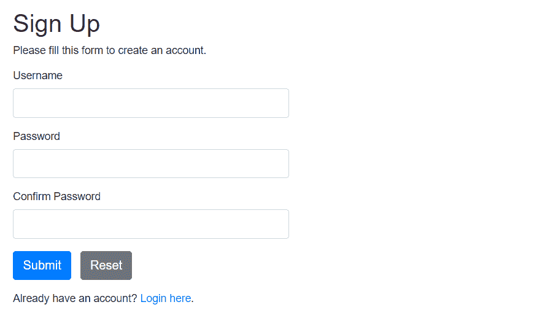

# PHP MySQL 登录系统

> 原文：<https://www.tutorialrepublic.com/php-tutorial/php-mysql-login-system.php>

在本教程中，你将学习如何用 PHP 和 MySQL 建立一个登录系统。

## 实现用户认证机制

用户认证在现代 web 应用中非常普遍。这是一种安全机制，用于限制未经授权访问网站上的会员专用区域和工具。

在本教程中，我们将使用 PHP 和 MySQL 创建一个简单的注册和登录系统。本教程由两部分组成:第一部分我们将创建一个用户注册表单，第二部分我们将创建一个登录表单，以及一个欢迎页面和一个注销脚本。

## 建立注册系统

在本节中，我们将构建一个注册系统，允许用户通过填写 web 表单来创建一个新帐户。但是，首先我们需要创建一个保存所有用户数据的表。

### 步骤 1:创建数据库表

执行以下 SQL 查询，在 MySQL 数据库中创建 *users* 表。

#### 例子

[Download](../examples/downloads/users-table.zip "Download Users Table")

```php
CREATE TABLE users (
    id INT NOT NULL PRIMARY KEY AUTO_INCREMENT,
    username VARCHAR(50) NOT NULL UNIQUE,
    password VARCHAR(255) NOT NULL,
    created_at DATETIME DEFAULT CURRENT_TIMESTAMP
);
```

关于在 MySQL 数据库系统中创建表的语法的详细信息，请查看关于 [SQL `CREATE TABLE`语句](../sql-tutorial/sql-create-table-statement.php)的教程。

### 步骤 2:创建配置文件

创建表之后，我们需要创建一个 PHP 脚本来连接到 MySQL 数据库服务器。让我们创建一个名为“config.php”的文件，并将以下代码放入其中。

#### 例子

Procedural Object Oriented PDO[Download](../examples/bin/download-source.php?topic=php&file=config "Download Source Code") 

```php
<?php
/* Database credentials. Assuming you are running MySQL
server with default setting (user 'root' with no password) */
define('DB_SERVER', 'localhost');
define('DB_USERNAME', 'root');
define('DB_PASSWORD', '');
define('DB_NAME', 'demo');

/* Attempt to connect to MySQL database */
$link = mysqli_connect(DB_SERVER, DB_USERNAME, DB_PASSWORD, DB_NAME);

// Check connection
if($link === false){
    die("ERROR: Could not connect. " . mysqli_connect_error());
}
?>
```

```php
<?php
/* Database credentials. Assuming you are running MySQL
server with default setting (user 'root' with no password) */
define('DB_SERVER', 'localhost');
define('DB_USERNAME', 'root');
define('DB_PASSWORD', '');
define('DB_NAME', 'demo');

/* Attempt to connect to MySQL database */
$mysqli = new mysqli(DB_SERVER, DB_USERNAME, DB_PASSWORD, DB_NAME);

// Check connection
if($mysqli === false){
    die("ERROR: Could not connect. " . $mysqli->connect_error);
}
?>
```

```php
<?php
/* Database credentials. Assuming you are running MySQL
server with default setting (user 'root' with no password) */
define('DB_SERVER', 'localhost');
define('DB_USERNAME', 'root');
define('DB_PASSWORD', '');
define('DB_NAME', 'demo');

/* Attempt to connect to MySQL database */
try{
    $pdo = new PDO("mysql:host=" . DB_SERVER . ";dbname=" . DB_NAME, DB_USERNAME, DB_PASSWORD);
    // Set the PDO error mode to exception
    $pdo->setAttribute(PDO::ATTR_ERRMODE, PDO::ERRMODE_EXCEPTION);
} catch(PDOException $e){
    die("ERROR: Could not connect. " . $e->getMessage());
}
?>
```

  *如果您已经使用下载按钮下载了面向对象或 PDO 代码示例，请在测试代码之前从文件名中删除文本“-oo-format”或“-pdo-format”。

 ***注意:**在测试这段代码之前，根据您的 MySQL 服务器设置替换凭证，例如，用您自己的数据库名称替换数据库名称“demo ”,用您自己的数据库用户名替换用户名“root ”,指定数据库密码(如果有的话)。*  *### 步骤 3:创建注册表单

让我们创建另一个 PHP 文件“register.php ”,并将下面的示例代码放入其中。该示例代码将创建一个允许用户注册的 web 表单。

如果用户试图在不输入任何值的情况下提交表单，或者如果用户输入的用户名已经被另一个用户使用，该脚本也会生成错误。

#### 例子

Procedural Object Oriented PDO[Download](../examples/bin/download-source.php?topic=php&file=register "Download Source Code") 

```php
<?php
// Include config file
require_once "config.php";

// Define variables and initialize with empty values
$username = $password = $confirm_password = "";
$username_err = $password_err = $confirm_password_err = "";

// Processing form data when form is submitted
if($_SERVER["REQUEST_METHOD"] == "POST"){

    // Validate username
    if(empty(trim($_POST["username"]))){
        $username_err = "Please enter a username.";
    } elseif(!preg_match('/^[a-zA-Z0-9_]+$/', trim($_POST["username"]))){
        $username_err = "Username can only contain letters, numbers, and underscores.";
    } else{
        // Prepare a select statement
        $sql = "SELECT id FROM users WHERE username = ?";

        if($stmt = mysqli_prepare($link, $sql)){
            // Bind variables to the prepared statement as parameters
            mysqli_stmt_bind_param($stmt, "s", $param_username);

            // Set parameters
            $param_username = trim($_POST["username"]);

            // Attempt to execute the prepared statement
            if(mysqli_stmt_execute($stmt)){
                /* store result */
                mysqli_stmt_store_result($stmt);

                if(mysqli_stmt_num_rows($stmt) == 1){
                    $username_err = "This username is already taken.";
                } else{
                    $username = trim($_POST["username"]);
                }
            } else{
                echo "Oops! Something went wrong. Please try again later.";
            }

            // Close statement
            mysqli_stmt_close($stmt);
        }
    }

    // Validate password
    if(empty(trim($_POST["password"]))){
        $password_err = "Please enter a password.";     
    } elseif(strlen(trim($_POST["password"])) < 6){
        $password_err = "Password must have atleast 6 characters.";
    } else{
        $password = trim($_POST["password"]);
    }

    // Validate confirm password
    if(empty(trim($_POST["confirm_password"]))){
        $confirm_password_err = "Please confirm password.";     
    } else{
        $confirm_password = trim($_POST["confirm_password"]);
        if(empty($password_err) && ($password != $confirm_password)){
            $confirm_password_err = "Password did not match.";
        }
    }

    // Check input errors before inserting in database
    if(empty($username_err) && empty($password_err) && empty($confirm_password_err)){

        // Prepare an insert statement
        $sql = "INSERT INTO users (username, password) VALUES (?, ?)";

        if($stmt = mysqli_prepare($link, $sql)){
            // Bind variables to the prepared statement as parameters
            mysqli_stmt_bind_param($stmt, "ss", $param_username, $param_password);

            // Set parameters
            $param_username = $username;
            $param_password = password_hash($password, PASSWORD_DEFAULT); // Creates a password hash

            // Attempt to execute the prepared statement
            if(mysqli_stmt_execute($stmt)){
                // Redirect to login page
                header("location: login.php");
            } else{
                echo "Oops! Something went wrong. Please try again later.";
            }

            // Close statement
            mysqli_stmt_close($stmt);
        }
    }

    // Close connection
    mysqli_close($link);
}
?>

<!DOCTYPE html>
<html lang="en">
<head>
    <meta charset="UTF-8">
    <title>Sign Up</title>
    <link rel="stylesheet" href="https://stackpath.bootstrapcdn.com/bootstrap/4.5.2/css/bootstrap.min.css">
    <style>
        body{ font: 14px sans-serif; }
        .wrapper{ width: 360px; padding: 20px; }
    </style>
</head>
<body>
    <div class="wrapper">
        <h2>Sign Up</h2>
        <p>Please fill this form to create an account.</p>
        <form action="<?php echo htmlspecialchars($_SERVER["PHP_SELF"]); ?>" method="post">
            <div class="form-group">
                <label>Username</label>
                <input type="text" name="username" class="form-control <?php echo (!empty($username_err)) ? 'is-invalid' : ''; ?>" value="<?php echo $username; ?>">
                <span class="invalid-feedback"><?php echo $username_err; ?></span>
            </div>    
            <div class="form-group">
                <label>Password</label>
                <input type="password" name="password" class="form-control <?php echo (!empty($password_err)) ? 'is-invalid' : ''; ?>" value="<?php echo $password; ?>">
                <span class="invalid-feedback"><?php echo $password_err; ?></span>
            </div>
            <div class="form-group">
                <label>Confirm Password</label>
                <input type="password" name="confirm_password" class="form-control <?php echo (!empty($confirm_password_err)) ? 'is-invalid' : ''; ?>" value="<?php echo $confirm_password; ?>">
                <span class="invalid-feedback"><?php echo $confirm_password_err; ?></span>
            </div>
            <div class="form-group">
                <input type="submit" class="btn btn-primary" value="Submit">
                <input type="reset" class="btn btn-secondary ml-2" value="Reset">
            </div>
            <p>Already have an account? <a href="login.php">Login here</a>.</p>
        </form>
    </div>    
</body>
</html>
```

```php
<?php
// Include config file
require_once "config.php";

// Define variables and initialize with empty values
$username = $password = $confirm_password = "";
$username_err = $password_err = $confirm_password_err = "";

// Processing form data when form is submitted
if($_SERVER["REQUEST_METHOD"] == "POST"){

    // Validate username
    if(empty(trim($_POST["username"]))){
        $username_err = "Please enter a username.";
    } elseif(!preg_match('/^[a-zA-Z0-9_]+$/', trim($_POST["username"]))){
        $username_err = "Username can only contain letters, numbers, and underscores.";
    } else{
        // Prepare a select statement
        $sql = "SELECT id FROM users WHERE username = ?";

        if($stmt = $mysqli->prepare($sql)){
            // Bind variables to the prepared statement as parameters
            $stmt->bind_param("s", $param_username);

            // Set parameters
            $param_username = trim($_POST["username"]);

            // Attempt to execute the prepared statement
            if($stmt->execute()){
                // store result
                $stmt->store_result();

                if($stmt->num_rows == 1){
                    $username_err = "This username is already taken.";
                } else{
                    $username = trim($_POST["username"]);
                }
            } else{
                echo "Oops! Something went wrong. Please try again later.";
            }

            // Close statement
            $stmt->close();
        }
    }

    // Validate password
    if(empty(trim($_POST["password"]))){
        $password_err = "Please enter a password.";     
    } elseif(strlen(trim($_POST["password"])) < 6){
        $password_err = "Password must have atleast 6 characters.";
    } else{
        $password = trim($_POST["password"]);
    }

    // Validate confirm password
    if(empty(trim($_POST["confirm_password"]))){
        $confirm_password_err = "Please confirm password.";     
    } else{
        $confirm_password = trim($_POST["confirm_password"]);
        if(empty($password_err) && ($password != $confirm_password)){
            $confirm_password_err = "Password did not match.";
        }
    }

    // Check input errors before inserting in database
    if(empty($username_err) && empty($password_err) && empty($confirm_password_err)){

        // Prepare an insert statement
        $sql = "INSERT INTO users (username, password) VALUES (?, ?)";

        if($stmt = $mysqli->prepare($sql)){
            // Bind variables to the prepared statement as parameters
            $stmt->bind_param("ss", $param_username, $param_password);

            // Set parameters
            $param_username = $username;
            $param_password = password_hash($password, PASSWORD_DEFAULT); // Creates a password hash

            // Attempt to execute the prepared statement
            if($stmt->execute()){
                // Redirect to login page
                header("location: login.php");
            } else{
                echo "Oops! Something went wrong. Please try again later.";
            }

            // Close statement
            $stmt->close();
        }
    }

    // Close connection
    $mysqli->close();
}
?>

<!DOCTYPE html>
<html lang="en">
<head>
    <meta charset="UTF-8">
    <title>Sign Up</title>
    <link rel="stylesheet" href="https://stackpath.bootstrapcdn.com/bootstrap/4.5.2/css/bootstrap.min.css">
    <style>
        body{ font: 14px sans-serif; }
        .wrapper{ width: 360px; padding: 20px; }
    </style>
</head>
<body>
    <div class="wrapper">
        <h2>Sign Up</h2>
        <p>Please fill this form to create an account.</p>
        <form action="<?php echo htmlspecialchars($_SERVER["PHP_SELF"]); ?>" method="post">
            <div class="form-group">
                <label>Username</label>
                <input type="text" name="username" class="form-control <?php echo (!empty($username_err)) ? 'is-invalid' : ''; ?>" value="<?php echo $username; ?>">
                <span class="invalid-feedback"><?php echo $username_err; ?></span>
            </div>    
            <div class="form-group">
                <label>Password</label>
                <input type="password" name="password" class="form-control <?php echo (!empty($password_err)) ? 'is-invalid' : ''; ?>" value="<?php echo $password; ?>">
                <span class="invalid-feedback"><?php echo $password_err; ?></span>
            </div>
            <div class="form-group">
                <label>Confirm Password</label>
                <input type="password" name="confirm_password" class="form-control <?php echo (!empty($confirm_password_err)) ? 'is-invalid' : ''; ?>" value="<?php echo $confirm_password; ?>">
                <span class="invalid-feedback"><?php echo $confirm_password_err; ?></span>
            </div>
            <div class="form-group">
                <input type="submit" class="btn btn-primary" value="Submit">
                <input type="reset" class="btn btn-secondary ml-2" value="Reset">
            </div>
            <p>Already have an account? <a href="login.php">Login here</a>.</p>
        </form>
    </div>    
</body>
</html>
```

```php
<?php
// Include config file
require_once "config.php";

// Define variables and initialize with empty values
$username = $password = $confirm_password = "";
$username_err = $password_err = $confirm_password_err = "";

// Processing form data when form is submitted
if($_SERVER["REQUEST_METHOD"] == "POST"){

    // Validate username
    if(empty(trim($_POST["username"]))){
        $username_err = "Please enter a username.";
    } elseif(!preg_match('/^[a-zA-Z0-9_]+$/', trim($_POST["username"]))){
        $username_err = "Username can only contain letters, numbers, and underscores.";
    } else{
        // Prepare a select statement
        $sql = "SELECT id FROM users WHERE username = :username";

        if($stmt = $pdo->prepare($sql)){
            // Bind variables to the prepared statement as parameters
            $stmt->bindParam(":username", $param_username, PDO::PARAM_STR);

            // Set parameters
            $param_username = trim($_POST["username"]);

            // Attempt to execute the prepared statement
            if($stmt->execute()){
                if($stmt->rowCount() == 1){
                    $username_err = "This username is already taken.";
                } else{
                    $username = trim($_POST["username"]);
                }
            } else{
                echo "Oops! Something went wrong. Please try again later.";
            }

            // Close statement
            unset($stmt);
        }
    }

    // Validate password
    if(empty(trim($_POST["password"]))){
        $password_err = "Please enter a password.";     
    } elseif(strlen(trim($_POST["password"])) < 6){
        $password_err = "Password must have atleast 6 characters.";
    } else{
        $password = trim($_POST["password"]);
    }

    // Validate confirm password
    if(empty(trim($_POST["confirm_password"]))){
        $confirm_password_err = "Please confirm password.";     
    } else{
        $confirm_password = trim($_POST["confirm_password"]);
        if(empty($password_err) && ($password != $confirm_password)){
            $confirm_password_err = "Password did not match.";
        }
    }

    // Check input errors before inserting in database
    if(empty($username_err) && empty($password_err) && empty($confirm_password_err)){

        // Prepare an insert statement
        $sql = "INSERT INTO users (username, password) VALUES (:username, :password)";

        if($stmt = $pdo->prepare($sql)){
            // Bind variables to the prepared statement as parameters
            $stmt->bindParam(":username", $param_username, PDO::PARAM_STR);
            $stmt->bindParam(":password", $param_password, PDO::PARAM_STR);

            // Set parameters
            $param_username = $username;
            $param_password = password_hash($password, PASSWORD_DEFAULT); // Creates a password hash

            // Attempt to execute the prepared statement
            if($stmt->execute()){
                // Redirect to login page
                header("location: login.php");
            } else{
                echo "Oops! Something went wrong. Please try again later.";
            }

            // Close statement
            unset($stmt);
        }
    }

    // Close connection
    unset($pdo);
}
?>

<!DOCTYPE html>
<html lang="en">
<head>
    <meta charset="UTF-8">
    <title>Sign Up</title>
    <link rel="stylesheet" href="https://stackpath.bootstrapcdn.com/bootstrap/4.5.2/css/bootstrap.min.css">
    <style>
        body{ font: 14px sans-serif; }
        .wrapper{ width: 360px; padding: 20px; }
    </style>
</head>
<body>
    <div class="wrapper">
        <h2>Sign Up</h2>
        <p>Please fill this form to create an account.</p>
        <form action="<?php echo htmlspecialchars($_SERVER["PHP_SELF"]); ?>" method="post">
            <div class="form-group">
                <label>Username</label>
                <input type="text" name="username" class="form-control <?php echo (!empty($username_err)) ? 'is-invalid' : ''; ?>" value="<?php echo $username; ?>">
                <span class="invalid-feedback"><?php echo $username_err; ?></span>
            </div>    
            <div class="form-group">
                <label>Password</label>
                <input type="password" name="password" class="form-control <?php echo (!empty($password_err)) ? 'is-invalid' : ''; ?>" value="<?php echo $password; ?>">
                <span class="invalid-feedback"><?php echo $password_err; ?></span>
            </div>
            <div class="form-group">
                <label>Confirm Password</label>
                <input type="password" name="confirm_password" class="form-control <?php echo (!empty($confirm_password_err)) ? 'is-invalid' : ''; ?>" value="<?php echo $confirm_password; ?>">
                <span class="invalid-feedback"><?php echo $confirm_password_err; ?></span>
            </div>
            <div class="form-group">
                <input type="submit" class="btn btn-primary" value="Submit">
                <input type="reset" class="btn btn-secondary ml-2" value="Reset">
            </div>
            <p>Already have an account? <a href="login.php">Login here</a>.</p>
        </form>
    </div>    
</body>
</html>
```

  *—上述示例的输出(即注册表单)类似于以下内容:



在上面的例子中，我们使用 PHP 内置的`password_hash()`函数从用户输入的密码字符串中创建一个密码散列(*第 78 行*)。此函数使用强单向哈希算法创建密码哈希。它还会在散列密码时自动生成并应用随机 salt 这基本上意味着，即使两个用户有相同的密码，他们的密码哈希值也会不同。

在登录时，我们将使用 PHP `password_verify()`函数用存储在数据库中的密码散列来验证给定的密码，如下例所示。

我们已经使用 Bootstrap 框架使[表单布局](../twitter-bootstrap-tutorial/bootstrap-forms.php)快速而漂亮。请查看[Bootstrap 教程](/twitter-bootstrap-tutorial/)部分，了解关于这个框架的更多信息。

 ***提示:**密码加盐(Password salting)是一种广泛使用的技术，它通过随机化密码哈希来保护密码，这样，如果两个用户有相同的密码，他们就不会有相同的密码哈希。这是通过在哈希之前将一个随机字符串(称为 salt)附加或前置到密码来实现的。*  ** * *

## 构建登录系统

在本节中，我们将创建一个登录表单，用户可以在其中输入用户名和密码。当用户提交表单时，这些输入将根据存储在数据库中的凭据进行验证，如果用户名和密码匹配，则用户被授权访问该网站，否则登录尝试将被拒绝。

### 步骤 1:创建登录表单

让我们创建一个名为“login.php”的文件，并将以下代码放入其中。

#### 例子

Procedural Object Oriented PDO[Download](../examples/bin/download-source.php?topic=php&file=login "Download Source Code") 

```php
<?php
// Initialize the session
session_start();

// Check if the user is already logged in, if yes then redirect him to welcome page
if(isset($_SESSION["loggedin"]) && $_SESSION["loggedin"] === true){
    header("location: welcome.php");
    exit;
}

// Include config file
require_once "config.php";

// Define variables and initialize with empty values
$username = $password = "";
$username_err = $password_err = $login_err = "";

// Processing form data when form is submitted
if($_SERVER["REQUEST_METHOD"] == "POST"){

    // Check if username is empty
    if(empty(trim($_POST["username"]))){
        $username_err = "Please enter username.";
    } else{
        $username = trim($_POST["username"]);
    }

    // Check if password is empty
    if(empty(trim($_POST["password"]))){
        $password_err = "Please enter your password.";
    } else{
        $password = trim($_POST["password"]);
    }

    // Validate credentials
    if(empty($username_err) && empty($password_err)){
        // Prepare a select statement
        $sql = "SELECT id, username, password FROM users WHERE username = ?";

        if($stmt = mysqli_prepare($link, $sql)){
            // Bind variables to the prepared statement as parameters
            mysqli_stmt_bind_param($stmt, "s", $param_username);

            // Set parameters
            $param_username = $username;

            // Attempt to execute the prepared statement
            if(mysqli_stmt_execute($stmt)){
                // Store result
                mysqli_stmt_store_result($stmt);

                // Check if username exists, if yes then verify password
                if(mysqli_stmt_num_rows($stmt) == 1){                    
                    // Bind result variables
                    mysqli_stmt_bind_result($stmt, $id, $username, $hashed_password);
                    if(mysqli_stmt_fetch($stmt)){
                        if(password_verify($password, $hashed_password)){
                            // Password is correct, so start a new session
                            session_start();

                            // Store data in session variables
                            $_SESSION["loggedin"] = true;
                            $_SESSION["id"] = $id;
                            $_SESSION["username"] = $username;                            

                            // Redirect user to welcome page
                            header("location: welcome.php");
                        } else{
                            // Password is not valid, display a generic error message
                            $login_err = "Invalid username or password.";
                        }
                    }
                } else{
                    // Username doesn't exist, display a generic error message
                    $login_err = "Invalid username or password.";
                }
            } else{
                echo "Oops! Something went wrong. Please try again later.";
            }

            // Close statement
            mysqli_stmt_close($stmt);
        }
    }

    // Close connection
    mysqli_close($link);
}
?>

<!DOCTYPE html>
<html lang="en">
<head>
    <meta charset="UTF-8">
    <title>Login</title>
    <link rel="stylesheet" href="https://stackpath.bootstrapcdn.com/bootstrap/4.5.2/css/bootstrap.min.css">
    <style>
        body{ font: 14px sans-serif; }
        .wrapper{ width: 360px; padding: 20px; }
    </style>
</head>
<body>
    <div class="wrapper">
        <h2>Login</h2>
        <p>Please fill in your credentials to login.</p>

        <?php 
        if(!empty($login_err)){
            echo '<div class="alert alert-danger">' . $login_err . '</div>';
        }        
        ?>

        <form action="<?php echo htmlspecialchars($_SERVER["PHP_SELF"]); ?>" method="post">
            <div class="form-group">
                <label>Username</label>
                <input type="text" name="username" class="form-control <?php echo (!empty($username_err)) ? 'is-invalid' : ''; ?>" value="<?php echo $username; ?>">
                <span class="invalid-feedback"><?php echo $username_err; ?></span>
            </div>    
            <div class="form-group">
                <label>Password</label>
                <input type="password" name="password" class="form-control <?php echo (!empty($password_err)) ? 'is-invalid' : ''; ?>">
                <span class="invalid-feedback"><?php echo $password_err; ?></span>
            </div>
            <div class="form-group">
                <input type="submit" class="btn btn-primary" value="Login">
            </div>
            <p>Don't have an account? <a href="register.php">Sign up now</a>.</p>
        </form>
    </div>
</body>
</html>
```

```php
<?php
// Initialize the session
session_start();

// Check if the user is already logged in, if yes then redirect him to welcome page
if(isset($_SESSION["loggedin"]) && $_SESSION["loggedin"] === true){
    header("location: welcome.php");
    exit;
}

// Include config file
require_once "config.php";

// Define variables and initialize with empty values
$username = $password = "";
$username_err = $password_err = $login_err = "";

// Processing form data when form is submitted
if($_SERVER["REQUEST_METHOD"] == "POST"){

    // Check if username is empty
    if(empty(trim($_POST["username"]))){
        $username_err = "Please enter username.";
    } else{
        $username = trim($_POST["username"]);
    }

    // Check if password is empty
    if(empty(trim($_POST["password"]))){
        $password_err = "Please enter your password.";
    } else{
        $password = trim($_POST["password"]);
    }

    // Validate credentials
    if(empty($username_err) && empty($password_err)){
        // Prepare a select statement
        $sql = "SELECT id, username, password FROM users WHERE username = ?";

        if($stmt = $mysqli->prepare($sql)){
            // Bind variables to the prepared statement as parameters
            $stmt->bind_param("s", $param_username);

            // Set parameters
            $param_username = $username;

            // Attempt to execute the prepared statement
            if($stmt->execute()){
                // Store result
                $stmt->store_result();

                // Check if username exists, if yes then verify password
                if($stmt->num_rows == 1){                    
                    // Bind result variables
                    $stmt->bind_result($id, $username, $hashed_password);
                    if($stmt->fetch()){
                        if(password_verify($password, $hashed_password)){
                            // Password is correct, so start a new session
                            session_start();

                            // Store data in session variables
                            $_SESSION["loggedin"] = true;
                            $_SESSION["id"] = $id;
                            $_SESSION["username"] = $username;                            

                            // Redirect user to welcome page
                            header("location: welcome.php");
                        } else{
                            // Password is not valid, display a generic error message
                            $login_err = "Invalid username or password.";
                        }
                    }
                } else{
                    // Username doesn't exist, display a generic error message
                    $login_err = "Invalid username or password.";
                }
            } else{
                echo "Oops! Something went wrong. Please try again later.";
            }

            // Close statement
            $stmt->close();
        }
    }

    // Close connection
    $mysqli->close();
}
?>

<!DOCTYPE html>
<html lang="en">
<head>
    <meta charset="UTF-8">
    <title>Login</title>
    <link rel="stylesheet" href="https://stackpath.bootstrapcdn.com/bootstrap/4.5.2/css/bootstrap.min.css">
    <style>
        body{ font: 14px sans-serif; }
        .wrapper{ width: 360px; padding: 20px; }
    </style>
</head>
<body>
    <div class="wrapper">
        <h2>Login</h2>
        <p>Please fill in your credentials to login.</p>

        <?php 
        if(!empty($login_err)){
            echo '<div class="alert alert-danger">' . $login_err . '</div>';
        }        
        ?>

        <form action="<?php echo htmlspecialchars($_SERVER["PHP_SELF"]); ?>" method="post">
            <div class="form-group">
                <label>Username</label>
                <input type="text" name="username" class="form-control <?php echo (!empty($username_err)) ? 'is-invalid' : ''; ?>" value="<?php echo $username; ?>">
                <span class="invalid-feedback"><?php echo $username_err; ?></span>
            </div>    
            <div class="form-group">
                <label>Password</label>
                <input type="password" name="password" class="form-control <?php echo (!empty($password_err)) ? 'is-invalid' : ''; ?>">
                <span class="invalid-feedback"><?php echo $password_err; ?></span>
            </div>
            <div class="form-group">
                <input type="submit" class="btn btn-primary" value="Login">
            </div>
            <p>Don't have an account? <a href="register.php">Sign up now</a>.</p>
        </form>
    </div>
</body>
</html>
```

```php
<?php
// Initialize the session
session_start();

// Check if the user is already logged in, if yes then redirect him to welcome page
if(isset($_SESSION["loggedin"]) && $_SESSION["loggedin"] === true){
    header("location: welcome.php");
    exit;
}

// Include config file
require_once "config.php";

// Define variables and initialize with empty values
$username = $password = "";
$username_err = $password_err = $login_err = "";

// Processing form data when form is submitted
if($_SERVER["REQUEST_METHOD"] == "POST"){

    // Check if username is empty
    if(empty(trim($_POST["username"]))){
        $username_err = "Please enter username.";
    } else{
        $username = trim($_POST["username"]);
    }

    // Check if password is empty
    if(empty(trim($_POST["password"]))){
        $password_err = "Please enter your password.";
    } else{
        $password = trim($_POST["password"]);
    }

    // Validate credentials
    if(empty($username_err) && empty($password_err)){
        // Prepare a select statement
        $sql = "SELECT id, username, password FROM users WHERE username = :username";

        if($stmt = $pdo->prepare($sql)){
            // Bind variables to the prepared statement as parameters
            $stmt->bindParam(":username", $param_username, PDO::PARAM_STR);

            // Set parameters
            $param_username = trim($_POST["username"]);

            // Attempt to execute the prepared statement
            if($stmt->execute()){
                // Check if username exists, if yes then verify password
                if($stmt->rowCount() == 1){
                    if($row = $stmt->fetch()){
                        $id = $row["id"];
                        $username = $row["username"];
                        $hashed_password = $row["password"];
                        if(password_verify($password, $hashed_password)){
                            // Password is correct, so start a new session
                            session_start();

                            // Store data in session variables
                            $_SESSION["loggedin"] = true;
                            $_SESSION["id"] = $id;
                            $_SESSION["username"] = $username;                            

                            // Redirect user to welcome page
                            header("location: welcome.php");
                        } else{
                            // Password is not valid, display a generic error message
                            $login_err = "Invalid username or password.";
                        }
                    }
                } else{
                    // Username doesn't exist, display a generic error message
                    $login_err = "Invalid username or password.";
                }
            } else{
                echo "Oops! Something went wrong. Please try again later.";
            }

            // Close statement
            unset($stmt);
        }
    }

    // Close connection
    unset($pdo);
}
?>

<!DOCTYPE html>
<html lang="en">
<head>
    <meta charset="UTF-8">
    <title>Login</title>
    <link rel="stylesheet" href="https://stackpath.bootstrapcdn.com/bootstrap/4.5.2/css/bootstrap.min.css">
    <style>
        body{ font: 14px sans-serif; }
        .wrapper{ width: 360px; padding: 20px; }
    </style>
</head>
<body>
    <div class="wrapper">
        <h2>Login</h2>
        <p>Please fill in your credentials to login.</p>

        <?php 
        if(!empty($login_err)){
            echo '<div class="alert alert-danger">' . $login_err . '</div>';
        }        
        ?>

        <form action="<?php echo htmlspecialchars($_SERVER["PHP_SELF"]); ?>" method="post">
            <div class="form-group">
                <label>Username</label>
                <input type="text" name="username" class="form-control <?php echo (!empty($username_err)) ? 'is-invalid' : ''; ?>" value="<?php echo $username; ?>">
                <span class="invalid-feedback"><?php echo $username_err; ?></span>
            </div>    
            <div class="form-group">
                <label>Password</label>
                <input type="password" name="password" class="form-control <?php echo (!empty($password_err)) ? 'is-invalid' : ''; ?>">
                <span class="invalid-feedback"><?php echo $password_err; ?></span>
            </div>
            <div class="form-group">
                <input type="submit" class="btn btn-primary" value="Login">
            </div>
            <p>Don't have an account? <a href="register.php">Sign up now</a>.</p>
        </form>
    </div>
</body>
</html>
```

  *—上述示例的输出(即登录表单)将类似于以下内容:


### 步骤 2:创建欢迎页面

下面是我们的“welcome.php”文件的代码，用户在成功登录后被重定向到该文件。

#### 例子

[Download](../examples/bin/download-source.php?topic=php&file=welcome "Download Source Code") 

```php
<?php
// Initialize the session
session_start();

// Check if the user is logged in, if not then redirect him to login page
if(!isset($_SESSION["loggedin"]) || $_SESSION["loggedin"] !== true){
    header("location: login.php");
    exit;
}
?>

<!DOCTYPE html>
<html lang="en">
<head>
    <meta charset="UTF-8">
    <title>Welcome</title>
    <link rel="stylesheet" href="https://stackpath.bootstrapcdn.com/bootstrap/4.5.2/css/bootstrap.min.css">
    <style>
        body{ font: 14px sans-serif; text-align: center; }
    </style>
</head>
<body>
    <h1 class="my-5">Hi, <b><?php echo htmlspecialchars($_SESSION["username"]); ?></b>. Welcome to our site.</h1>
    <p>
        <a href="reset-password.php" class="btn btn-warning">Reset Your Password</a>
        <a href="logout.php" class="btn btn-danger ml-3">Sign Out of Your Account</a>
    </p>
</body>
</html>
```

  *如果数据来自外部来源，如匿名用户填写的表单，则存在可能包含恶意脚本以发起跨站点脚本(XSS)攻击的风险。因此，在浏览器中显示这些数据之前，必须使用 PHP `htmlspecialchars()`函数对其进行转义，这样它所包含的任何 HTML 标签都不会受到影响。

例如，对特殊字符进行转义后，字符串`<script>alert("XSS")</script>`变成了`&lt;script&gt;alert("XSS")&lt;/script&gt;`，浏览器不会执行该字符串。

### 步骤 3:创建注销脚本

现在，让我们创建一个“logout.php”文件。当用户单击“注销”或“登出”链接时，该文件中的脚本会破坏会话并将用户重定向回登录页面。

#### 例子

[Download](../examples/bin/download-source.php?topic=php&file=logout "Download Source Code")

```php
<?php
// Initialize the session
session_start();

// Unset all of the session variables
$_SESSION = array();

// Destroy the session.
session_destroy();

// Redirect to login page
header("location: login.php");
exit;
?>
```

* * *

## 添加密码重置功能

最后，在本节中，我们将在登录系统中添加密码重置实用程序。使用此功能*登录的用户*可以立即重置他们自己的账户密码。

让我们创建一个名为“reset-password.php”的文件，并将以下代码放入其中。

#### 例子

Procedural Object Oriented PDO[Download](../examples/bin/download-source.php?topic=php&file=reset-password "Download Source Code") 

```php
<?php
// Initialize the session
session_start();

// Check if the user is logged in, otherwise redirect to login page
if(!isset($_SESSION["loggedin"]) || $_SESSION["loggedin"] !== true){
    header("location: login.php");
    exit;
}

// Include config file
require_once "config.php";

// Define variables and initialize with empty values
$new_password = $confirm_password = "";
$new_password_err = $confirm_password_err = "";

// Processing form data when form is submitted
if($_SERVER["REQUEST_METHOD"] == "POST"){

    // Validate new password
    if(empty(trim($_POST["new_password"]))){
        $new_password_err = "Please enter the new password.";     
    } elseif(strlen(trim($_POST["new_password"])) < 6){
        $new_password_err = "Password must have atleast 6 characters.";
    } else{
        $new_password = trim($_POST["new_password"]);
    }

    // Validate confirm password
    if(empty(trim($_POST["confirm_password"]))){
        $confirm_password_err = "Please confirm the password.";
    } else{
        $confirm_password = trim($_POST["confirm_password"]);
        if(empty($new_password_err) && ($new_password != $confirm_password)){
            $confirm_password_err = "Password did not match.";
        }
    }

    // Check input errors before updating the database
    if(empty($new_password_err) && empty($confirm_password_err)){
        // Prepare an update statement
        $sql = "UPDATE users SET password = ? WHERE id = ?";

        if($stmt = mysqli_prepare($link, $sql)){
            // Bind variables to the prepared statement as parameters
            mysqli_stmt_bind_param($stmt, "si", $param_password, $param_id);

            // Set parameters
            $param_password = password_hash($new_password, PASSWORD_DEFAULT);
            $param_id = $_SESSION["id"];

            // Attempt to execute the prepared statement
            if(mysqli_stmt_execute($stmt)){
                // Password updated successfully. Destroy the session, and redirect to login page
                session_destroy();
                header("location: login.php");
                exit();
            } else{
                echo "Oops! Something went wrong. Please try again later.";
            }

            // Close statement
            mysqli_stmt_close($stmt);
        }
    }

    // Close connection
    mysqli_close($link);
}
?>

<!DOCTYPE html>
<html lang="en">
<head>
    <meta charset="UTF-8">
    <title>Reset Password</title>
    <link rel="stylesheet" href="https://stackpath.bootstrapcdn.com/bootstrap/4.5.2/css/bootstrap.min.css">
    <style>
        body{ font: 14px sans-serif; }
        .wrapper{ width: 360px; padding: 20px; }
    </style>
</head>
<body>
    <div class="wrapper">
        <h2>Reset Password</h2>
        <p>Please fill out this form to reset your password.</p>
        <form action="<?php echo htmlspecialchars($_SERVER["PHP_SELF"]); ?>" method="post"> 
            <div class="form-group">
                <label>New Password</label>
                <input type="password" name="new_password" class="form-control <?php echo (!empty($new_password_err)) ? 'is-invalid' : ''; ?>" value="<?php echo $new_password; ?>">
                <span class="invalid-feedback"><?php echo $new_password_err; ?></span>
            </div>
            <div class="form-group">
                <label>Confirm Password</label>
                <input type="password" name="confirm_password" class="form-control <?php echo (!empty($confirm_password_err)) ? 'is-invalid' : ''; ?>">
                <span class="invalid-feedback"><?php echo $confirm_password_err; ?></span>
            </div>
            <div class="form-group">
                <input type="submit" class="btn btn-primary" value="Submit">
                <a class="btn btn-link ml-2" href="welcome.php">Cancel</a>
            </div>
        </form>
    </div>    
</body>
</html>
```

```php
<?php
// Initialize the session
session_start();

// Check if the user is logged in, otherwise redirect to login page
if(!isset($_SESSION["loggedin"]) || $_SESSION["loggedin"] !== true){
    header("location: login.php");
    exit;
}

// Include config file
require_once "config.php";

// Define variables and initialize with empty values
$new_password = $confirm_password = "";
$new_password_err = $confirm_password_err = "";

// Processing form data when form is submitted
if($_SERVER["REQUEST_METHOD"] == "POST"){

    // Validate new password
    if(empty(trim($_POST["new_password"]))){
        $new_password_err = "Please enter the new password.";     
    } elseif(strlen(trim($_POST["new_password"])) < 6){
        $new_password_err = "Password must have atleast 6 characters.";
    } else{
        $new_password = trim($_POST["new_password"]);
    }

    // Validate confirm password
    if(empty(trim($_POST["confirm_password"]))){
        $confirm_password_err = "Please confirm the password.";
    } else{
        $confirm_password = trim($_POST["confirm_password"]);
        if(empty($new_password_err) && ($new_password != $confirm_password)){
            $confirm_password_err = "Password did not match.";
        }
    }

    // Check input errors before updating the database
    if(empty($new_password_err) && empty($confirm_password_err)){
        // Prepare an update statement
        $sql = "UPDATE users SET password = ? WHERE id = ?";

        if($stmt = $mysqli->prepare($sql)){
            // Bind variables to the prepared statement as parameters
            $stmt->bind_param("si", $param_password, $param_id);

            // Set parameters
            $param_password = password_hash($new_password, PASSWORD_DEFAULT);
            $param_id = $_SESSION["id"];

            // Attempt to execute the prepared statement
            if($stmt->execute()){
                // Password updated successfully. Destroy the session, and redirect to login page
                session_destroy();
                header("location: login.php");
                exit();
            } else{
                echo "Oops! Something went wrong. Please try again later.";
            }

            // Close statement
            $stmt->close();
        }
    }

    // Close connection
    $mysqli->close();
}
?>

<!DOCTYPE html>
<html lang="en">
<head>
    <meta charset="UTF-8">
    <title>Reset Password</title>
    <link rel="stylesheet" href="https://stackpath.bootstrapcdn.com/bootstrap/4.5.2/css/bootstrap.min.css">
    <style>
        body{ font: 14px sans-serif; }
        .wrapper{ width: 360px; padding: 20px; }
    </style>
</head>
<body>
    <div class="wrapper">
        <h2>Reset Password</h2>
        <p>Please fill out this form to reset your password.</p>
        <form action="<?php echo htmlspecialchars($_SERVER["PHP_SELF"]); ?>" method="post"> 
            <div class="form-group">
                <label>New Password</label>
                <input type="password" name="new_password" class="form-control <?php echo (!empty($new_password_err)) ? 'is-invalid' : ''; ?>" value="<?php echo $new_password; ?>">
                <span class="invalid-feedback"><?php echo $new_password_err; ?></span>
            </div>
            <div class="form-group">
                <label>Confirm Password</label>
                <input type="password" name="confirm_password" class="form-control <?php echo (!empty($confirm_password_err)) ? 'is-invalid' : ''; ?>">
                <span class="invalid-feedback"><?php echo $confirm_password_err; ?></span>
            </div>
            <div class="form-group">
                <input type="submit" class="btn btn-primary" value="Submit">
                <a class="btn btn-link ml-2" href="welcome.php">Cancel</a>
            </div>
        </form>
    </div>    
</body>
</html>
```

```php
<?php
// Initialize the session
session_start();

// Check if the user is logged in, otherwise redirect to login page
if(!isset($_SESSION["loggedin"]) || $_SESSION["loggedin"] !== true){
    header("location: login.php");
    exit;
}

// Include config file
require_once "config.php";

// Define variables and initialize with empty values
$new_password = $confirm_password = "";
$new_password_err = $confirm_password_err = "";

// Processing form data when form is submitted
if($_SERVER["REQUEST_METHOD"] == "POST"){

    // Validate new password
    if(empty(trim($_POST["new_password"]))){
        $new_password_err = "Please enter the new password.";     
    } elseif(strlen(trim($_POST["new_password"])) < 6){
        $new_password_err = "Password must have atleast 6 characters.";
    } else{
        $new_password = trim($_POST["new_password"]);
    }

    // Validate confirm password
    if(empty(trim($_POST["confirm_password"]))){
        $confirm_password_err = "Please confirm the password.";
    } else{
        $confirm_password = trim($_POST["confirm_password"]);
        if(empty($new_password_err) && ($new_password != $confirm_password)){
            $confirm_password_err = "Password did not match.";
        }
    }

    // Check input errors before updating the database
    if(empty($new_password_err) && empty($confirm_password_err)){
        // Prepare an update statement
        $sql = "UPDATE users SET password = :password WHERE id = :id";

        if($stmt = $pdo->prepare($sql)){
            // Bind variables to the prepared statement as parameters
            $stmt->bindParam(":password", $param_password, PDO::PARAM_STR);
            $stmt->bindParam(":id", $param_id, PDO::PARAM_INT);

            // Set parameters
            $param_password = password_hash($new_password, PASSWORD_DEFAULT);
            $param_id = $_SESSION["id"];

            // Attempt to execute the prepared statement
            if($stmt->execute()){
                // Password updated successfully. Destroy the session, and redirect to login page
                session_destroy();
                header("location: login.php");
                exit();
            } else{
                echo "Oops! Something went wrong. Please try again later.";
            }

            // Close statement
            unset($stmt);
        }
    }

    // Close connection
    unset($pdo);
}
?>

<!DOCTYPE html>
<html lang="en">
<head>
    <meta charset="UTF-8">
    <title>Reset Password</title>
    <link rel="stylesheet" href="https://stackpath.bootstrapcdn.com/bootstrap/4.5.2/css/bootstrap.min.css">
    <style>
        body{ font: 14px sans-serif; }
        .wrapper{ width: 360px; padding: 20px; }
    </style>
</head>
<body>
    <div class="wrapper">
        <h2>Reset Password</h2>
        <p>Please fill out this form to reset your password.</p>
        <form action="<?php echo htmlspecialchars($_SERVER["PHP_SELF"]); ?>" method="post"> 
            <div class="form-group">
                <label>New Password</label>
                <input type="password" name="new_password" class="form-control <?php echo (!empty($new_password_err)) ? 'is-invalid' : ''; ?>" value="<?php echo $new_password; ?>">
                <span class="invalid-feedback"><?php echo $new_password_err; ?></span>
            </div>
            <div class="form-group">
                <label>Confirm Password</label>
                <input type="password" name="confirm_password" class="form-control <?php echo (!empty($confirm_password_err)) ? 'is-invalid' : ''; ?>">
                <span class="invalid-feedback"><?php echo $confirm_password_err; ?></span>
            </div>
            <div class="form-group">
                <input type="submit" class="btn btn-primary" value="Submit">
                <a class="btn btn-link ml-2" href="welcome.php">Cancel</a>
            </div>
        </form>
    </div>    
</body>
</html>
```

