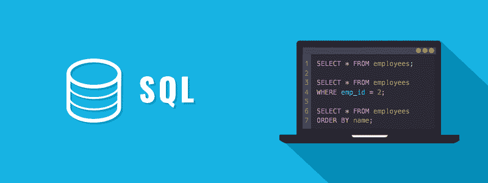

# SQL 教程

> 原文：<https://www.tutorialrepublic.com/sql-tutorial/>

SQL 是为在关系数据库管理系统中管理数据而设计的标准语言。

SQL 代表结构化查询语言。SQL 是一种标准的编程语言，专门用于存储、检索、管理或操作关系数据库管理系统(RDBMS)中的数据。SQL 在 1987 年成为 ISO 标准。

SQL 是实现最广泛的数据库语言，受流行的关系数据库系统支持，如 MySQL、SQL Server 和 Oracle。然而，SQL 标准的一些特性在不同的数据库系统中以不同的方式实现。

SQL 最初是在 20 世纪 70 年代早期由 IBM 开发的。最初它被称为 SEQUEL(结构化英语查询语言)，后来被改为 SQL(发音为 S-Q-L)。

 *提示:我们的 SQL 教程将帮助您从基础到高级逐步学习 SQL 语言的基础知识。如果你是初学者，从基础部分开始，通过每天学习一点点逐步前进。*  ** * *

## 你能用 SQL 做什么

使用 SQL 还可以做更多的事情:

*   您可以创建一个数据库。
*   您可以在数据库中创建表。
*   您可以从数据库中查询或请求信息。
*   您可以在数据库中插入记录。
*   您可以更新或修改数据库中的记录。
*   您可以从数据库中删除记录。
*   为了数据安全，您可以在数据库中设置权限或访问控制。
*   您可以创建视图来避免键入常用的复杂查询。

列表并没有到此结束，您可以使用 SQL 执行许多其他与数据库相关的任务。在接下来的章节中，你将会详细地了解它们。

 ***注意:**除了 SQL 标准之外，大多数关系数据库系统也有它们自己的附加专有扩展，这些扩展只在它们的系统上可用。*  ** * *

## 本教程涵盖的内容

本 SQL 教程系列涵盖了 SQL 语言的所有基本概念，例如创建数据库和表、使用约束、向表中添加记录、基于不同条件从表中选择记录、更新和删除表中的记录等等。

一旦您熟悉了基础知识，您将进入下一个层次，解释通过连接多个表、基于模式搜索表中的记录等来检索记录的方法。

最后，您将探索一些高级概念，例如修改现有的表结构、执行聚合并将数据分组在一起、创建视图以简化和保护表访问、创建表索引、处理日期和时间、克隆现有的表、创建临时表，以及 SQL 子查询和 SQL 注入的概念。

 *提示:本教程的每一章都包含了大量真实世界的例子，你可以使用在线编辑器来尝试和测试。这些例子将帮助你更好地理解概念或主题。它还包含智能解决方案以及有用的提示和重要说明。***