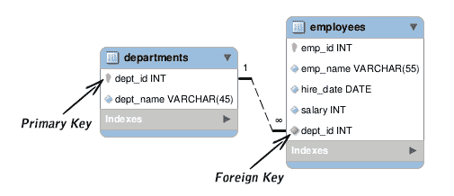

# SQL 约束

> 原文：<https://www.tutorialrepublic.com/sql-tutorial/sql-constraints.php>

在本教程中，您将学习如何使用 SQL 约束。

## 什么是约束？

约束只是对表中一列或多列的限制，用来限制该列中可以存储的值的类型。约束提供了一种标准机制来维护数据库表中数据的准确性和完整性。

SQL 中有几种不同类型的约束，包括:

*   `[NOT NULL](#not-null)`
*   `[PRIMARY KEY](#primary-key)`
*   `[UNIQUE](#unique)`
*   `[DEFAULT](#default)`
*   `[FOREIGN KEY](#foreign-key)`
*   `[CHECK](#check)`

现在，让我们详细讨论一下这些约束。

## 非空约束

`NOT NULL`约束指定该列不接受`NULL`值。

这意味着如果对一列应用了`NOT NULL`约束，那么如果不为该列添加一个非空值，就不能在表中插入一个新行。

下面的 SQL 语句创建一个名为 *persons* 的表，该表有四列，其中三列 *id* 、*姓名*和*电话*不接受空值。

#### 例子

[Try this code »](../codelab.php?topic=sql&file=not-null-constraint "Try this code using online Editor")

```
CREATE TABLE persons (
    id INT NOT NULL,
    name VARCHAR(30) NOT NULL,
    birth_date DATE,
    phone VARCHAR(15) NOT NULL
);
```

 ***注意:**空值或`NULL`不同于零(`0`)、空白或零长度字符串如`''`。`NULL`表示没有录入。*  ** * *

## 主键约束

`PRIMARY KEY`约束标识一列或一组列，这些列的值唯一标识表中的一行。表中的任何两行都不能有相同的主键值。此外，您不能在主键列中输入`NULL`值。

下面的 SQL 语句创建一个名为 *persons* 的表，并将 *id* 列指定为主键。这意味着该字段不允许`NULL`或重复值。

#### 例子

[Try this code »](../codelab.php?topic=sql&file=primary-key-constraint "Try this code using online Editor")

```
CREATE TABLE persons (
    id INT NOT NULL PRIMARY KEY,
    name VARCHAR(30) NOT NULL,
    birth_date DATE,
    phone VARCHAR(15) NOT NULL
);
```

 ***提示:**主键通常由表中的一列组成，但是主键可以由多列组成，例如，雇员的电子邮件地址或分配的标识号是雇员表的逻辑主键。*  ** * *

## 唯一约束

`UNIQUE`约束限制一个或多个列在一个表中包含唯一值。

虽然`UNIQUE`约束和`PRIMARY KEY`约束都强制唯一性，但是当您想要强制非主键的列或列组合的唯一性时，请使用`UNIQUE`约束而不是`PRIMARY KEY`约束。

下面的 SQL 语句创建一个名为 *persons* 的表，并将 *phone* 列指定为唯一列。这意味着该字段不允许重复值。

#### 例子

[Try this code »](../codelab.php?topic=sql&file=unique-constraint "Try this code using online Editor")

```
CREATE TABLE persons (
    id INT NOT NULL PRIMARY KEY,
    name VARCHAR(30) NOT NULL,
    birth_date DATE,
    phone VARCHAR(15) NOT NULL UNIQUE
);
```

 ***注意:**一个表上可以定义多个`UNIQUE`约束，而一个表上只能定义一个`PRIMARY KEY`约束。此外，与`PRIMARY KEY`约束不同，`UNIQUE`约束允许`NULL`值。*  ** * *

## 默认约束

`DEFAULT`约束指定了列的默认值。

列默认值是当 [`INSERT`](sql-insert-statement.php) 语句没有显式指定特定值时，数据库引擎将在列中插入的某个值。

以下 SQL 语句为*国家*列创建一个默认值。

#### 例子

[Try this code »](../codelab.php?topic=sql&file=default-constraint "Try this code using online Editor")

```
CREATE TABLE persons (
    id INT NOT NULL PRIMARY KEY,
    name VARCHAR(30) NOT NULL,
    birth_date DATE,
    phone VARCHAR(15) NOT NULL UNIQUE,
    country VARCHAR(30) NOT NULL DEFAULT 'Australia'
);
```

 ***注意:**如果您将一个表列定义为`NOT NULL`，但是为该列指定了一个默认值，那么在`INSERT`语句中，您不需要为该列显式指定一个值来在表中插入一个新行。*  ** * *

## 外键约束

外键(FK)是一列或多列的组合，用于建立和实施两个表中数据之间的关系。

这里有一个示例图，显示了**雇员**和**部门**表之间的关系。如果仔细观察，您会注意到**雇员**表的**部门标识**列与**部门**表的主键列相匹配。因此，**雇员**表的**部门标识**列是**部门**表的外键。



在 MySQL 中，您可以在创建表时通过定义一个`FOREIGN KEY`约束来创建一个外键，如下所示。以下语句在*雇员*表的*部门标识*列上建立一个外键，该外键引用*部门*表的*部门标识*列。

#### 例子

[Try this code »](../codelab.php?topic=sql&file=foreign-key-constraint "Try this code using online Editor")

```
CREATE TABLE employees (
    emp_id INT NOT NULL PRIMARY KEY,
    emp_name VARCHAR(55) NOT NULL,
    hire_date DATE NOT NULL,
    salary INT,
    dept_id INT,
    FOREIGN KEY (dept_id) REFERENCES departments(dept_id)
);
```

* * *

## 检查约束

`CHECK`约束用于限制可以放入列中的值。

例如，可以通过创建一个`CHECK`约束来限制 salary 列的值的范围，该约束只允许 3000 到 10000 之间的值。这可以防止输入超出正常薪金范围的薪金。这里有一个例子:

#### 例子

[Try this code »](../codelab.php?topic=sql&file=check-constraint "Try this code using online Editor")

```
CREATE TABLE employees (
    emp_id INT NOT NULL PRIMARY KEY,
    emp_name VARCHAR(55) NOT NULL,
    hire_date DATE NOT NULL,
    salary INT NOT NULL CHECK (salary >= 3000 AND salary <= 10000),
    dept_id INT,
    FOREIGN KEY (dept_id) REFERENCES departments(dept_id)
);
```

 ***注意:** MySQL 不支持 SQL 检查约束。然而,`CHECK`子句被 MySQL 的所有存储引擎解析但忽略。*****