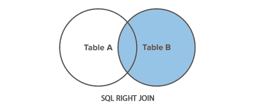

# SQL 右连接（`RIGHT JOIN`）操作

> 原文：<https://www.tutorialrepublic.com/sql-tutorial/sql-right-join-operation.php>

在本教程中，您将学习如何使用 SQL 右连接从两个表中获取数据。

## 使用右连接

`RIGHT JOIN`与 [`LEFT JOIN`](sql-left-join-operation.php) 正好相反。它返回右表中的所有行以及左表中满足连接条件的行。

右连接是[外连接](sql-joining-tables.php#outer-join)的一种，这就是为什么它也被称为*右外连接*的原因。外连接的其他变化有[左连接](sql-left-join-operation.php)和[全连接](sql-full-join-operation.php)。下面的文氏图说明了右连接是如何工作的。



 ***注意:**外部连接是一种包括结果集中的行的连接，即使被连接的两个表中的行可能不匹配。*  *为了清楚地理解这一点，让我们看看下面的*员工*和*部门*表。

| 

```sql
+--------+--------------+------------+---------+
&#124; emp_id &#124; emp_name     &#124; hire_date  &#124; dept_id &#124;
+--------+--------------+------------+---------+
&#124;      1 &#124; Ethan Hunt   &#124; 2001-05-01 &#124;       4 &#124;
&#124;      2 &#124; Tony Montana &#124; 2002-07-15 &#124;       1 &#124;
&#124;      3 &#124; Sarah Connor &#124; 2005-10-18 &#124;       5 &#124;
&#124;      4 &#124; Rick Deckard &#124; 2007-01-03 &#124;       3 &#124;
&#124;      5 &#124; Martin Blank &#124; 2008-06-24 &#124;    NULL &#124;
+--------+--------------+------------+---------+

```

 |   | 

```sql
+---------+------------------+
&#124; dept_id &#124; dept_name        &#124;
+---------+------------------+
&#124;       1 &#124; Administration   &#124;
&#124;       2 &#124; Customer Service &#124;
&#124;       3 &#124; Finance          &#124;
&#124;       4 &#124; Human Resources  &#124;
&#124;       5 &#124; Sales            &#124;
+---------+------------------+

```

 |
| 表: **`employees`** |  | 表: **`departments`** |

现在，假设您想要检索所有部门的名称以及在该部门工作的员工的详细信息。但是，在实际情况中，可能有一些部门目前没有员工在工作。好吧，让我们来看看。

以下语句通过使用公共的 *dept_id* 字段将 *employees* 和 *departments* 表连接在一起，检索所有可用的部门以及属于该部门的雇员的 id、姓名、雇用日期。

#### 例子

[Try this code »](javascript:void(0); "Not Supported in Web SQL")

```sql
SELECT t1.emp_id, t1.emp_name, t1.hire_date, t2.dept_name
FROM employees AS t1 RIGHT JOIN departments AS t2
ON t1.dept_id = t2.dept_id ORDER BY dept_name;
```

 ***提示:**在连接查询中，左边的表是出现在`JOIN`子句最左边的表，右边的表是出现在最右边的表。*  *执行上述命令后，您将得到类似如下的输出:

```sql
+--------+--------------+------------+------------------+
| emp_id | emp_name     | hire_date  | dept_name        |
+--------+--------------+------------+------------------+
|      2 | Tony Montana | 2002-07-15 | Administration   |
|   NULL | NULL         | NULL       | Customer Service |
|      4 | Rick Deckard | 2007-01-03 | Finance          |
|      1 | Ethan Hunt   | 2001-05-01 | Human Resources  |
|      3 | Sarah Connor | 2005-10-18 | Sales            |
+--------+--------------+------------+------------------+

```

右连接包括结果集中来自 *departments* 表的所有行，无论在 *employees* 表中的 *dept_id* 列上是否有匹配，因为您可以清楚地看到部门“客户服务”被包括在内，即使该部门中没有雇员。

 ***注意:**如果右表中有一行，但左表中没有匹配，那么相关的结果行包含来自左表的所有列的`NULL`值。***