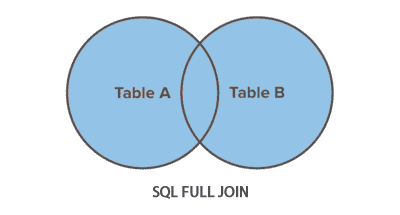

# SQL 全连接（`FULL JOIN`）语句

> 原文：<https://www.tutorialrepublic.com/sql-tutorial/sql-full-join-operation.php>

在本教程中，您将学习如何使用 SQL 全连接从两个表中检索数据。

## 使用全连接

一个`FULL JOIN`从连接的表中返回所有的行，不管它们是否匹配，也就是说，一个全连接结合了一个 [`LEFT JOIN`](sql-left-join-operation.php) 和一个 [`RIGHT JOIN`](sql-right-join-operation.php) 的功能。全连接是[外部连接](sql-joining-tables.php#outer-join)的一种，这就是为什么它也被称为*完全外部连接*。

下面的文氏图说明了全连接是如何工作的。



 ***注意:**外部连接是一种包括结果集中的行的连接，即使被连接的两个表中的行可能不匹配。*  *为了清楚地理解这一点，让我们看看下面的*员工*和*部门*表。

| 

```
+--------+--------------+------------+---------+
&#124; emp_id &#124; emp_name     &#124; hire_date  &#124; dept_id &#124;
+--------+--------------+------------+---------+
&#124;      1 &#124; Ethan Hunt   &#124; 2001-05-01 &#124;       4 &#124;
&#124;      2 &#124; Tony Montana &#124; 2002-07-15 &#124;       1 &#124;
&#124;      3 &#124; Sarah Connor &#124; 2005-10-18 &#124;       5 &#124;
&#124;      4 &#124; Rick Deckard &#124; 2007-01-03 &#124;       3 &#124;
&#124;      5 &#124; Martin Blank &#124; 2008-06-24 &#124;    NULL &#124;
+--------+--------------+------------+---------+

```

 |   | 

```
+---------+------------------+
&#124; dept_id &#124; dept_name        &#124;
+---------+------------------+
&#124;       1 &#124; Administration   &#124;
&#124;       2 &#124; Customer Service &#124;
&#124;       3 &#124; Finance          &#124;
&#124;       4 &#124; Human Resources  &#124;
&#124;       5 &#124; Sales            &#124;
+---------+------------------+

```

 |
| 表: **`employees`** |  | 表: **`departments`** |

现在，假设您只想检索所有雇员的姓名和可用部门的名称，而不管它们在另一个表中是否有相应的行，在这种情况下，您可以使用全连接，如下所示。

以下语句通过使用公共的 *dept_id* 字段将 *employees* 和 *departments* 表连接在一起，检索所有部门以及所有雇员的详细信息。

#### 例子

[Try this code »](javascript:void(0); "Not Supported in Web SQL")

```
SELECT t1.emp_id, t1.emp_name, t1.hire_date, t2.dept_name
FROM employees AS t1 FULL JOIN departments AS t2
ON t1.dept_id = t2.dept_id ORDER BY emp_name;
```

有些数据库，如 Oracle、MySQL，不支持全连接。在这种情况下，您可以使用`UNION ALL`操作符来组合`LEFT JOIN`和`RIGHT JOIN`，如下所示:

#### 例子

[Try this code »](javascript:void(0); "Not Supported in Web SQL")

```
SELECT t1.emp_id, t1.emp_name, t1.hire_date, t2.dept_name
FROM employees AS t1 LEFT JOIN departments AS t2
ON t1.dept_id = t2.dept_id
UNION ALL
SELECT t1.emp_id, t1.emp_name, t1.hire_date, t2.dept_name
FROM employees AS t1 RIGHT JOIN departments AS t2
ON t1.dept_id = t2.dept_id ORDER BY emp_name;
```

执行上述命令后，您将得到类似如下的输出:

```
+--------+--------------+------------+------------------+
| emp_id | emp_name     | hire_date  | dept_name        |
+--------+--------------+------------+------------------+
|   NULL | NULL         | NULL       | Customer Service |
|      1 | Ethan Hunt   | 2001-05-01 | Human Resources  |
|      1 | Ethan Hunt   | 2001-05-01 | Human Resources  |
|      5 | Martin Blank | 2008-06-24 | NULL             |
|      4 | Rick Deckard | 2007-01-03 | Finance          |
|      4 | Rick Deckard | 2007-01-03 | Finance          |
|      3 | Sarah Connor | 2005-10-18 | Sales            |
|      3 | Sarah Connor | 2005-10-18 | Sales            |
|      2 | Tony Montana | 2002-07-15 | Administration   |
|      2 | Tony Montana | 2002-07-15 | Administration   |
+--------+--------------+------------+------------------+

```

如您所见，结果包括来自*部门*和*雇员*表的所有行。

 ***提示:**在连接查询中，左边的表是出现在`JOIN`子句最左边的表，右边的表是出现在最右边的表。*  ****注意:**当执行外部连接时，只要 DBMS(数据库管理系统)不能匹配任何行，它就在列中放置`NULL`来表示数据不存在。***