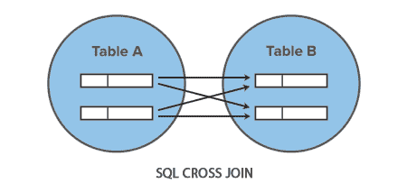

# SQL 交叉连接操作

> 原文：<https://www.tutorialrepublic.com/sql-tutorial/sql-cross-join-operation.php>

在本教程中，您将学习如何使用 SQL 交叉连接从两个表中获取数据。

## 使用交叉连接

如果在联接两个表时没有指定联接条件，数据库系统会将第一个表中的每一行与第二个表中的每一行合并。这种类型的连接称为交叉连接或笛卡儿积。下面的文氏图说明了交叉连接是如何工作的。



为了容易理解这一点，让我们看看下面的*雇员*和*部门*表。

| 

```
+--------+--------------+------------+---------+
&#124; emp_id &#124; emp_name     &#124; hire_date  &#124; dept_id &#124;
+--------+--------------+------------+---------+
&#124;      1 &#124; Ethan Hunt   &#124; 2001-05-01 &#124;       4 &#124;
&#124;      2 &#124; Tony Montana &#124; 2002-07-15 &#124;       1 &#124;
&#124;      3 &#124; Sarah Connor &#124; 2005-10-18 &#124;       5 &#124;
&#124;      4 &#124; Rick Deckard &#124; 2007-01-03 &#124;       3 &#124;
&#124;      5 &#124; Martin Blank &#124; 2008-06-24 &#124;    NULL &#124;
+--------+--------------+------------+---------+

```

 |   | 

```
+---------+------------------+
&#124; dept_id &#124; dept_name        &#124;
+---------+------------------+
&#124;       1 &#124; Administration   &#124;
&#124;       2 &#124; Customer Service &#124;
&#124;       3 &#124; Finance          &#124;
&#124;       4 &#124; Human Resources  &#124;
&#124;       5 &#124; Sales            &#124;
+---------+------------------+

```

 |
| 表: **`employees`** |  | 表: **`departments`** |

交叉联接中的行数是每个表中行数的乘积。下面是一个简单的交叉连接操作的例子。

#### 例子

[Try this code »](../codelab.php?topic=sql&file=cross-join "Try this code using online Editor")

```
SELECT t1.emp_id, t1.emp_name, t1.hire_date, t2.dept_name
FROM employees AS t1 CROSS JOIN departments AS t2;
```

 ***提示:**交叉连接创建一个表中所有行与另一个表中所有行的笛卡尔积或乘积。例如，如果一个表有 5 行，另一个表有 10 行，那么交叉连接查询将产生 50 行，即 5 和 10 的乘积。*  *执行上面的命令后，您会得到如下结果集:

```
+--------+--------------+------------+------------------+
| emp_id | emp_name     | hire_date  | dept_name        |
+--------+--------------+------------+------------------+
|      1 | Ethan Hunt   | 2001-05-01 | Administration   |
|      2 | Tony Montana | 2002-07-15 | Administration   |
|      3 | Sarah Connor | 2005-10-18 | Administration   |
|      4 | Rick Deckard | 2007-01-03 | Administration   |
|      5 | Martin Blank | 2008-06-24 | Administration   |
|      1 | Ethan Hunt   | 2001-05-01 | Customer Service |
|      2 | Tony Montana | 2002-07-15 | Customer Service |
|      3 | Sarah Connor | 2005-10-18 | Customer Service |
|      4 | Rick Deckard | 2007-01-03 | Customer Service |
|      5 | Martin Blank | 2008-06-24 | Customer Service |
|      1 | Ethan Hunt   | 2001-05-01 | Finance          |
|      2 | Tony Montana | 2002-07-15 | Finance          |
|      3 | Sarah Connor | 2005-10-18 | Finance          |
|      4 | Rick Deckard | 2007-01-03 | Finance          |
|      5 | Martin Blank | 2008-06-24 | Finance          |
|      1 | Ethan Hunt   | 2001-05-01 | Human Resources  |
|      2 | Tony Montana | 2002-07-15 | Human Resources  |
|      3 | Sarah Connor | 2005-10-18 | Human Resources  |
|      4 | Rick Deckard | 2007-01-03 | Human Resources  |
|      5 | Martin Blank | 2008-06-24 | Human Resources  |
|      1 | Ethan Hunt   | 2001-05-01 | Sales            |
|      2 | Tony Montana | 2002-07-15 | Sales            |
|      3 | Sarah Connor | 2005-10-18 | Sales            |
|      4 | Rick Deckard | 2007-01-03 | Sales            |
|      5 | Martin Blank | 2008-06-24 | Sales            |
+--------+--------------+------------+------------------+

```

正如你所看到的，交叉连接不如我们在前面章节中讨论的其他连接有用。由于查询没有指定联接条件，employees 表中的每一行都与 departments 表中的每一行相结合。因此，除非你确定你想要一个笛卡尔积，否则不要使用交叉连接。*